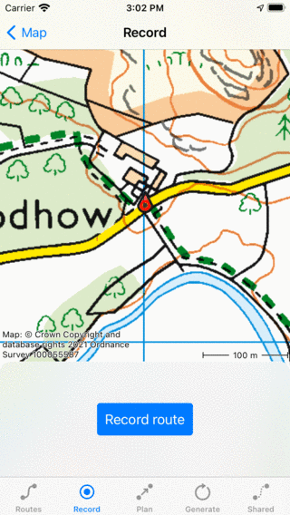
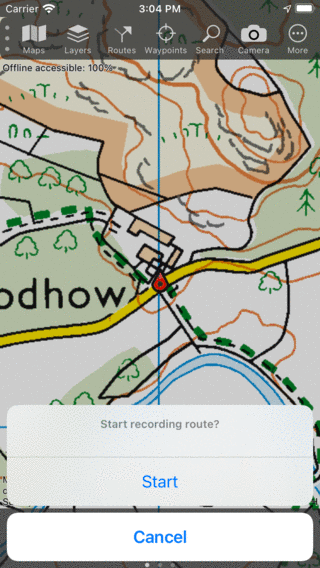
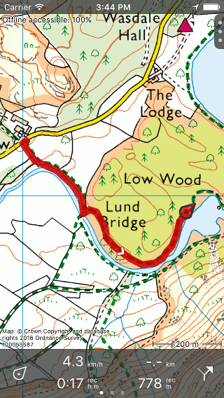
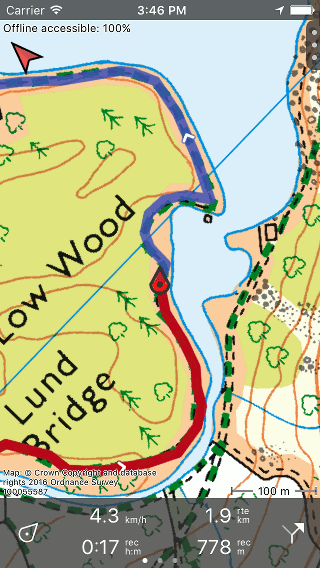
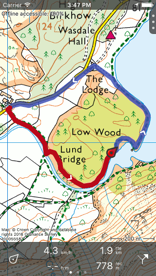
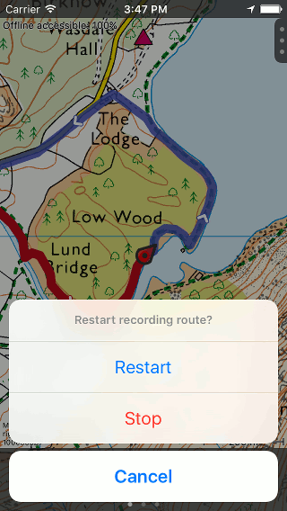
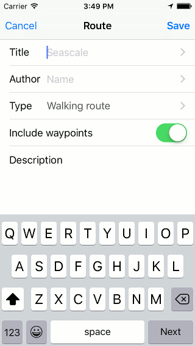

.. _sec-route-record:

Recording routes
----------------
When recording your route all the locations your are visiting are collected. If you finish the recording, you can save the locations as a route.

To record a route you need make sure that Topo GPS is given access to your precise location while using the app in the iOS Settings.

Starting a recording
~~~~~~~~~~~~~~~~~~~~
To start a route recording, you have to open the :ref:`routes screen <sec-routes-screen>` and select the tab 'Record'. An example is below:

   
   *The route record screen.*

In the 'Record' tab of the routes screen you can start a route recording by tapping the 'Record route' button.

Alternatively, you can also start recording a route from the :ref:`main screen <sec-main-screen>`, by tapping the :ref:`record timer <ss-rec-timer>` on the dashboard. A pop-up will appear in which you are asked whether you want to start a recording as in the example below:

   
   *Starting a route recording from the dashboard.*

If you tap 'Start' the route recording will be started.

Recording route
~~~~~~~~~~~~~~~
If you have started a recording and return to the main screen, you will see that a red line will appear on the map
if you are moving. This red line indicates your movement. An example is displayed in the figure below:

   *Recording a route. The red line indicates your movement.*

The :ref:`record timer <ss-rec-timer>` on the dashboard indicates the time you are recording.
In the figure above this is 0h17m. If you tap the timer you can :ref:`end the recording <ss-route-record-end>`.

The :ref:`record distance meter <ss-rec-distance>` on the dashboard indicates
the length of a recorded route. In the example above this is 778 m. If you tap the record distance meter the map will be zoomed to the recorded route.

You can modify the color, width and transparency of the record line in the 
:ref:`settings <ss-settings-lines>`.

While recording you can safely lock your device or switch to another app.
This will not interrupt the recording. In the top of the screen you can see that Topo GPS is using your location in the background. 
In some devices the clock gets a blue blackground, on other devices the whole status bar turns blue. If you tap the blue clock or the blue statusbar, you will return to Topo GPS.

If you tap on the line of the recorded route on the main map, the record screen will be opened. You can view the current altitude and speed profile. You can tap these :ref:`profiles <sec-route-profile>` to view them in more detail. 

If you have :ref:`loaded <ss-route-load>` one or more routes on the map, you can record a route at the same time. An example is shown below:

   *Recording and showing a route.*

The blue line indicates the loaded route with a length of 1.9 km, the red line the recorded route
with a length of 778 m.

Recording a route will cost a considerable amount of energy, therefore regularly check your battery level when recording a route to make sure you are not running out of power. Also pause or finish a recording if your are not longer moving.

.. _ss-route-record-end:

Ending recording
~~~~~~~~~~~~~~~~
You can end the a recording by tapping the :ref:`record timer <ss-rec-timer>` on the dashboard or by tapping 'Stop recording' in
the record screen. The record screen can be opened by tapping the line of the recorded route on the map,
and by selecting the record tab in the :ref:`routes screen <sec-routes-screen>`.

When doing this a pop-up will appear asking you to stop the recording was in the example below: 

.. figure:: ../_static/route-record4.png
   :height: 568px
   :width: 320px
   :alt: Routes opnemen stoppen Topo GPS

   *Ending recording a route.*

If you press 'Stop' the recording will be ended and a screen is presented in which you can :ref:`save the recorded route <ss-record-save>`.

.. _ss-route-record-pause:

Pause recording
~~~~~~~~~~~~~~~
If you press 'Pause' in the pop-up which appears when :ref:`ending a route recording <ss-route-record-end>`, the recording of a route will be paused. 
Your movement will no longer be recorded.

The :ref:`record timer <ss-rec-timer>` on the dashboard will be set to --:--
during a pause. The the :ref:`record distance meter will show
the recorded distance as you can see below:

   *The recording of a route is paused, which can be seen from the record clock and record distance meter.*
   
.. _ss-record-restart:

Restart recording
~~~~~~~~~~~~~~~~~
To restart a paused recording you have tap :ref:`record timer <ss-rec-timer>` or
the ‘Restart recording’ button in the top of the record screen. The following pop-up will then appear:

   *Restarting the recording of a route.*

If you press 'Restart' the recording will be continued. If you press 'Stop'
the recording of a route will be finished and you will be
given the possibility to :ref:`save the recorded route <ss-record-save>`.

.. _ss-record-save:

Saving recording
~~~~~~~~~~~~~~~~
If you have :ref:`stopped the recording of a route <ss-route-record-end>` a screen will appear
in which you can save the recorded route. An example is displayed below:

   *Saving a recorded route.*

In this screen you can subsequently enter the title, the author and a description. 

Based on the start and finish point of the route an automatic suggestion for the route title
will be made. This suggestion appears in the title field if you do not enter a title yourself.
If you do not enter a title, the suggestion will be used when saving the route. In the example above 
the suggestion is ‘Seascale’.

To ensure automatic title suggestion functions properly, the option :ref:`‘Addresses - Find automatically’ <settings-addresses>` should
be enabled in the settings.

If you press the '>' on the right hand side of the title you can add an URL.

If you press the '>' on the right hand side of the title you can add contact information, 
and copyright and license details. If you save a route also the author and copyright details
will be saved for future use. If you record or plan a new route, the same author and copyright details
will already be filled in. Therefore you do not have to reenter these details when saving the
next recorded route.

You can alter the route type by pressing the route type cell. If you save the route, the current
route type will be used as a suggestion for the next saved route. If you for example only record bicycles routes
you therefore only have to set the route type once.

Waypoints that are currently shown on the map can be included with the
route by setting the switch 'Include waypoints' on. If you do not want to save the currently displayed waypoints with the route you have to turn this switch off.

If you are ready, you can press 'Save' on the top right to save the recorded route.
If you do not want to save the route you can press 'Cancel' on the top left.

Be aware, the route will be saved into the folder that is currently opened in the :ref:`routes screen <ss-route-load>`.

After you have saved the recorded route, a pop-up will appear that ask you if you
would like to share your route with Topo GPS, or with Twitter/Facebook (only if you have installed these apps).
If you choose Topo GPS you can share your route with other Topo GPS users, so that they can :ref:`import your recorded
route <ss-routes-import>`.  You can also choose ‘Cancel’.
It is also possible to :ref:`share the recorded route <ss-routes-share>` later.

The screen that appears is the :ref:`route details screen <ss-route-details>`. You can load the 
recorded route on the map by pressing ‘Load’ on the top right of this screen.

If you would like to load the saved recorded route on the map later, you have to press the :ref:`route button <subsec-route-button>`
on the :ref:`dashboard <sec-dashboard>`.
If you did not go to another folder, you will see the saved route on the top of the list. 
You can :ref:`load <ss-route-load>` your route by pressing the title.

In the section :ref:`organizing routes and waypoints <ss-routes-organize>` it is explained how to move your route to another folder.

