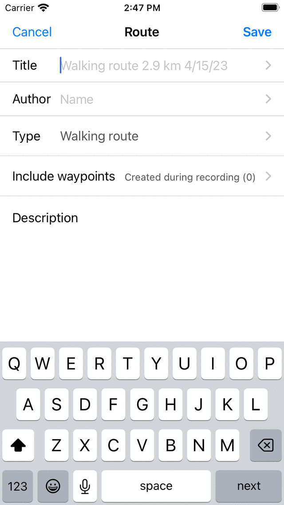

.. _sec-route-record:

Recording routes
----------------
When recording your route all the locations your are visiting are collected. If you finish the recording, you can save the locations as a route.

<APPLE>
To record a route you need make sure that Topo GPS is given access to your precise location while using the app in the iOS Settings > Privacy > Location Services > Topo GPS.
</APPLE>
<ANDROID>
To record your route, you need to make sure that Topo GPS is given access to your precise location and that Topo GPS is allowed to use your battery in the background.

To enable location access for Topo GPS, first go in the Android settings app to Apps > Topo GPS > Permissions. Here enable the location permission. Enable 'Use precise location' as well. Also 'Allow background battery usage' in Apps > Topo GPS > App battery usage.

For best performance with recording routes it is also recommended to enable notifications in Apps > Topo GPS > Permissions > Notifications 
for the Topo GPS route recorder. 
</ANDROID>

Starting a recording
~~~~~~~~~~~~~~~~~~~~
To start a route recording, you have to open the :ref:`routes pop-up <sec-routes-popup>` (Menu > Routes) and tap the item 'Record route'. 
A pop-up will appear in which you are asked whether you want to start a recording as in the example below:

   
   *Starting the recording of a route.*

If you tap 'Start' in the pop-up, the route recording will be started.

Alternatively, you can also start recording a route from the :ref:`main screen <sec-main-screen>`, by tapping the :ref:`record timer <ss-rec-timer>` on the dashboard. 

Recording route
~~~~~~~~~~~~~~~
If you have started a recording, you will see that a red line will appear on the map if you are moving. This red line indicates your movement. An example is displayed in the figure below:

   *Recording a route. The red line indicates your movement.*

The :ref:`record timer <ss-rec-timer>` on the dashboard indicates the duration of the current recording.
In the figure above this is 1h06m. If you tap the timer you can :ref:`end the recording <ss-route-record-end>`.

The :ref:`record distance meter <ss-rec-distance>` on the dashboard indicates
the length of a recorded route. In the example above this is 2.9 km. If you tap the record distance meter the map will be zoomed to the recorded route.

You can modify the color, width and transparency of the record line via :ref:`Menu > More > Settings > Styles > Record line <sec-settings-styles>`.

While recording you can safely lock your device or switch to another app. This will not interrupt the recording. In the top of the screen you can see that Topo GPS is using your location in the background.  In some devices the clock gets a blue background, on other devices the whole status bar turns blue. If you tap the blue clock or the blue statusbar, you will return to Topo GPS.

If you tap on the line of the recorded route on the main map, the record screen will be opened. You can view a live altitude and speed profile. You can tap these :ref:`profiles <sec-route-profiles>` to view them in more detail. 

   *The route record screen with live altitude and speed profiles.*

If you have :ref:`loaded <sec-routes-load>` one or more routes on the map, you can record a route at the same time. An example is shown below:

   *Recording and showing a route.*

On the dashboard the 'dtg' symbol is shown, this is the distance to go to the end of the blue route, which is 1.9 km in the example above. 
The 'rec' symbol on the dashboard indicates the length of the recorded route, which is 2.9 km in the example above. If you tap the 'rec' symbol, the map will be zoomed to the recorded route. If you tap the 'dtg' symbol, the map will be zoomed to the blue route.

While recording a route, every second your location is determined in the most accurate way possible.

Battery usage
~~~~~~~~~~~~~
Recording a route will cost a considerable amount of energy. Therefore regularly check your battery level while recording to make sure your device is not running out of power. :ref:`Pause <ss-route-record-pause>` or :ref:`finish <ss-route-record-end>` a recording when your are no longer moving. On a typical modern iOS device recording costs about 6-8% of battery per hour. With a full good quality battery, it is possible to record a trip of up to 10 - 12 hours long. For longer recordings, you need to recharge your battery, for example with a powerbank.

The amount of battery usage really depends on the quality and size of your battery, and on the other things you are doing while recording. Turning off the screen can make a considerable difference. You could also enable the switch 'Cover camera' in the :ref:`Switching off display section <sec-settings-switching-off-display>` of the settings.

If you have saved the recorded route, you can inspect the amount of battery percentage used in the :ref:`additional route details screen <ss-additional-route-details>`. To open the additional route details, open the :ref:`route details screen <sec-route-details>`, and then tap the title section just below the map.

.. _ss-route-record-end:

Ending recording
~~~~~~~~~~~~~~~~
You can end the a recording of a route by tapping the route button or Menu > Routes to open the routes pop-up.
Then tap 'Stop recording'. Alternatively, tap the :ref:`record timer <ss-rec-timer>` on the dashboard or tap 'Stop recording' in
the record screen. The record screen can be opened by tapping the line of the recorded route on the map.

A pop-up will appear asking you to stop the recording like in the example below: 

.. figure:: ../_static/route-record4.jpg
   :height: 568px
   :width: 320px
   :alt: Stopping route recording Topo GPS

   *Ending recording a route.*

If you press 'Stop' the recording will be ended and a screen is presented in which you can :ref:`save the recorded route <ss-record-save>`.

.. _ss-route-record-pause:

Pause recording
~~~~~~~~~~~~~~~
If you press 'Pause' in the pop-up which appears when :ref:`ending a route recording <ss-route-record-end>`, the recording will be paused. 

The :ref:`record timer <ss-rec-timer>` on the dashboard will be set to '--:--' during a pause. The :ref:`record distance meter <ss-rec-distance>` will show the recorded distance as you can see below:

   *The recording of a route has been paused, which can be seen from the record timer and record distance meter.*
   
.. _ss-record-restart:

Restart recording
~~~~~~~~~~~~~~~~~
To restart a paused recording you have tap :ref:`record timer <ss-rec-timer>` or
the ‘Restart recording’ button in the top of the record screen. The following pop-up will then appear:

   *Restarting the recording of a route.*

If you press 'Restart' the recording will be continued. If you press 'Stop'
the recording of a route will be finished and you will be
given the possibility to :ref:`save the recorded route <ss-record-save>`.

.. _ss-record-save:

Saving recording
~~~~~~~~~~~~~~~~
If you have :ref:`stopped the recording of a route <ss-route-record-end>` a screen will appear
in which you can save the recorded route. An example is displayed below:

   *Saving a recorded route.*

In this screen you can subsequently enter the title, the author and a description. 

Based on the start and finish point of the route an automatic suggestion for the route title
will be made. This suggestion appears in the title field if you do not enter a title yourself.
If you do not enter a title, the suggestion will be used when saving the route. 

To ensure automatic title suggestion functions properly, the option :ref:`‘Addresses - Find automatically’ <sec-settings-addresses>` should
be enabled in the :ref:`settings <ss-settings>`.

If you press the '>' on the right hand side of the title you can add an URL.

If you press the '>' on the right hand side of the author you can add contact information, and copyright and license details. If you save a route also the author and copyright details will be saved for future use. If you record or plan a new route, the same author and copyright details will already be filled in. Therefore you do not have to reenter these details when saving the next recorded route.

You can alter the route type by pressing the route type field. If you save the route, the current route type will be used as a route type suggestion for the next saved route. If you for example only record bicycles routes you therefore only have to set the route type once.

Using the setting 'Include waypoints' you can determine which waypoints that are currently shown on the main screen map will be included in the saved route. By tapping this setting you can choose between: all waypoints that are on the map, waypoints near the route, waypoints created during recording, and no waypoints. The number between parentheses indicate the number of waypoints to be included. We recommend to set 'Include waypoints' to 'waypoints created during recording'. Then only waypoints that are loaded on the map and created during the recording will be added to the route. This ensures no irrelevant waypoints, which for example photo's from another day are added to the route. If you choose for 'waypoints near route', you can determine the maximal distance of the waypoints to the route. Be careful with setting the value to 'All waypoints'. This might cause adding waypoints which are far a way and hence irrelevant to the saved route.

If you are done, you can press 'Save' on the top right to save the recorded route. If you do not want to save the route you can press 'Cancel' on the top left.

The route will be saved into the folder that is currently opened in the :ref:`saved routes screen <sec-routes-load>`.

After you have saved the recorded route, a pop-up will appear that asks you if you would like to share your route with Topo GPS or with another app (for this tap 'More). If you do not want to share the recorded route, you can tap 'Cancel'.

If you choose Topo GPS you can :ref:`share your route with other Topo GPS users <sec-routes-share-topo-gps>`, so that they can :ref:`import your recorded
route <ss-routes-import-shared>`. 

It is also possible to :ref:`share the recorded route <sec-routes-share-topo-gps>` later.

Immediately after saving the route, the :ref:`route details screen <sec-route-details>` will be shown. Here you can view and edit the details of the route, and load the recorded route on the map by tapping the map button on the top right of this screen.

You can also :ref:`load the recorded route on the map <sec-routes-load>` at a later time.
