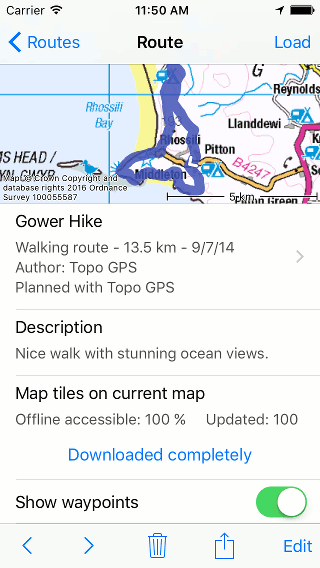
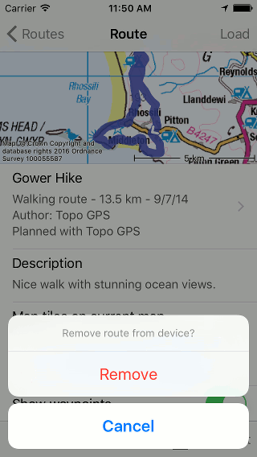

.. _sec-route-remove:

Removing routes
===============
To remove a route from your device you first have to open the :ref:`route details screen <sec-route-details>`.

You can do this by pressing the info button on the right hand side of a route in the :ref:`save routes tab of the routes screen <sec-routes-load>` or by
tapping a route that is loaded on the map.

An example of the route details screen is displayed below:

   *The route details screen of the route 'Gower Hike'.*

You can remove the route from your device by pressing the trash icon on the bottom of
the route details screen. A pop-up will appear in which you have to confirm the removal as is shown below:

   *Removing the route ‘Gower Hike’.*

If you press ‘Remove’ the route will be removed from your device.

If you have enabled :ref:`iCloud synchronization of routes <ss-routes-synchronize-icloud>` the route will also be removed from iCloud and from all devices that are synchronized with the same iCloud account.

It is also possible to remove multiple routes. Open the 'Routes' tab of the routes screen. Press 'More > Select’ and :ref:`select <sec-routes-select>` the routes that need to be removed. Next press the trash icon on the bottom of the screen and confirm the removal.

If you only want to :ref:`remove a route from the map (and not from the device) <sec-routes-unload>` you have to tap 'Remove from map' in the route details screen. 
