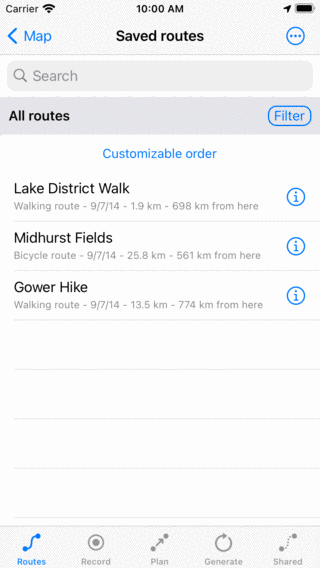

.. _sec-routes-screen:
 
Routes screen
=============
 
Routes can be controlled via the routes screen.
The routes screen can be opened by tapping the :ref:`route button <ss-route-button>` on the dashboad. 
This is the button in the bottom right of the :ref:`main screen <sec-main-screen>`. 
Alternatively you can open the routes screen by tapping :ref:`Menu <sec-menu>` > Routes.

   *The routes screen with a tabbar in the bottom.*
      
In the bottom of the routes screen you find a tab bar with five different tabs. These are

- *Routes*: This tab shows the routes that are locally stored on your device. This tab can be used for :ref:`loading routes on the map <sec-routes-load>` and exporting your routes.
- *Record*: With this tab you can record your route.
- *Plan*: With this tab you can plan a route.
- *Generate*: With this tab you can generate a route.
- *Shared*: This tab shows routes shared by other Topo GPS users. You can browse through these routes and import on to your device.

To open a tab, tap an item in the bottom tab bar. The currently opened tab is colored blue. The app remembers the last opened tab. So if you have opened the 'Plan' tab, return to the main screen and open the routes screen again, the routes screen will be opened with the 'Plan' tab open.
