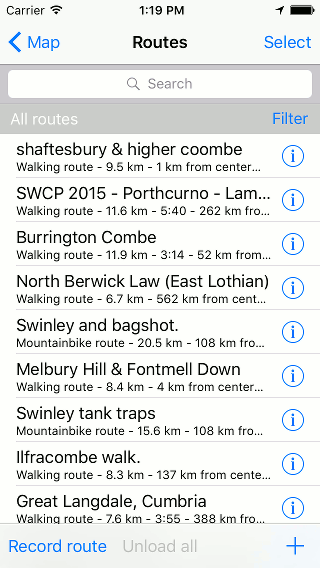
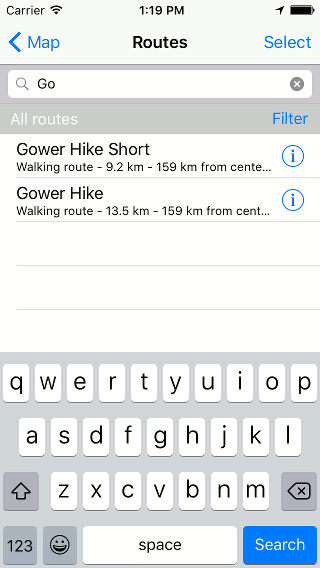
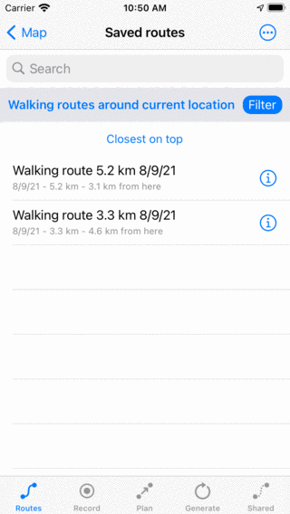
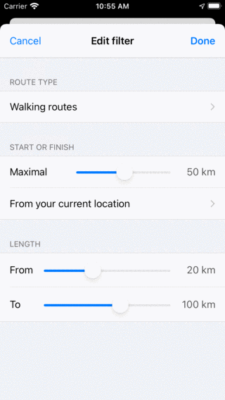

.. _sec-routes-search:

Searching routes
================
In the 'Routes' and 'Shared' tab of the :ref:`routes screen <sec-routes-screen>` you can search routes by :ref:`entering keywords in the search bar <ss-route-search-keywords>`, and by :ref:`applying filters <ss-route-filter>`. Furthermore you can :ref:`sort the routes <ss-route-sort>` in various ways.

.. _ss-route-search-keywords:

Searching routes with keywords
~~~~~~~~~~~~~~~~~~~~~~~~~~~~~~
If you enter a keyword in the search bar on the top of the list of routes only routes will be shown which have the keyword in its title, description or author. Search is case insensitive.  If you search in a folder, also all search results in descendant folders will be displayed.
If a :ref:`filter <ss-route-filter>` is applied, the search will restrict itself to the filtered route.

  
   *Searching on 'Stone'*
   
.. _ss-route-sort:

Sorting routes
~~~~~~~~~~~~~~
Below the folder/filter bar below the search bar, the current sort method is displayed in the middle.
If you tap the sort button you can change the current sort method between:

- *Customizable order*: The routes are sorted in customizable order. If you did not change the order manually, the most recent added routes are on top.
- *Closest on top*: The routes are sorted according to their distance of the start or end point to your current location, the closest is on top.
- *Newest on top*: The routes are sorted according to their creation time, the newest is on top.
- *Longest on top*: The routes are sorted on length, the longest is on top.
- *Shortest on top*: The routes are sorted on length, the shortest is on top.
- *Oldest on top*: The routes are sorted according to their creation time, the oldest is on top.
- *Most recently updated on top*: The routes are sorted according to the time at which they were last changed, the routes that was changed most recently is on top.
- *Least recently updated on top*: The routes are sorted according to the time at which they were last changed, the routes that was changed the longest go is on top.
- *Alphabetically*: The routes are sorted in alphabetical order.

  
   *Sorting routes on distance to current location.*

.. _ss-route-filter:

Filtering routes
~~~~~~~~~~~~~~~~
It is also possible to filter routes on location and on route type.
To enable a filter, tap the filter button in the routes screen (just below the search bar on the right hand side). If the filter is enabled, the filter button has a blue background, as in the figure below. If the filter is disabled, only the edge of the filter button is blue, as in the figure above.

  
   *A filter is enabled.*
   
In the figure above you see an example of an enabled filter. Below the search bar on the left hand side you see a description of the currently active filter. 
Here the routes are filtered on location, only routes within 100 km of the current location are shown.
If you tap the filter description you can modify the current filter. To disable the filter, tap the filter button.

To edit a filter, tap the filter button to enable the filter. Then tap the filter description to modify the current filter. 
The following screen will be shown in which you can change the current filter:

  
   *Modifying a filter.*

.. _ss-route-filter-type:

Filtering on route type
-----------------------
In the section 'Route type' you can filter the routes on route type, like for example 'Walking routes'.
If you choose for 'All routes' the routes are not filtered on route type.

.. _ss-route-filter-location:

Filtering on location
---------------------

In the section 'Start or finish' you can change the properties of the location filter.
The slider can be moved to determine the maximal distance of the start or finish of a shown route to a specific point.
Below the slider, the point is displayed. In the example above this is the current location.
If you tap it, you could change the current point to:

- *Everywhere*: There is no filtering on location.
- *Current location*: Only routes within a certain distance of the current location are shown.
- *Visible part of map*: Only routes that are within the bounds of the currently visible part of the main map are shown in the routes srceen.
- *Custom location*: If you enter a custom location or coordinate only routes within a certain distance of the entered location are shown.

.. _ss-route-filter-length:

Filtering on route length
-------------------------
In the section 'Length' you can set the minimal and maximal length of the filtered routes. 
