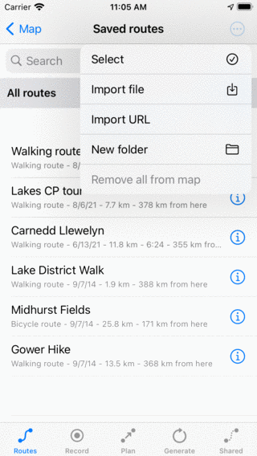
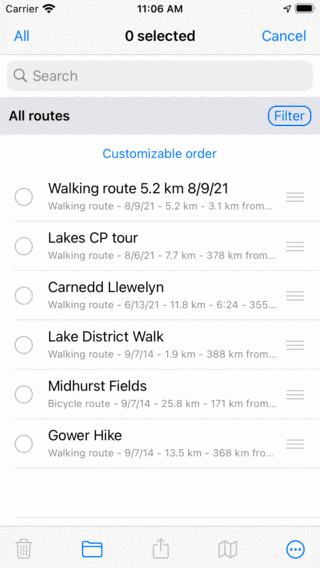

.. _sec-routes-select:

Selecting routes
================

In the 'Routes' tab of the :ref:`routes screen <sec-routes-screen>` you can
select routes and perform one of the following actions on the selected routes: 

- Remove selected routes
- Move selected routes into a folder
- Export selected routes
- Load selected routes on the map
- Remove selected routes from the map

Selecting routes is similar to :ref:`selecting waypoints <ss-waypoints-select>`.

Opening selection screen
~~~~~~~~~~~~~~~~~~~~~~~~
If you press the button 'More' on the top right of the 'Routes' tab, a menu will be shown as in the figure below.

   *The more menu of the routes tab.*

Press ‘Select’ in the menu to open the selection screen. It is also possible to open the selection screen by pressing long on an item in the routes list. That item will then be selected immediately. An example of a selection screen is shown below:

   *The selection screen in which you can select routes.*

Selecting route
~~~~~~~~~~~~~~~
To select a route, tap a route item in the selection screen. A checkmark will show up and the background of the route row will become grey to indicate that it is selected. An example in which two routes are selected is displayed below:

.. figure:: ../_static/routes-select3.png
   :height: 568px
   :width: 320px
   :alt: Two selected routes Topo GPS

   *Two selected routes.*

The title of the selection screen shows how many items are selected. You can deselect a route by tapping a selected one. If you want to select all routes in the list, you have to press ‘All’ on the top left. To return to the usual routes screen you have to press ‘Cancel’.

Performing an action
~~~~~~~~~~~~~~~~~~~~
If you have made a selection you can perform an action with one of the buttons
in the toolbar on the bottom of the screen. The toolbar buttons are from left to right:

- *Trash button*: If you press this button a pop-up will ask to to whether you would like to remove the selected routes from your device (and iCloud if enabled). If you press 'Remove' the selected routes will be removed.

- *Folder button*: If you press this button a screen with the folder tree will be opened. You can select a folder and the selected routes will be moved to a new folder.

- *Export button*: If you press this button the export pop-up will be shown. In this pop-up you can select the kind of data to be exported and change the export settings. If you press 'Export' in the export pop-up the selected routes will be exported. Another pop-up with apps and actions will be shown. If you tap an app or action, the result of the export will be handled by the app or action.

- *Map button*: If you press this button, the selected routes will be loaded on the map. The map will zoom automatically to the selected waypoitns and you will be returned to the map.

- *More button*: If you press the more button in the bottom toolbar, a menu will appear from which you can choose the following actions:

  - *Remove from map*: If you press this button, the selected routes will be removed from the map.
