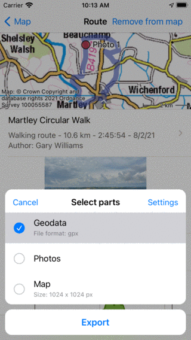
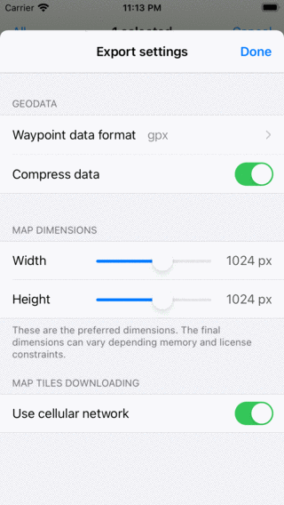
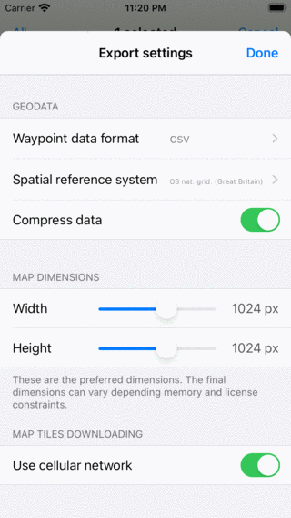

.. _sec-routes-export:

Exporting routes
================

To export a single route, open the :ref:`route details screen <sec-route-details>` and tap the export icon in the bottom toolbar.

To export multiple route, open the :ref:`routes screen <sec-routes-screen>` and select the 'Routes' tab. Then open the :ref:`route selection screen <sec-routes-select>` by tapping More > Select. Select the desired routes and folders and tap the export icon in the bottom toolbar.

After pressing the export icon the export pop-up will appear in both cases, an example is shown below:

   
   *The export pop-up.*
   
In the export pop-up you can select the kind of data that will be exported when pressing the export button in the bottom of the pop-up.
The kind of exported data can be any combination of the following:

- *Geodata*: If you include 'Geodata' a data file containing the waypoint(s) will be exported. The file format is shown in the subtitle of the geodata item. In the example above it is gpx.zip. If you press :ref:`settings <ss-waypoints-export-settings>` you can change the dataformat. Supported file formats for exporting waypoints are gpx, gpx.zip, kml, kmz, geojson, geojson.zip, csv and csv.zip.
- *Photos*: If you include 'Photos' the photos of the waypoint(s) will be exported as well. This item is not available if their are no photos.
- *Map*: If you include 'Map' a map of the waypoint(s) will be exported. The pixel size of the map is displayed in the subtitle. You can change the pixel size in the :ref:`export settings <ss-waypoints-export-settings>`.

After you have selected the kind of data to be exported you can press 'Export' in the bottom of the export pop-up to export the waypoint(s). Then a regular iOS pop-up will show up in which you can pick an app to send the exported data to. For example, iMessage to send the waypoint to a friend, or the files app to save the waypoint on the cloud.

.. _ss-waypoints-export-settings:

Export settings
~~~~~~~~~~~~~~~
In the export pop-up you can also change the export settings by pressing the 'Settings' button on the top right of the export pop-up. Then the following screen will appear:

   
   *The waypoint export settings screen.*

The first section in the export settings screen is about geodata.
Here you can set the dataformat of the to be exported waypoint(s). By tapping 'Waypoint data format' you can choose between gpx, kml, csv and geojson.
You can decide whether you want to compress the data. If you enable compression the exported geodata file will be zip compressed. The file size will be much smaller than without compression. 

If you export to csv or geojson, you can also choose the spatial reference system (coordinate system) to be used in the exported data. If you for example want to generate a csv from the waypoints with coordinates in the OS National Grid system, you can set the spatial reference system to OSNG as in the example below:

   
   *The waypoint export settings screen.*
   
The remaining sections deal with the map (image) that can be exported. You can set the desired pixel width and height with the sliders. Also to generate a map sometimes map tiles need to be downloaded. You can determine if you want to allow cellular downloads of map tiles.
 

Exporting all routes
~~~~~~~~~~~~~~~~~~~~

To export all waypoints stored on your device, open the :ref:`waypoints screen <ss-waypoint-load>` (Menu > Waypoints). Make sure that the filter is not active (filter button has a blue edge). Go to the root waypoint folder, so that 'All waypoints' is displayed below the search bar. Make sure that the search bar is empty. 
Then open the :ref:`waypoint selection screen <ss-waypoints-select>` by tapping More > Select. Press 'All' on the top left to select all waypoints and folders. Then tap the export icon in the bottom toolbar to open the export pop-up. Select the kind of data to be exported in the export pop-up and press 'Export'.

