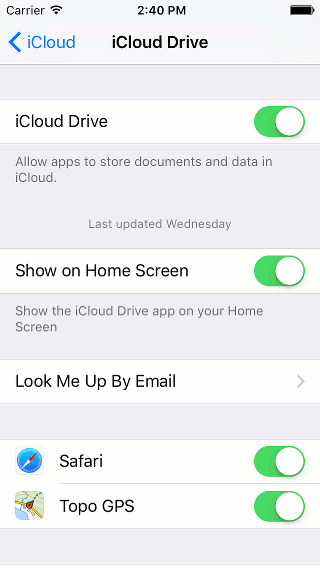
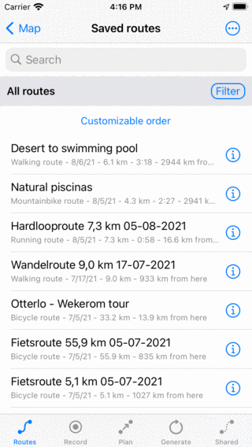
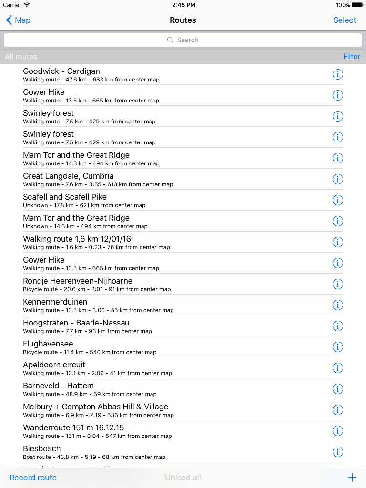
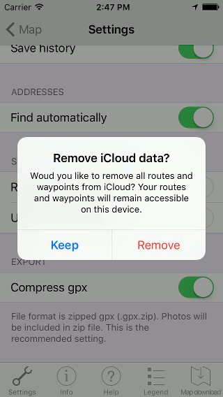

.. _ss-routes-synchronize-icloud:

Synchronizing routes and waypoints with iCloud
==============================================

Routes and waypoints can be synchronized automatically with iCloud in Topo GPS. This makes all your routes and waypoints accessible on all your devices.
This has two advantages:

- *Convenience*: For example, you plan a hike on your iPad. If you save that route, it will be available on your iPhone within a few seconds. You can go outdoors with your iPhone to walk the planned route. Then if you record your route on your iPhone and save it when finished, the recorded route will be accessible on your iPad as well. Hence you can view your recorded route on your iPad.

- *Backup*: With synchronization a copy of all your routes and waypoints will be made on iCloud. If your remove Topo GPS or if your loose your device, your routes and waypoints will not be lost.

Required settings
~~~~~~~~~~~~~~~~~
To enable iCloud synchronization of routes and waypoint you have to do the following.

First you have to be logged in to iCloud (Settings > iCloud). If you want to synchronize between devices, these devices should use the same iCloud account.

Next you should enable on all devices the iOS setting: Account > iCloud > Topo GPS, like in the figure below:

   *To synchronize routes and waypoints with iCloud, the iOS setting iCloud > Topo GPS should be enabled.*

Finally you have to enable the Topo GPS :ref:`setting <ss-settings>` (Menu > More > Settings) Routes and Waypoints - Synchronize with iCloud, as is shown below:
 
.. figure:: ../_static/icloudsync2.png
   :height: 568px
   :width: 320px
   :alt: Routes and waypoints synchronize iCloud

   *To synchronize routes and waypoints with iCloud, Menu > More > Settings > Routes and Waypoints - Synchronize with iCloud should be enabled.*

Automatic synchronization
~~~~~~~~~~~~~~~~~~~~~~~~~
If the settings are correct, no more action is required, synchronization will occur completely automatically. All modifications to routes and waypoints will be sent to iCloud when possible. If a device detects changes on iCloud, they will immediately be carried out.

Below you see an example of iCloud synchronization with an iPhone and iPad. First 'Saved routes' screen on the iPhone:

   *The 'Saved routes' on an iPhone.*

Due to iCloud synchronization, the saved routes screen of the iPad contains exactly the same routes in the same order as the iPhone, as you can see below:

   *The saved routes screen on the iPad contains exactly the same routes as the iPhone due to iCloud synchronization.*

Percentage synchronized with iCloud
~~~~~~~~~~~~~~~~~~~~~~~~~~~~~~~~~~~
To see the percentage of routes or waypoints synchronized with iCloud, pull the list with waypoints or routes down. On the top the percentage synchronized with iCloud will be displayed, as you can see in the example below:

Details of iCloud synchronization
~~~~~~~~~~~~~~~~~~~~~~~~~~~~~~~~~
If you enable iCloud synchronization, your routes and waypoints will still be stored locally on your device. This ensures that your routes and waypoints remain always accessible, even without internet connection and if iCloud is unreachable.

If synchronization is enabled, a copy of all routes and waypoints (with corresponding photos) will be made on iCloud.

Suppose that you have a number of devices which each contain a number of routes and waypoints. Now, enable iCloud synchronization on all these devices. On each device the combination of all routes and waypoints will now be accessible. In case similar routes were available on different devices, it could happen that some routes appear multiple times in the routes screen after synchronization. You can remove this duplicates manually, and this only has to be done once.

If you remove a route or waypoint from a device, they will be also removed from iCloud and all other devices automatically.

If you edit a route or waypoint on one device, and at the same time also at another, a synchronization conflict could occur. Topo GPS then always synchronizes the route that has last been modified and does not give a warning.

The speed at which routes and waypoints are synchronized and become available on other devices depend on the quality of the network connection and the battery level. In good circumstances a route/waypoint will be available on another device within 10 seconds, but sometimes it can take longer.

If you open the routes/waypoints screen all not synchronized modifications will be synchronized. By opening the routes/waypoints screen you can hence force a synchronization.

If you would like to synchronize routes and waypoints on a mobile network (be aware this can lead to increased data traffic and battery usage) you have to enable the Topo GPS setting: Synchronize with iCloud - Use mobile network. Also the iOS settings iCloud > Use mobile data should be enabled.

The routes and waypoints that are synchronized with iCloud, are only accessible from within the Topo GPS app with your iCloud account. You will not find your routes in iCloud Drive. Also other users cannot access your synchronized routes and waypoints.

Disabling iCloud synchronization
~~~~~~~~~~~~~~~~~~~~~~~~~~~~~~~~
If you do not longer want to synchronize your routes and waypoints with iCloud,
you can disable synchronization in the Topo GPS :ref:`settings <ss-settings>`.
If you disable iCloud synchronization a pop-up will appear, as is displayed below:

.. figure:: ../_static/icloudsync6.png
   :height: 568px
   :width: 320px
   :alt: Routes and waypoints synchronize iCloud

   *If you disable iCloud synchronization, you will be asked whether you want to remove all routes and waypoints from iCloud or to keep them on iCloud.*

You have to choose whether to keep or remove all routes and waypoints from iCloud.
In both cases all routes and waypoints will be kept locally on your device. Locally no routes and waypoints will be removed.

- *Keep*: The routes and waypoints will be kept on iCloud, and synchronization via others possible devices can continue as normal.
- *Remove:* All routes and waypoints will be removed from iCloud. On other possible devices on which iCloud synchronization is still enabled, an alert will appear. This alert will tell the user that all its routes and waypoints have been removed from iCloud. The alert shows to options. The user could decide to remove all routes/waypoints locally. Or to resynchronize all locally stored routes with iCloud.
