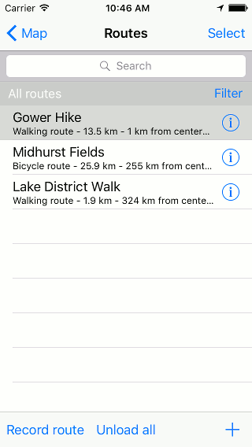

.. _sec-routes-unload:

Removing routes from map
------------------------
A route can be removed from the map in several ways.

Routes screen
~~~~~~~~~~~~~
Tap the route button on the dashboard to open the :ref:`routes screen <sec-routes-screen>`. Then select the tab 'Routes'. An example is shown below:

   *An example of the routes screen with one loaded route.*

The routes with a gray background are currently loaded on the map. If you tap a gray item, it will be removed immediately on from the map.

It is also possible to remove all loaded routes from the map at once by tapping: More (top right in the Routes tab) > Remove all from map.

Map
~~~
If you tap a route line of a route that is loaded on the map, the :ref:`route details screen <sec-route-details>` will be opened. You can tap 'Remove from map' in the top right of the route details screen. The route will be immediately removed from the map and you will return to the main screen.

