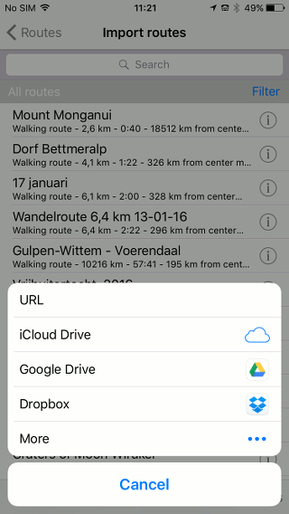
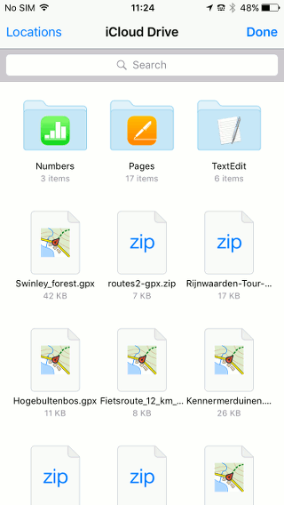
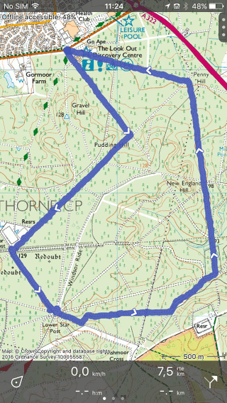

.. _ss-routes-import-cloud:

Importing routes and waypoints from the cloud
=============================================

Routes and waypoints that are stored in the cloud (i.e. iCloud Drive, Dropbox, Google Drive, One Drive, etc.) can be imported into Topo GPS.

You can import the following file formats into Topo GPS:

- gpx
- zipped gpx (gpx.zip)
- kml and mkz
- OZI explorer track file (.plt)

Importing from Topo GPS
~~~~~~~~~~~~~~~~~~~~~~~
To import routes or waypoints from the cloud you have to open
the :ref:`routes screen <ss-route-load>` first. Then you press ‘+’ on the bottom
of the routes screen to open the import routes screen. Next you press ‘More import possibilities’. A pop-up will appear which shows the installed cloud apps, like
in the figure below:

   *Figure 1. List of installed cloud apps which can be used to import routes.*

If your preferred cloud app is not listed, you need to make sure that its app is installed on your device. Next you should press ‘More’ in the pop-up and enable your Cloud App if it turns out to be disabled.

As an example we now choose iCloud Drive in the pop-up of Fig. 1. Importing from other Cloud apps is similar. The following screen will appear:

   *Figure 2. Importing a route from iCloud Drive.*

A list of files that are stored in iCloud Drive is listed. The files that could be imported into Topo GPS are highlighted. If you want to import a file, you have to press its icon. We now press on ‘Swinley_forest.gpx’. The file will be imported and its route will be displayed on the map as you can see in the figure below:

   *Figure 3. A route has been imported from iCloud Drive.*

Importing from cloud app
~~~~~~~~~~~~~~~~~~~~~~~~
Another possibility is to open your cloud app (iCloud Drive, Dropbox, Google Drive, OneDrive, etc.) from the screen with apps. 

You press the file you would like to import. Then you should press the share/export icon. Finally you should choose ‘Copy to Topo GPS’. The file will then be imported into Topo GPS and the containing routes and waypoints will be stored on your device and displayed on the map.