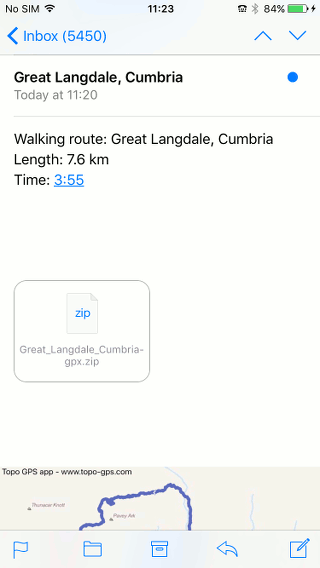
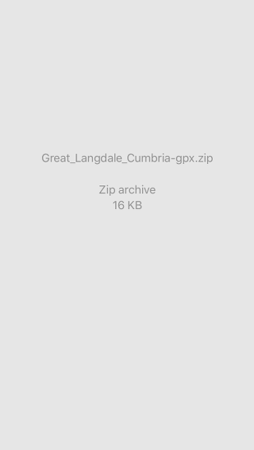
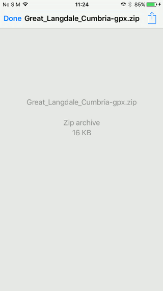
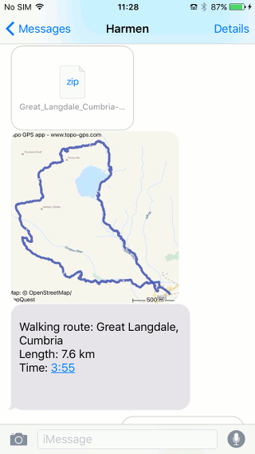
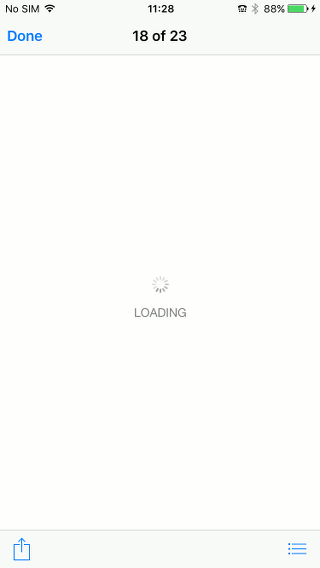
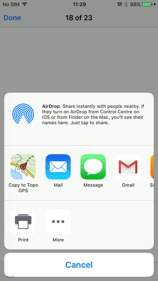

.. _ss-routes-import-mail:

Importing routes and waypoints from e-mail and iMessage
=======================================================
Routes and waypoints that you have received via e-mail or
iMessage can be imported into Topo GPS.

You can import the following file formats into Topo GPS:

- gpx
- zipped gpx (gpx.zip)
- kml and kmz
- OZI explorer track file (.plt)

Importing from mail
~~~~~~~~~~~~~~~~~~~
A route/waypoint file that you have received in an e-mail is
indicated with an icon. An example is displayed in the 
figure below:

   *Figure 1. An e-mail with an attached zipped gpx file.*

To import the attached file you have to press **long** on the 
attachment icon. If you press shortly on the attachment opening
will be more complicated.

Long press on the attachment
~~~~~~~~~~~~~~~~~~~~~~~~~~~~
A pop-up will appear like in the figure below:

.. figure:: _static/import-mail-zip2.png  
   :height: 568px
   :width: 320px
   :alt: Importing files Topo GPS

   *Figure 2. A pop-up with which you can import the file into Topo GPS.*

A pop-up with a list of apps will appear, including Topo GPS. If you do not see the Topo GPS icon you have to scroll through the list off apps. You can drag the Topo GPS icon to the front if you like.

To import the attachment into Topo GPS you have now to press ‘Copy to Topo GPS’
in the pop-up. The attached file will then imported and the included routes and waypoints will be displayed on the map like in the figure below:

   *Figure 3. A route has been imported from an e-mail.*

Short press on attachment
~~~~~~~~~~~~~~~~~~~~~~~~~
If you have pressed shortly on the attachment icon, mail will try to open the attachment. If you open a zip file, a grey screen will appear. If you open a gpx file, you will see lots of code. Sometimes however, first a black screen will appear, then you have to press this screen so that the grey screen appears. 

You have to tap this grey screen or the screen with code so that a toolbar appears on the top of the screen, like in the figure below:

   *Figure 4. Opening a file in mail.*

You now have to press the export icon on the top of the screen. A pop-up like in Figure 2 will appear. You now have to choose ‘Copy to Topo GPS’ to import the file into Topo GPS. 

Importing from iMessage
~~~~~~~~~~~~~~~~~~~~~~~
A route/waypoints file that you have received via iMessage can be imported into Topo GPS. An example is shown in the Figure below:

   *Figure 5. An iMessage with a zipped gpx file.*

You can import the attached file by pressing shortly on the attachment icon. iMessage will try to open this file. You might see a black screen, a grey screen, a white screen, or a screen with code without any buttons. Press one or more times on the screen so that a toolbar appears on the bottom of the screen, like in the figure below:

   *Figure 6. Importing a route file from iMessage.*

On the left hand side of the bottom toolbar, you can find an export icon. If you press this export icon a pop-up with a list of apps will appear, including Topo GPS. If you do not see Topo GPS you have to scroll through the list. An example of this pop-up is displayed below:

   *Figure 7. Importing a route file from iMessage.*

If you press ‘Copy to Topo GPS’ in this pop-up the file will be imported into Topo GPS and the containing routes and waypoints will be displayed on the map.
