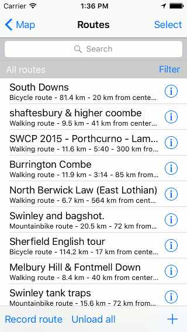
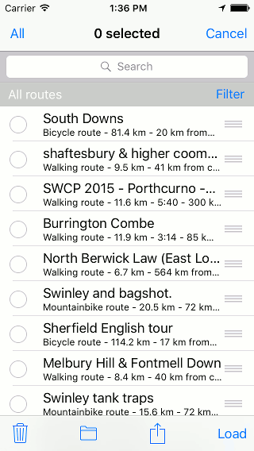
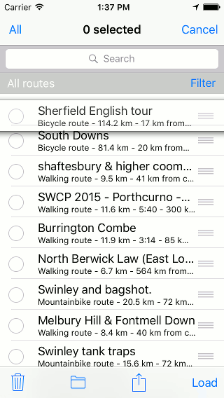
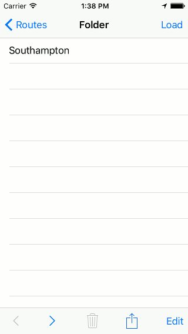

.. _ss-routes-organize:

Organizing routes and waypoints
===============================
In the :ref:`routes screen <ss-route-load>` and
in the :ref:`waypoints screen <ss-waypoint-load>` 
you can organize routes and waypoints into folders and
you can reorder the routes and waypoints.

Organizing waypoints is similar to organizing routes. Below,
we will organize routes as an example.

An example of the routes screen is displayed below:

   *Figure 1. An example of the routes screen.*

To alter the ordering of the routes/waypoints, to create
new folders, and to move routes/waypoints into folders
you have to open the selection screen. You can do this by
pressing ‘Select’ on the top of the routes/waypoints screen.
An example of the selection screen is displayed below:

   *Figure 2. An example of the selection screen.*

.. _ss-routes-organize-reorder:

Reordering routes and waypoints
-------------------------------
In the selection screen (Fig. 2) you can alter the ordering of the routes/waypoints
that appears in the routes/waypoints screen. For this, the :ref:`filter <ss-routes-search-filter>` has
to be set to ‘All routes’/‘All waypoints’.

To reorder you have to hold your finger on the icon with the tree lines on the right hand side
of a title. You can now drag the item to the desired position as is illustrated in the figure below.

   *Figure 3. Reordering routes.*

If you release your finger the route/waypoint will be moved. If you leave the selection screen
by pressing ‘Cancel’ you can see the result of the reordering.

.. _ss-routes-organize-folder:

Organizing routes and waypoints into folders
--------------------------------------------
You can organize your collection of routes and waypoints into folders. This may
help to keep the lists in the routes/waypoints screen clear.

Folders will only appear in the routes/waypoints screen if the :ref:`filter <ss-routes-search-filter>` 
is set to ‘All routes’/‘All waypoints’.

Creating folders
~~~~~~~~~~~~~~~~
To create a folder you have to open the selection screen (Fig. 2) first. 
You have to make sure that no items are selected.
Next you press the folder icon on the bottom of the screen.
You will be shown the following screen in which you can give the folder a name:

.. figure:: _static/route-folder1.png
   :height: 568px
   :width: 320px
   :alt: Creating folder Topo GPS

   *Figure 4. Creating a folder.*

If you press ‘Save’ in the top of the screen, the folder will be created.
The newly created folder will be put on top of the list of routes/waypoints.
This is illustrated in the figure below in which the folder ‘Southampton’ has
been created.

.. figure:: _static/route-folder2.png
   :height: 568px
   :width: 320px
   :alt: Creating folder Topo GPS

   *Figure 5. The folder ‘Southampton’ has been created.*

Moving routes/waypoints into folders
~~~~~~~~~~~~~~~~~~~~~~~~~~~~~~~~~~~~
To move routes, waypoints and folders into a folder you
have to open the selection screen by pressing ‘Select’.

.. figure:: _static/route-folder3.png
   :height: 568px
   :width: 320px
   :alt: Moving folder Topo GPS

   *Figure 6. The selection screen.*

Next you have to select the items that have to be moved, as
is illustrated below:

.. figure:: _static/route-folder4.png
   :height: 568px
   :width: 320px
   :alt: Moving folder Topo GPS

   *Figure 7. Selecting the items that need to be moved.*
 
Then you have to press the folder icon in the bottom of the screen.
You will be shown an overview of all the existing folders as
is illustrated in the figure below:

.. figure:: _static/route-folder5.png
   :height: 568px
   :width: 320px
   :alt: Moving folder Topo GPS

   *Figure 8. Moving items into a folder.*

In this screen you can choose a folder by pressing it. The selected items
will then be moved to the chosen folder and do not longer show up directly
in the routes screen as you can see below:

.. figure:: _static/route-folder6.png
   :height: 568px
   :width: 320px
   :alt: Moving folder Topo GPS

   *Figure 9. The routes screen. Some of the routes shown in Fig. 6 have been moved into 
	the folder ‘Southampton’.*

Opening folders
~~~~~~~~~~~~~~~
To open a folder you have to tap the corresponding item in the routes/waypoints screen.
If we open the folder ‘Southampton’ from Fig. 9, the following screen will appear:

.. figure:: _static/route-folder7.png
   :height: 568px
   :width: 320px
   :alt: Moving folder Topo GPS

   *Figure 10. The contents of the folder ‘Southampton’.*

Below the search box you can see the folder path and the title of the current folder.
You can go back to the root folder by pressing ‘All routes’/‘All waypoints’.

In Fig. 10 you can see that the moved routes indeed can be found in the folder ‘Southampton’.

Routes and waypoints that you import in Topo GPS will be automatically saved in the folder
that is currently open.

If you create a folder in an opened folder, the created folder will become a subfolder
of the opened folder.

Editing and sharing folders
~~~~~~~~~~~~~~~~~~~~~~~~~~~
By pressing the info button (i) of the folder item in the routes/waypoints screen (Fig. 9),
the folder details screen will be opened. For the ‘Southampton’ folder the details screen
is as follows:

   *Figure 11. The folder details screen.*

In the folder details screen you can do the following things:

- Modifying folder title: Press ‘Edit’ on the bottom right.

- Sharing contents folder: Press export icon on the bottom.

- Loading contents folder: Press ‘Load’ on the top right.

- Remove folder: Press the trash bin on the bottom. You can only remove folders that are completely empty.
