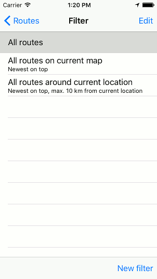
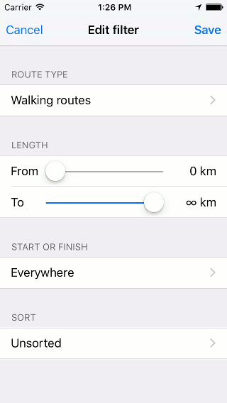
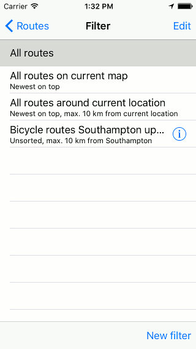
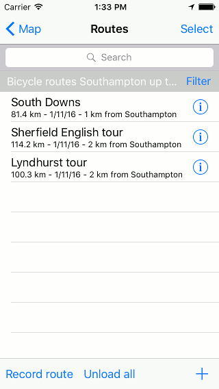
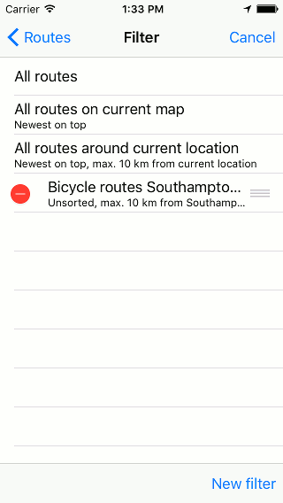

.. _ss-routes-search:

Searching routes and waypoints
==============================
In the :ref:`routes screen <ss-route-load>` and in
the :ref:`waypoints screen <ss-waypoint-load>` you can
search in the routes and waypoints that are stored on your device.
You can search with keywords and you can apply filters to quickly find your
required routes and waypoints.

Searching waypoints is similar to searching routes.

An example of the routes screen is displayed below:

.. figure:: _static/route-search1.png
   :height: 568px
   :width: 320px
   :alt: Searching routes and waypoints Topo GPS

   *Figure 1. The routes screen with the filter set to ‘All routes’.*

In the figure above, no keyword has been entered into the search box.
The filter is set to ‘All routes’, this means that all routes and
folders will be shown in the list.

.. _ss-routes-search-keyword:

Searching with keyword
~~~~~~~~~~~~~~~~~~~~~~
If you enter a keyword in the search box, only routes/waypoints
that contain (part of) this keyword will be appear in the list.

As an example we will search for ‘Go’. In the figure below
you can see that only routes ‘Gower Hike’ and ‘Gower Hike Short’ appear.

.. figure:: _static/route-search2.png
   :height: 568px
   :width: 320px
   :alt: Searching routes and waypoints Topo GPS

   *Figure 2. Searching for ‘Go’. Only the routes ‘Gower Hike’ and
‘Gower Hike Short’ appear.*

The list that appears functions in the same way as usual in 
the routes screen. If you press an item it will be loaded on the map.
Als you can use the ‘Select’ button to make a :ref:`selection <ss-routes-select>` on which you can perform an action.

Be aware that the filter is applied to the list of search results. If you want to search with a keyword in all routes/waypoints you have to make sure that the filter is set to ‘All routes’/‘All waypoints’.

.. _ss-routes-search-filter:

Searching with filters
~~~~~~~~~~~~~~~~~~~~~~
By pressing the ‘Filter’ button in the :ref:`routes <ss-route-load>`/:ref:`waypoints screen <ss-waypoint-load>` the filter screen appears. The filter screen contains a list with filters, as you can see in the figure below:

   *Figure 3. In the filter screen you can choose a filter.*

The titles and subtitles explain how the filter operates and how it sorts the routes/waypoints. The filter that is currently active has a grey background color. In the figure above this is the filter ’All routes’. You can apply another filter by pressing on one of the filters in the filter screen.

As an example we now load the filter ‘All routes around current location - Newest on top, Max. 10 km from current location’. 

The routes screen will now show a different list of routes as you can see below:

.. figure:: _static/route-filter2.png
   :height: 568px
   :width: 320px
   :alt: Searching routes and waypoints Topo GPS

   *Figure 4. Due to the filter only routes with a start or finish near the current location will be shown.*

The current location is in this case Bellever. That is why only two routes around Bellever show up in the list of routes in Fig. 4.

.. _ss-routes-search-filter-create:

Creating new filters
~~~~~~~~~~~~~~~~~~~~
To create a new filter you have to press ‘New filter’ in the bottom of the filter screen (Fig. 3). The following screen will appear:

   *Figure 5. Creating a new filter.*

First you can choose a route type. You can change the route type by pressing it. If you do not want to filter on route type you have to set the type to ‘All routes’.

Then you can set the minimal and maximal length using the sliders.

Next you can set the location of the start and end point.

Finally you can determine how to sort the routes.

If you have set all details of the filter you have to press ’Save’. You will return to the filter screen and you can see that your filter is added to the list of filters.

As an example we have created a filter for bicycle routes up to 120 km that lie at most 10 km from Southampton. The filter screen then becomes:

   *Figure 6. The bicycle routes around Southampton filter is added to the list of filters.*

You can now apply the new filter by pressing it in the filter screen. You will return to the routes screen and the filter will be applied, as is illustrated in the figure below:

   *Figure 7. The filter ‘bicycle routes around Southampton’ is applied to the routes.*

As you can see from Fig. 7 only Bicycle routes around Southampton appear in the list with routes due to the filter.

Modifying filters
~~~~~~~~~~~~~~~~~
By pressing the info button (i) in the filter screen (Fig. 6) you can modify a filter. The filter edit screen (Fig. 5) will appear. You can now modify the filter. To save the changes you have to press ‘Save’ on the top right of the screen.

Removing filters
~~~~~~~~~~~~~~~~
You can remove a filter from the list with filters by pressing ‘Edit’ on
the top right of the filters screen (Fig. 6). 
The filter screen will then look like:

   *Figure 8. Removal of a filter.*

The first three filters are the standard filters. They cannot be removed or edited. 

By pressing the red button in front of a filter title you can remove a filter.

Reordering filters
~~~~~~~~~~~~~~~~~~
You can modify the order of the filters by pressing ‘Edit’ in the the filters screen (Fig. 6).

By dragging the grey buttons on the right hand side of the title of a filter you can alter the ordering of the filters.

