.. _ss-routes-share:

Sharing/exporting routes and waypoints
======================================

You can share/export routes and waypoints
that are saved on your device via several apps.

You can share/export routes and waypoints in two ways.
Either from the :ref:`route/waypoint details screen <ss-routes-export-details>` or
from the :ref:`routes/waypoints screen <ss-routes-export-screen>`.

.. _ss-routes-export-details:

Exporting from routes/waypoint details screen
~~~~~~~~~~~~~~~~~~~~~~~~~~~~~~~~~~~~~~~~~~~~~
To open the :ref:`route <ss-route-details>`/:ref:`waypoint details screen <ss-waypoint-details>` you have to tap a route or waypoint that is loaded on the map. You can also open the details screen by pressing an info button in the :ref:`routes <ss-route-load>` or :ref:`waypoints screen <ss-waypoint-load>`.

To export a route or a waypoint, you have to press the export/share icon in the 
bottom of the details screen. A pop-up will appear from which you can choose an
app to export route route or waypoint to. An example of this pop-up is displayed in the figure below:

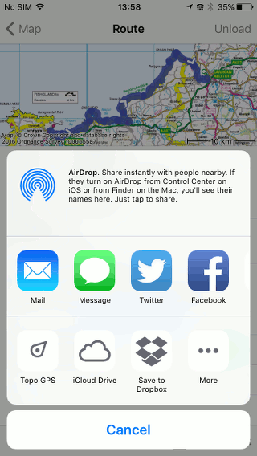

   *Figure 1. A pop-up with apps to which you can export a route.*

.. _ss-routes-export-screen:

Exporting from routes/waypoints screen
~~~~~~~~~~~~~~~~~~~~~~~~~~~~~~~~~~~~~~
From the :ref:`routes <ss-route-load>` and :ref:`waypoints screen <ss-waypoint-load>` you can export multiple routes/waypoints at once. First you press ‘Select’ on the top right of this screen. Next you have to :ref:`select <ss-routes-select>` the desired items by tapping them. Then you have to press the share/export icon on the bottom of the screen. A pop-up with a list of apps to which you can export the items will be displayed, like in the figure below:

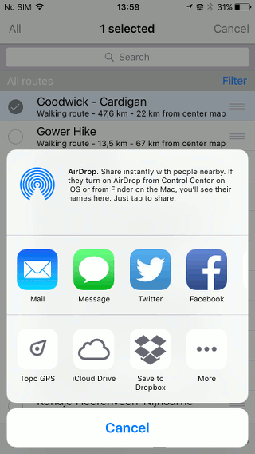

   *Figure 2. A pop-up with apps to which you can export a route or waypoint.*

File format
~~~~~~~~~~~
Depending on the app you choose, an map in jpg format and a (zipped) gpx file will be exported.

The gpx format is a universal file format for routes and waypoints and can be read by most other GPS apps and programs.

The default setting is to compress the exported gpx file to a zipped gpx file. You can disable compression of the gpx file in the :ref:`settings <ss-settings-export>`.

Compressing the gpx file leads to smaller files. Moreover, photos can be included. And multiple routes/waypoints can be fitted into one zip file.

Examples
~~~~~~~~
Below we will discuss the following example of exporting routes. Exporting waypoints is similar.

- :ref:`ss-export-mail`
- :ref:`ss-export-imessage`
- :ref:`ss-export-topo-gps`
- :ref:`ss-export-facebook`
- :ref:`ss-export-twitter`
- :ref:`ss-export-airdrop`
- :ref:`ss-export-icloud`
- :ref:`ss-export-dropbox`

.. _ss-export-mail:

Exporting routes via e-mail
***************************
To export a route via e-mail you have to choose ‘Mail’ in
the :ref:`share pop-up <ss-routes-export-details>`.
The following screen will appear:

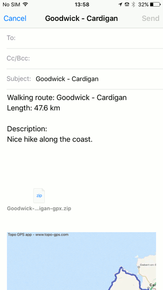

   *Figure 3. Exporting a route via e-mail.*

If you enter an e-mail address and press ‘Send’, the
e-mail will be sent with a route in the attachment.

.. _ss-export-imessage:

Exporting routes via Message
****************************
To export a route via Message you have to choose ‘Message’ in
the :ref:`share pop-up <ss-routes-export-details>`.
The following screen will appear:

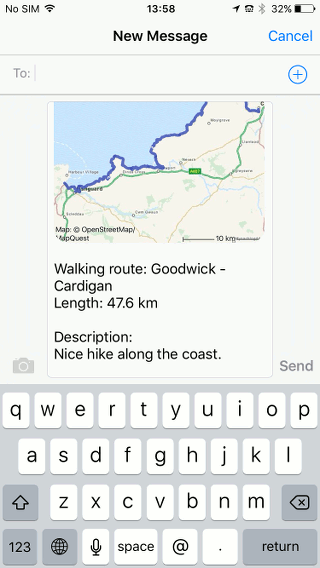

   *Figure 4. Exporting a route via Message.*

You have to enter a receiver and press ‘Send’ to
send the message.

.. _ss-export-topo-gps:

Sharing routes with Topo GPS
****************************
If you have recorded or planned a route with Topo GPS
you can share this route with Topo GPS.

If you share a route with Topo GPS, this route
can be :ref:`imported <ss-routes-import>` by other Topo GPS users.
In this way other users can enjoy your route.

To share a route with Topo GPS you have to press ‘Topo GPS’ in
the :ref:`share pop-up <ss-routes-export-details>`.

As an example we will now where the route
‘Goodwick-Cardigan’ with Topo GPS. The following pop-up
will appear:

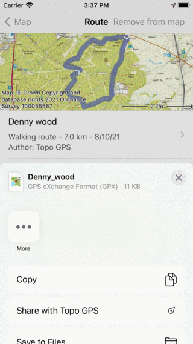

   *Figure 5. Sharing a route with Topo GPS.*

To share the route with Topo GPS, you have to press
‘Share’ in the top right of the share with Topo GPS pop-up.
Then the route will be sent to Topo GPS as you can see 
in the figure below:

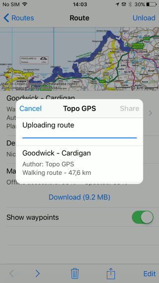

   *Figure 6. The route is being sent to Topo GPS.*

If the route has been shared successfully, a confirmation
message will be displayed in the pop-up, as you can
see in the figure below:

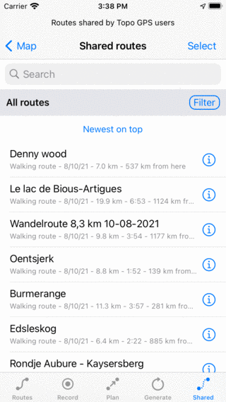

   *Figure 7. The route has been successfully shared with Topo GPS.*

The shared route will now show up in the :ref:`import routes screen <ss-routes-import>`, as you can see below:

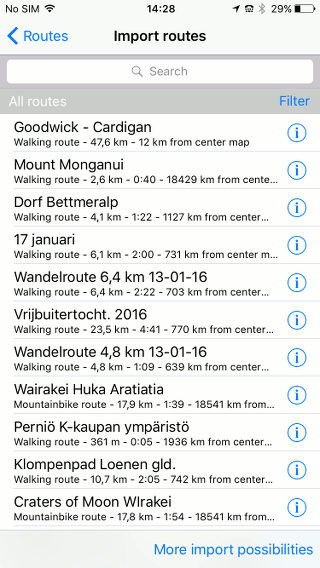

   *Figure 8. Other users can now import the shared route via the import routes screen.*

.. _ss-export-facebook:

Sharing routes with Facebook
****************************
To share a route with Facebook you have to press ‘Facebook’ in
the :ref:`share pop-up <ss-routes-export-details>`.

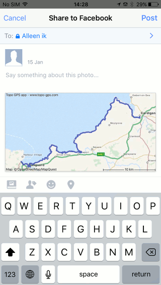

   *Figure 9. Sharing a route with Facebook.*

You could add a description. If you are 
ready you have to press ‘Post’ to share you route
with Facebook.

.. _ss-export-twitter:

Sharing routes with Twitter
***************************
To share a route with Twitter you have to press ‘Twitter’ in
the :ref:`share pop-up <ss-routes-export-details>`.

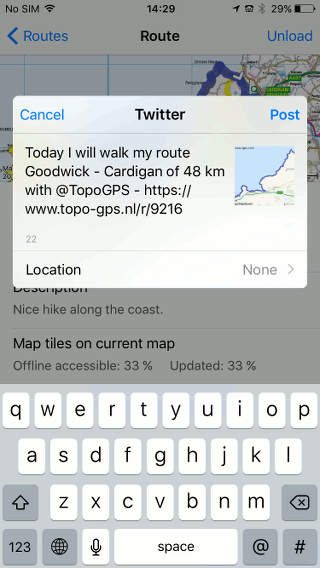

   *Figure 10. Sharing a route with Twitter.*

You could modify the description. Press ‘Post’ to
share the route with Twitter.

.. _ss-export-airdrop:

Sharing routes via Airdrop
**************************
If you want to share routes or waypoints with somebody that is nearby
and has an iPhone/iPad, Airdrop is the most suitable.

If one of your contacts has enabled Airdrop and is nearby, the
contact will appear in the Airdrop box of the 
:ref:`share pop-up <ss-routes-export-details>`.
You have to press the contact and then the (zipped) gpx file
will sent very quickly to your contact.

.. _ss-export-icloud:

Exporting multiple routes to iCloud Drive
*****************************************
To export multiple routes to iCloud Drive, you
first have to :ref:`select <ss-routes-select>` them in 
the routes screen. Next you press the export/share icon. Then
the share pop-up will appear, as is illustrated below:

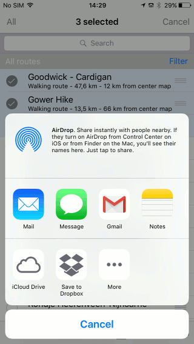

   *Figure 11. Sharing multiple routes.*

If you press iCloud Drive in the share pop-up,
the iCloud Drive screen will appear. An
example of this screen is displayed below:

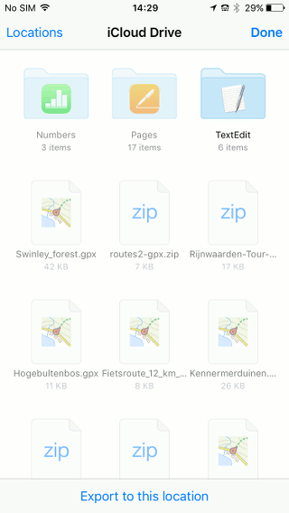

   *Figure 12. The iCloud Drive screen*

You have to determine the desired folder for
the file that is to be exported. If you
want to export the file you have to press
‘Export to this location’ in the bottom
of the screen.

If the file has been exported successfully a
confirmation message will appear, like in
the figure below:

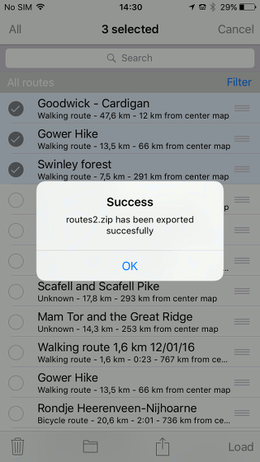

   *Figure 13. The routes have been exported successfully to iCloud Drive.*

.. _ss-export-dropbox:

Exporting route to Dropbox
**************************
To export routes to Dropbox, you have
to choose Dropbox in the :ref:`share pop-up <ss-routes-export-details>`.
The Dropbox app needs to be installed for this. If Dropbox does not
show up, you might have to press ‘More’ in the share pop-up and enable ‘Dropbox’.

It could happen that only a map of the route will be exported. This is a bug
that will be solved in the next release of Topo GPS.

In that case you have to press ‘iCloud Drive’ instead in the share pop-up.
Then you press ‘Locations’ on the top of the screen and select ‘Dropbox’.
You choose the desired folder. Then press ‘Save in ...’. A pop-up will appear
if the route has been successfully exported to Dropbox.
