.. _ss-search-address:

Searching addresses and places
==============================

To search addresses and places
you first have to open the :ref:`menu <sec-menu>`
and press the ‘Search’ icon. You might need
to select the ‘Address’ tab above the keyboard in order to be able to
enter addresses and places.

A screen will appear in which you can enter
an address or a place names. 

Loading single search result
~~~~~~~~~~~~~~~~~~~~~~~~~~~~
As an example we now will enter the town ‘Saint Just’ in the
search box. While typing results will appear in the
list below the search box, as you can see below:

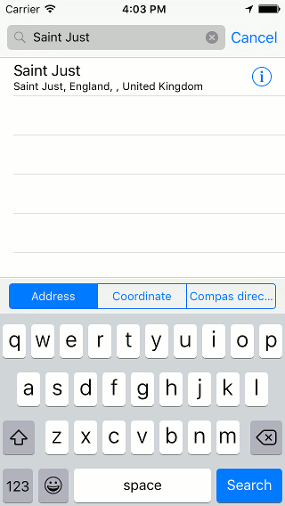

   *Figure 1. Searching the town ‘Saint Just’.*

In order to be able to find addresses or places you have to
be connected to the internet. Searching will occur via a service
of Apple.

If you tap on a search result in the list, it will be loaded
on the map as a waypoint, as you can see below:

.. figure:: _static/search-address2.png
   :height: 568px
   :width: 320px
   :alt: Searching address Topo GPS

   *Figure 2. The search result ‘Saint Just’ has been loaded on the map.*

Loading all search results
~~~~~~~~~~~~~~~~~~~~~~~~~~
You can also search on a keyword, like for example ‘Pub’. 
The results that appear in the list depend on 
the area that is currently visible in the map screen. If you
search for Pub and the map is zoomed to Saint Just, only
pub near Saint Just will be show up, like in the figure below:

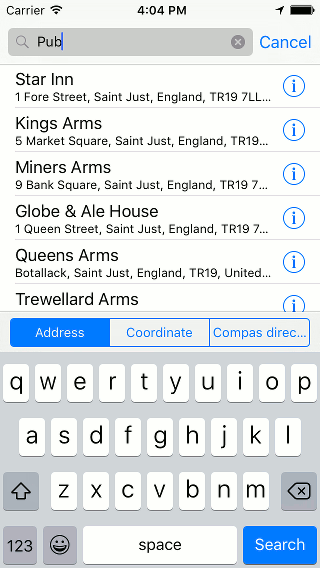

   *Figure 3. Searching for ‘Pub’.*

If you tap a single search result, it will be loaded on the
map. You can also load all results, by pressing ‘Search’ on
the bottom right of the screen. This is illustrated
in the figure below:

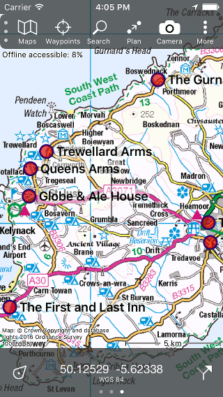

   *Figure 4. All found pubs near Saint Just.*

Loading selection of search results
~~~~~~~~~~~~~~~~~~~~~~~~~~~~~~~~~~~
If you now search for ‘Camping’, a list
of campings near Saint Just will appear,
as you can see in the figure below:

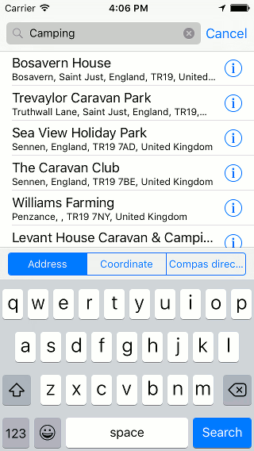

   *Figure 5. Searching for a Camping near Saint Just.*

If you only want to load a few of the results on the map,
you have to press long on one of the desired results.
A selection screen will appear as you can see below:

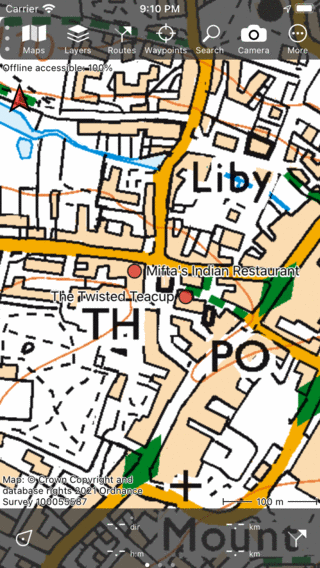

   *Figure 6. Selecting search results.*

In this selection screen you can select multiple search
results by tapping them. If Fig. 6 the campings ‘Trevaylor’ and ‘Roselands’
have been selected. If you press ‘Load’ on the bottom
right the selected items will be loaded on the map. 
In our example the two selected campings will be loaded
on the map, as you can see below:

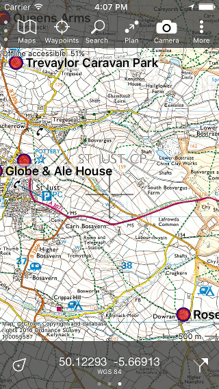

   *Figure 7. Two selected search results have been loaded on the map.*

Search result details
~~~~~~~~~~~~~~~~~~~~~
If you want to view the details of a search result,
yo have to press the info (i) button on the right
hand side of the title of a search result. If you
open the details of the ’Trevaylor Caravan Park’,
the following screen will appear:

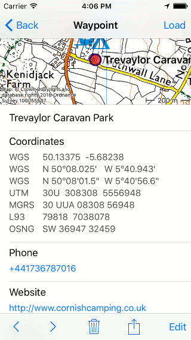

   *Figure 8. Details of the search result ‘Trevaylor Caravan Park’.*

In the screen with search result details, you can find a map,
the coordinates, possibly a phone number and an url, and the address.

If the search result has been loaded on the map, you can also
view its details by tapping the red circle on the map.

Searching with search history
~~~~~~~~~~~~~~~~~~~~~~~~~~~~~
Your searches will be saved in the search history. This
can be disabled in the :ref:`settings <ss-search-settings>`.

If the search box is empty, the search history
will appear below the search box. An example
is displayed below:

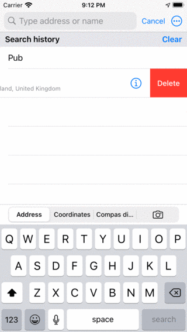

   *Figure 9. If the search box is empty, the search history will be displayed.*

If you tap a result from the history, it will be searched, and its
results will be placed on the map. 

For example, it is now easy to search for pubs at another location. Just
move the map, and press ‘Pub’ from the search history. In
the example below, quickly all pubs in Newquay appear:

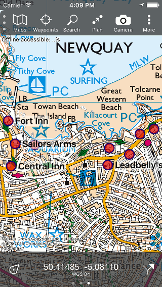

   *Figure 10. Searching for pubs in Newquay.*

Clearing search history
~~~~~~~~~~~~~~~~~~~~~~~
You can remove all results from the search history
by pressing the ‘Clear’ button on the right hand
side of the label ‘Search history’.

It is also possible to remove individual results
from the history. Make a slide to the left with
one finger on an item that needs to be removed.
A remove button will appear, as is illustrated
in the figure below:

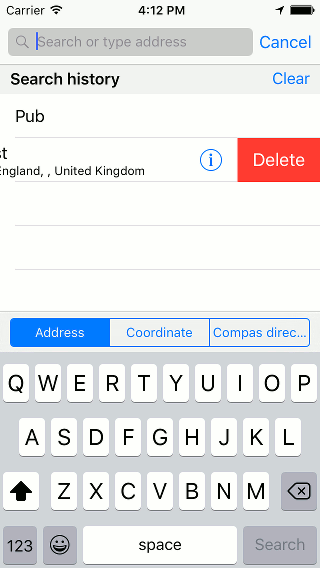

   *Figure 11. Removing a search result from the search history.*

If you press the red ’Remove’ button the item will be removed from
the search history.

Removing search results from map
~~~~~~~~~~~~~~~~~~~~~~~~~~~~~~~~
To remove search results from the map you have to tap the waypoint
corresponding to the search result on the map. The details screen
will appear. Next you have to press ‘Unload’ on the top right of the 
screen.

You can also unload all search results at once by pressing ‘Waypoints’
in the menu. Next you press the button ‘Unload all’.

.. _ss-search-settings:

Search settings
~~~~~~~~~~~~~~~
In the :ref:`settings screen <ss-settings>` (Menu > More > Settings)
two options are important for searching addresses and places.

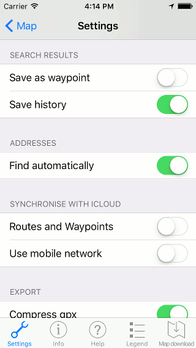

   *Figure 12. Settings related to search in the settings screen (Menu > More > Settings).*

- *Save as waypoint:* If this setting is enabled, the search results that are loaded on the map will also automatically saved in the list with waypoints. If you disable this setting, the search results will not be saved as a waypoint.

- *Save history:* If you enable this setting, the search results will be stored in the search history. If this settings is disabled your search results will not be saved. The search history will show up if no text is entered in the search box.