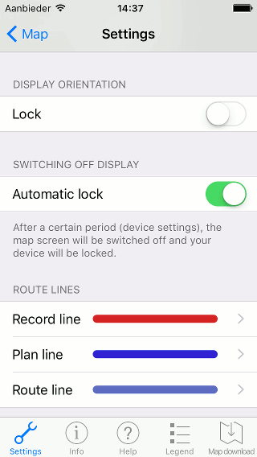
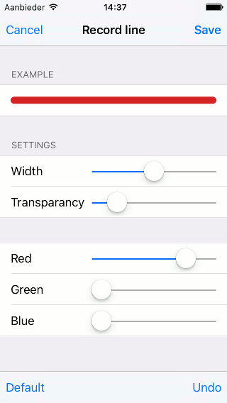
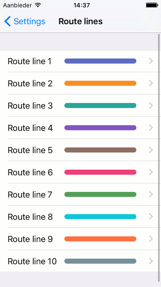
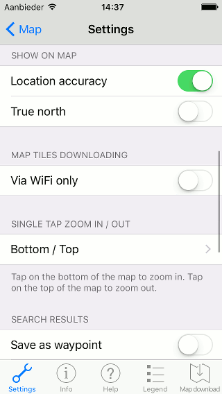
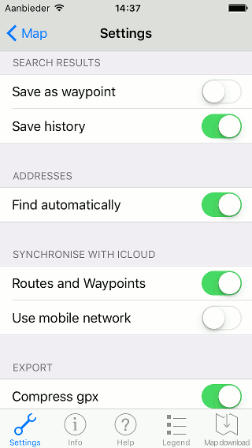

.. _ss-settings:

Settings
========
In the settings screen you can alter several options of Topo GPS.
You can open the settings screen by opening the :ref:`menu <sec-menu>`, pressing ‘More’ and selecting the tab 'Settings'.

An example of the settings screen is displayed in the figure below:

   *Figure 1. The settings screen (top).*

Below, we will discuss all items of the settings screen.

.. _ss-settings-orientation:

Display orientation
-------------------
With the setting 'Lock' you can lock the screen such that it does not rotate if you
rotate your device.

To lock the screen in the desired orientation, you first disable 'Lock'.
Then you rotate your device to the desired orientation and enable ‘Lock’.

.. _ss-settings-camera:

Switching off map screen
------------------------
With the settings ‘Automatic lock’ you can determine whether the map screen should be switched off and locked automatically after a period of inactivity by iOS. For example you mount your iPhone to your bicycle. Then it could be convenient that the map screen stays on. So in that case you have to disable ‘Automatic lock’.

If you have :ref:`locked the orientation of an iPhone <ss-settings-orientation>` in the normal (portrait) orientation, then the option ‘Cover camera’ appears.

If you enable the setting ‘Cover camera’ the map screen will be switched off automatically if you cover the front camera. The screen will appear immediately when the the camera is uncovered.

Enabling the option ‘Cover camera’ is recommended when going outdoors. When you put your iPhone in your pocket, the screen will be switched off immediately, saving power. If you also disable the option automatic lock, the map screen will appear immediately when you uncover your iPhone. 

Be aware, with automatic lock disabled you do not have to enter your password when the screen reappears. This is convenient, but is also less secure.

.. _ss-settings-lines:

Route lines
-----------
Below the header ‘Route lines' you can modify the appearance of different route lines. Modifying the appearance can be useful if the current lines are not clearly visible to you.

The record line is used for routes that are being recorded. The plan line is used for routes that are being planned. And the route lines are used for routes that are displayed on the map.

If you press the record or plan line a screen will appear in which you
can modify the appearance, as is illustrated below:

   *Figure 2. Setting the appearance of the record line.*

On the top of the screen you see an example of the current line. If you alter the sliders below, you can directly see the resulting line.

You can modify subsequently the width, transparency, and color.
You can make a color with the red, green and blue sliders. The resulting
color is a combination of red, green and blue. For example you make purple by putting the red and blue sliders to the right and the green slider to the left.

On the bottom of the screen you can find the buttons 'Reset' and 'Standard'. With 'Reset' you reset the line settings back to the previous setting. With 'Standard' you get the default Topo GPS line.

If you want to apply your modifications you have to press ‘Save’ on the top right of the screen.

If you press ‘Route lines’ in the settings screen in order to modify the appearance of routes that are loaded on the map, the following screen will appear first:

   *Figure 3. Modifying the lines of routes that are displayed on the map.*

By pressing route line 1 you can modify the appearance of the route that has been loaded first on the map. By pressing route line 2 you can modify the appearance of the route that has been loaded second on the map, etc.

.. _ss-settings-show-on-map:

Show on map
-----------
Below the header 'Show on map' you can decide whether to show the ‘Location accuracy' and the ’True north' on the map.

If you enable the ‘Location accuracy' a red circle around the position marker will be shown. This circle indicates the accuracy of the location determination.

If you switch on 'Map north' an arrow will appear on the top left of the map. This arrow indicates the direction of the true north on the map. The direction of the true north can differ from the top of the map.

   *Figure 4. The settings screen (middle).*

.. _ss-settings-maptiles:

Downloading map tiles
---------------------
If you enable the option 'Only via WiFi', map tiles will only be download if a
WIFI connection is available. If you switch on this option, you can avoid 
downloading map tiles via your mobile network.

If you disable ‘Only via WiFi’, map tiles will also be downloaded via your
mobile network if necessary.

.. _ss-settings-onetapzoom:

One tap zoom in/out
-------------------
With this option you can decide in which way you want to zoom when
tapping on the map.

If you press this item you can choose one of the following options:

- Bottom/Top: Tapping the bottom of the map zooms in, the top zooms out.
- Top/Bottom: Tapping the top of the map zooms in, the bottom zooms out.
- Right/Left: Tapping the right of the map zooms in, the left zooms out.
- Left/Right: Tapping the left of the map zooms in, the right zooms out.

   *Figure 5. The settings screen (bottom).*

.. _settings-search-results:

Search results
--------------
If you search for a location results will appear. You can load these results on the map. They will appear as a waypoint. If you enable the option ‘Save as waypoint’ these waypoints will be saved on your device and then also show up in your list with waypoints.

If you enable the option ‘Save history’, your search queries will be saved. If you do not enter a keyword in the search box, the search history will be displayed.

.. _settings-addresses:

Addresses
---------
If you enable the option ‘Find automatically’ coordinates can be turned into addresses. This will be done using a service of Apple.

Enabling this option is recommended and allows the following features:

- Showing addresses in waypoint details screen.
- Showing address in current location details details screen.
- Automatic title suggestion for routes and waypoints.

.. _settings-sync-icloud:

Synchronize with iCloud
-----------------------
If you enable the option ‘Routes and waypoint’, all your routes and waypoints
will be :ref:’synchronized automatically with iCloud <ss-routes-synchronize-icloud>`.

If you enable the option ‘Use mobile network’ routes and waypoints can also be synchronized via a mobile network. This could cause additional data traffic and increased battery use.

.. _ss-settings-export:

Export
------
If you enable the option ‘Compress gpx’, the file format of exported routes and waypoints is zip compressed gpx, ie. .gpx.zip.

If you disable this option, the file format is uncompressed gpx, .gpx.

It is recommended to switch on ‘Compress gpx’. This has the following advantages:

- *Smaller files*. Compressed gpx leads to much smaller files, and hence consumes less data traffic.
- *Multiple routes*. A compressed gpx file can contain multiple routes.
- *Photos*. A compressed gpx file can contain photos.