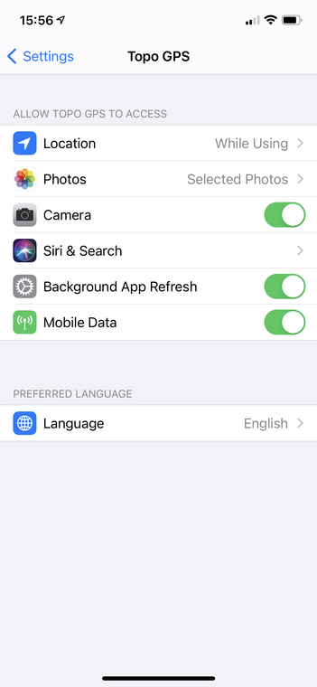

.. _sec-settings-device:

Device settings for Topo GPS
============================

If you scroll to the bottom of the :ref:`settings screen <ss-settings>` or you go to the iOS Settings app > Topo GPS, you can modify the device settings of Topo GPS.

An example of the iOS device settings screen is shown in the figure below:

   *The device settings screen for Topo GPS*
   
In the device settings screen you can subsquently set the following options:

- *Location*. If you set this to 'While using', Topo GPS can show your position on the map, record your route and find waypoints and routes near your location.

- *Photos*. If you set this to 'Selected photos', you can decide which photos Topo GPS can import. Also if you set this to 'Selected photos', Topo GPS can save the photos made with the :ref:`camera <sec-camera>` in your photo library.

- *Camera*. If you enable the camera, you can make :ref:`photos <sec-camera>` and :ref:`scan coordinates <sec-scanning-coordinates>`.

- *Siri & Search*. This contains settings related to search and the Siri assistent.

- *Background app refresh*. If you enable this setting, Topo GPS can process various tasks in the background, like updating synchronizing routes and waypoints and updating layers.

- *Mobile data*. If you enable this setting Topo GPS can use the mobile network. This is for example necessary for :ref:`route planning <sec-routes-plan>` and :ref:`downloading map tiles <sec-cache>` over a mobile network.

- *Language*. Here you can set the language Topo GPS is using. Supported languages are English, German, Spanish, French, Dutch, Swedish, Norwegian, Danish, Finnish and Japanese. If your device language is supported, that language is used by default.

