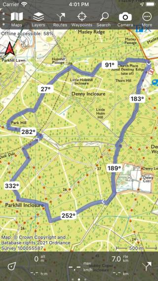

.. _sec-settings-routes:

Routes
======

In the section 'Routes' of the :ref:`settings <ss-settings>` you can enable and disable :ref:`route distance markers <ss-settings-route-distance-markers>`, :ref:`route course markers <ss-settings-route-course-markers>`, and :ref:`spoken instructions <ss-settings-spoken-instructions>` for node network routes.

.. _ss-settings-route-distance-markers:

Route distance markers
~~~~~~~~~~~~~~~~~~~~~~
Route distance markers are markers that appear on the route on regular intervals to show the distance from the start point. If you enable this switch these markers will appear on all routes that are loaded on the main map. An example is shown in the figure below:

.. figure:: ../_static/settings-route-distance.jpg 
   :height: 568px
   :width: 320px
   :alt: Settings screen Topo GPS

   *Route distance markers are enabled.*

.. _ss-settings-route-course-markers:

Route course markers
~~~~~~~~~~~~~~~~~~~~
Route course markers are markers that appear on the route on regular intervals to show the course (direction of the route with respect to true north) at the point of the marker. If you enable this switch these markers will appear on all routes that are loaded on the main map. An example is shown in the figure below:

   *Route course markers are enabled.*

.. _ss-settings-spoken-instructions:

Spoken instructions
~~~~~~~~~~~~~~~~~~~
If you have loaded a node network on the map, and you have loaded a route along these nodes on the map, the nodes will appear on the dashboard.
If you enable 'Spoken instructions' and you are near the next node, a voice will tell you the node you are nearing and the upcoming node. The screen should be switched on for this to work, therefore this is only useful in combination with :ref:`disabling the automatic screen lock <sec-settings-switching-off-display>`.

