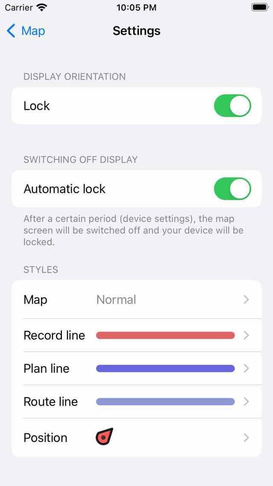

.. _ss-settings:

Settings
========
The settings screen can be opened by tapping the item 'More' in the :ref:`Menu <sec-menu>`. Then tap 'Settings' in the pop-up that appears.

An example of the settings screen is displayed in the figure below:

   *The settings screen.*

The settings screen contains the following sections:

.. toctree::
   :maxdepth: 2

   display_orientation
   switching_off_display
   styles
   routes
   show_on_map
   map
   units
   coordinates
   map_tiles_downloading
   single_tap_zoom
   search_results
   addresses
   camera
   dashboard
   synchronize_with_icloud
   device_settings
   

