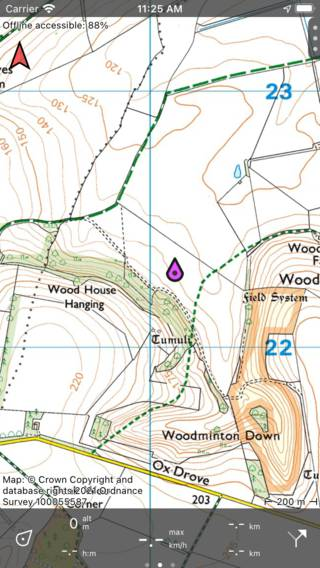

.. _sec-settings-styles:

Styles
======
In the section 'Styles' of the :ref:`settings <ss-settings>` you can set the appearance of the record, plan and route lines. Moreover you can determine the appearance of the :ref:`position marker <sec-posmarker>`.

Record, plan and route lines
~~~~~~~~~~~~~~~~~~~~~~~~~~~~
To change the color of the record, plan or route line, tap the corresponding item in the 'Styles' section of the :ref:`settings <ss-settings>`.
A screen will appear in which you can set the properties of the line. 

If you tap route lines, you will see that there are 10 different route lines. The first route line is for the first loaded route on the map, the second for the second loaded route, etc. 

As an example we now show below the screen in which you can change the line properties of the recorded route:

.. figure:: ../_static/settings-recordline.jpg
   :height: 150px
   :width: 150px
   :alt: Position marker Topo GPS
   
   *Changing the properties of the record line.*

.. _ss-settings-posmarker:

Position marker
~~~~~~~~~~~~~~~
The default position marker has a red color. For visibility it might be better to change the color of the position marker sometimes. Tap the position marker in the 'Styles' section of the :ref:`settings <ss-settings>`. A screen with available alternative position markers will be shown. If you tap a position marker it will be changed. 

Below you see an example of a map with a purple position marker:

   *The position marker was set to purple*

