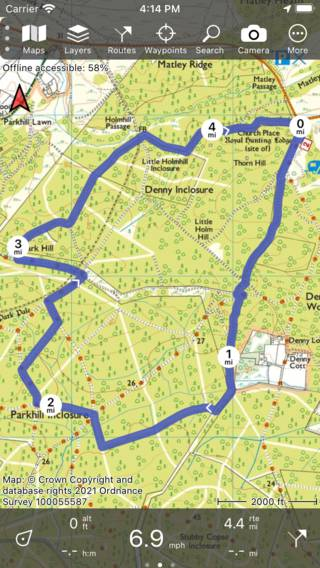

.. _sec-settings-units:

Units
=====
In the section units of the :ref:`settings <ss-settings>` you can set the length/speed and angle units.
The length/speed can be set to Metric (m, km, km/h), Imperial (ft, mi, mph) or Nautical (ft, NM, kt).
The unit of angle can be set to Degrees, NATO mil, Miliradian, Swedish streck and Finish streck.

Below and example of the main screen with imperial units:

   
   *The main screen with imperial units*
