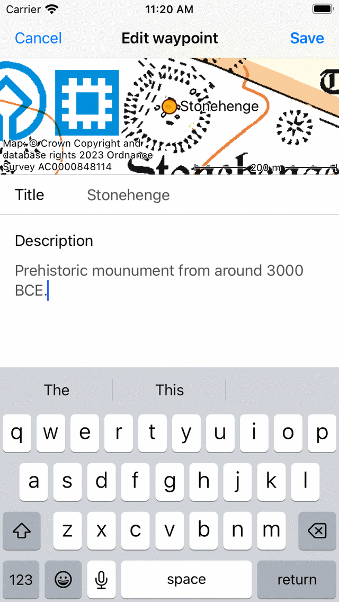
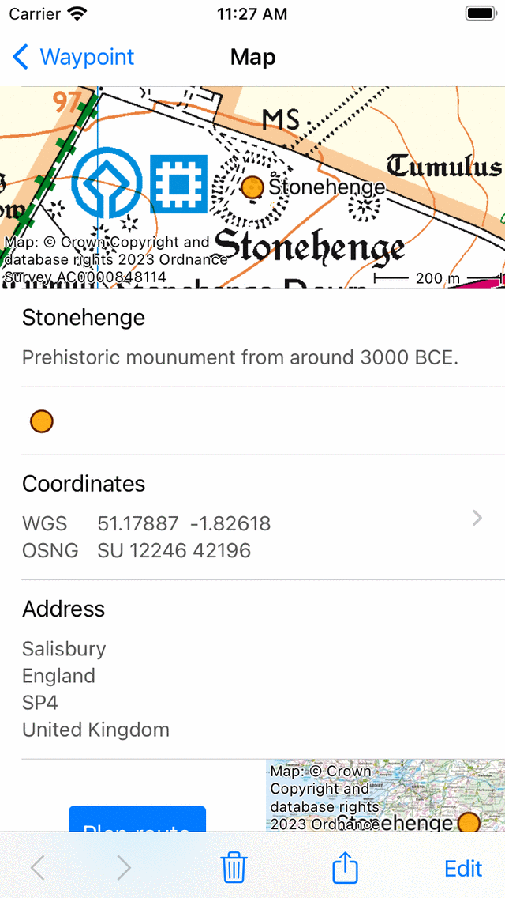

.. _ss-waypoint-edit:

Editing waypoints
=================
To edit a waypoint you have to press the ‘Edit’ button on the bottom of the :ref:`waypoint details screen <ss-waypoint-details>`.
If you press this button an edit pop-up will appear like in the figure below:

.. figure:: _static/waypoint-edit.png
   :height: 568px
   :width: 320px
   :alt: Editing Waypoints Topo GPS

   *A pop-up with five possibilities to modify a waypoint.*

The pop-up shows four possibilities to modify the waypoint.

- *Edit text*: Allows you to :ref:`edit the title and description <ss-waypoint-edit-title>` of a waypoint.
- *Edit photos*: Allows you to :ref:`edit the photos <ss-waypoint-edit-photos>` of a waypoint.
- *Edit coordinate*: Allows you to :ref:`edit the coordinates <ss-waypoint-edit-coordinate>` of a waypoint.
- *Move on map*: Allows you to :ref:`move the waypoint on the map <ss-waypoint-edit-map>`.
- *Change icon*: Allows you to :ref:`change the icon of the waypoint <ss-waypoint-change-icon>`.

.. _ss-waypoint-edit-title:

Editing title and description
~~~~~~~~~~~~~~~~~~~~~~~~~~~~~
By pressing ‘Edit text’ in the :ref:`edit pop-up <ss-waypoint-edit>` you can modify the title and
the description of the waypoint. An example is shown below:

   *Modifying the description of the waypoint ‘Stonehenge’.*

To save the changes you have to press ‘Save’ on the top right of the screen. You return to the waypoints details screen as you can see below:

   *The description of the waypoint ‘Stonehenge’ has been modified.*

.. _ss-waypoint-edit-photos:

Editing photos
~~~~~~~~~~~~~~
It is possible to add photos to waypoint and to remove waypoints from the waypoint.

If you press ‘Edit photos’ in the :ref:`edit pop-up <ss-waypoint-edit>` the following screen will appear.

.. figure:: _static/waypoint-photo1.png
   :height: 568px
   :width: 320px
   :alt: Empty photos screen Topo GPS

   *The photos screen if no photos are added to the waypoint.*

In the bottom toolbar of the photos screen you can find three buttons:

- *Map button*: If you press this button you can import photos from your photo library to the waypoint.
- *Camera button*: If you press this button the camera will be started. If you take a photo it will be added to the waypoint. You could also use Menu > Camera for this, then a waypoint is automatically created at your current location and the taken photo is added to it.
- *Trash button*: Allows you to remove a photo from a waypoint.

As an example we now will add a photo of ’Stonehenge’ to from our photo library by pressing the map icon. An example of the screen that appears is displayed below:

.. figure:: _static/waypoint-photo2.jpg
   :height: 568px
   :width: 320px
   :alt: Choosing photo from photo library Topo GPS

   *The photo library*

In the photo library you can choose a photo. By pressing the photo it will be imported and added to the photos screen as you can see below:

.. figure:: _static/waypoint-photo3.jpg
   :height: 568px
   :width: 320px
   :alt: Photos screen with photo Topo GPS

   *A photo of Stonehenge is added to the photos screen.*

If you like you can add more photos from the library or using the camera. The added photos are always copied to Topo GPS. So removing the photo afterwards from your photo library does not remove the photo in Topo GPS. The resolution of the added photo can be set via 'Menu > Settings > Camera > Photo size'. Larger photo sizes will require more disk space.

If you want to confirm the changes to the photos you have to press ‘Done’ on the top right of the photos screen. The changes will then be saved and the photos will be added to the waypoint.  

You can view the added photos in the :ref:`waypoint details screen <ss-waypoint-details>` as is illustrated in the figure below:

.. figure:: _static/waypoint-photo4.jpg
   :height: 568px
   :width: 320px
   :alt: Editing Waypoints Topo GPS

   *A photo of Stonehenge can be viewed in the waypoint details screen.*

If you press the photo in the waypoint details screen, the photo screen will be opened.

.. figure:: _static/waypoint-photo5.jpg
   :height: 568px
   :width: 320px
   :alt: Editing Waypoints Topo GPS

   *A photo of Stonehenge in the .*

In the photo screen you see a larger version of the photo. You can zoom in on this photo to by making a zoom gesture. Sharing the photo is possible by pressing the 'Export' icon on the top right. If you press 'Edit' on the top right you can also modify the photos of the waypoint.

.. _ss-waypoint-edit-coordinates:

Editing coordinates
~~~~~~~~~~~~~~~~~~~
By pressing ‘Edit coordinate’ in the :ref:`edit pop-up <ss-waypoint-edit>` 
the same screen appears when entering coordinates. An example 
of editing the coordinates of the waypoint ‘Stonehenge’ is shown below:

.. figure:: _static/waypoint-edit-coordinate.png
   :height: 568px
   :width: 320px
   :alt: Editing Waypoints Topo GPS

   *Figure 8. Editing the coordinates of the waypoint Stonehenge.*

If you press ‘Save’ on the top right the waypoint will be displaced to
the entered coordinates.

.. _ss-waypoint-edit-map:

Moving on map
~~~~~~~~~~~~~
By pressing move on map in the :ref:`edit pop-up <ss-waypoint-edit>` you
can modify the location of the waypoint on a map.

In the example of the waypoint ‘Stonehenge’ the following screen will appear.

.. figure:: _static/waypoint-move-map1.png
   :height: 568px
   :width: 320px
   :alt: Editing Waypoints Topo GPS

   *Figure 9. The screen in which you can move a waypoint.*

If you press long on the waypoint you can drag the waypoint to a
new location, as is illustrated in the figure below:

.. figure:: _static/waypoint-move-map2.png
   :height: 568px
   :width: 320px
   :alt: Editing Waypoints Topo GPS

   *Figure 10. The waypoint Stonehenge has been moved temporarily.*

To save the new location of the waypoint you have to press ‘Save’ in the top right of the screen. Otherwise press ‘Cancel’.

.. _ss-waypoint-change-icon:

Change icon
~~~~~~~~~~~

