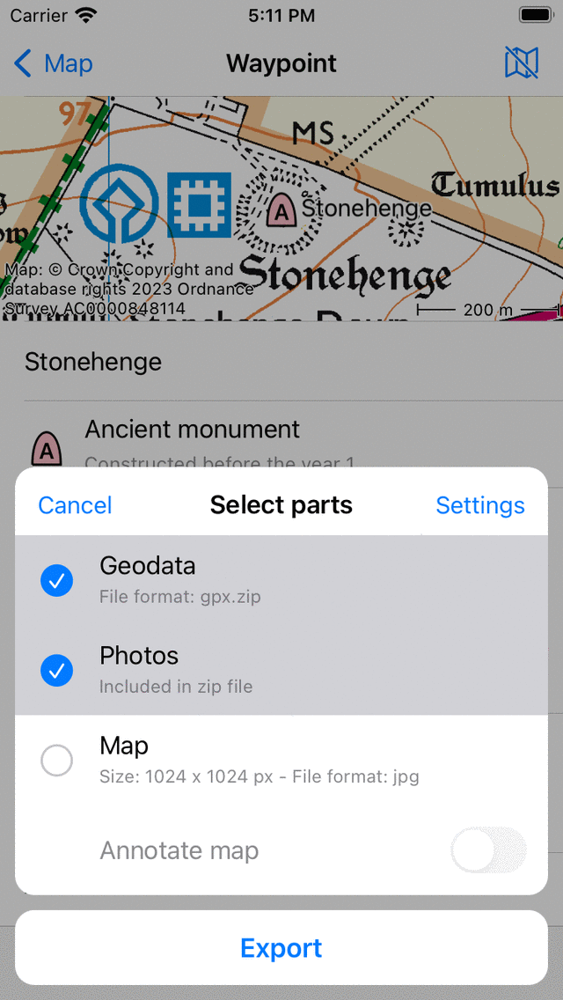

.. _ss-waypoints-exporting:

Exporting waypoints
===================

To export a single waypoint, open the :ref:`waypoint details screen <ss-waypoint-details>` and tap the export icon in the bottom toolbar.

To export multiple waypoints, open the :ref:`waypoints screen <ss-waypoint-load>` (Menu > Waypoints). Then open the :ref:`waypoint selection screen <ss-waypoints-select>` by tapping More > Select. It might be useful to apply filters and/or a search term. Select the desired waypoints and folders and tap the export icon in the bottom toolbar.

To export the waypoints that are loaded on the current visible part of the main map screen, tap :ref:`Menu > Maps > Export visible items <ss-maps-popup>`. Note that you then also might export routes if they are shown on the map.

After pressing the export button the export pop-up will appear in all cases, an example is shown below:

   
   *The export pop-up.*
   
In the export pop-up you can select the kind of data that will be exported. The kind of exported data can be any combination of the following:

- *Geodata*: If you include 'Geodata' a data file containing the waypoint(s) will be exported. The file format is shown in the subtitle of the geodata item. In the example above it is gpx.zip. If you press :ref:`settings <ss-waypoints-export-settings>` you can change the data format. Supported file formats for exporting waypoints are gpx, gpx.zip, kml, kmz, geojson, geojson.zip, csv and csv.zip. If you choose geojson or csv you can also choose the spatial reference system (coordinates type) in the export settings.
- *Photos*: If you include 'Photos' the photos of the waypoint(s) will be exported as well. This item is not available if there are no photos. If you have enabled compression in the :ref:`export settings <ss-waypoints-export-settings>` the photos are included in the zip file or kmz file.
- *Map*: If you include 'Map' a map of the waypoint(s) will be exported. The pixel size of the map and the data format are displayed in the subtitle. You can change the pixel size and the data format in the :ref:`export settings <ss-waypoints-export-settings>`. If you enable the switch 'Annotate map' you can draw remarks on the map before sharing the exported map.

After you have selected the kind of data to be exported you can press 'Export' in the bottom of the export pop-up to export the waypoint(s). 
<APPLE>
Then a regular iOS pop-up will show up in which you can pick an app to send the exported data to. For example, iMessage to send the waypoint to a friend, or the files app to save the waypoint on the cloud.
</APPLE>
<ANDROID>
Then a regular Android share pop-up will show up in which you can pick an app to send the exported data to. Sometimes not all apps are shown in the share pop-up. Then you could try to tap 'Open in other app' instead of 'Export'.
</ANDROID>

.. _ss-waypoints-export-settings:

Export settings
~~~~~~~~~~~~~~~
In the export pop-up you can also change the export settings by pressing the 'Settings' button on the top right of the export pop-up.

The first section in the export settings screen is about geodata. Here you can set the data format of the to be exported waypoint(s). By tapping 'Waypoint data format' you can choose between gpx, kml, csv and geojson. You can decide whether you want to compress the data. If you enable compression the exported geodata file will be zip compressed. The file size will be much smaller than without compression.

If you export to csv or geojson, you can also choose the spatial reference system (coordinates system) to be used in the exported data. 
   
The remaining sections deal with the map (image) that can be exported. You can choose the image format of the exported map. You can choose between jpg, png and pdf. You can set the desired pixel width and height with the sliders. To generate a map sometimes map tiles need to be downloaded. You can determine if you want to allow cellular downloads of map tiles.
 

Exporting all waypoints
~~~~~~~~~~~~~~~~~~~~~~~
<APPLE>
To export all waypoints stored on your device, open the :ref:`waypoints screen <ss-waypoint-load>` (Menu > Waypoints). Make sure that the filter is not active (filter button has a blue edge). Go to the root waypoint folder, so that 'All waypoints' is displayed below the search bar. Make sure that the search bar is empty. 
Then open the :ref:`waypoint selection screen <ss-waypoints-select>` by tapping More > Select. Press 'All' on the top left to select all waypoints and folders. Then tap the export icon in the bottom toolbar to open the export pop-up. Select the kind of data to be exported in the export pop-up and press 'Export'.
</APPLE>
<ANDROID>
To export all waypoints stored on your device, open the :ref:`waypoints screen <ss-waypoint-load>` (Menu > Waypoints). Then tap More (top right) > Export all.
All waypoints including photo's will be exported to a gpx.zip file. If the export was succesfull a share pop-up will appear. You can then choose e.g. to store the file at a cloud service like e.g. Google Drive. We recommend to do this regularly so that you have a backup of your waypoint data.
</ANDROID>
