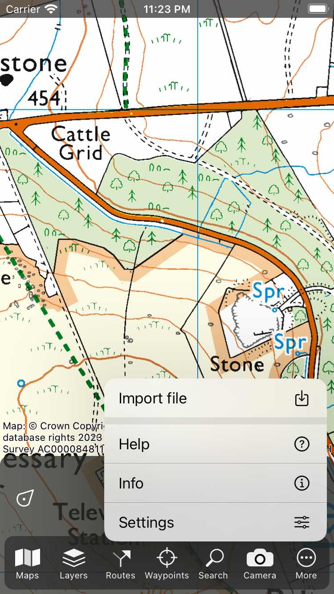

.. _ss-waypoints-importing:

Importing waypoints
===================

It is possible to import waypoints in Topo GPS in the following file formats: gpx, kml/kmz, csv, geojson, <APPLE>jpeg, heic, and heif.</APPLE><ANDROID>and jpeg.</ANDROID>
Multiple files of these types can also be imported at once if they are compressed as a zip file. If the files are organized into folders in the zip file, this folder structure will be imported as well and visible in the waypoints screen.

Separate photo will only be imported if they contain a location in the EXIF metadata. For every photo a waypoint will be created at its location and the photo is added to the waypoint. If you want to import multiple photos at once, first create a zip file, add the photos, and then import this zip file.

To import waypoints you could try to tap on a file icon. Most often an app picker will show up. You then have to select 'Open with Topo GPS' or 'Copy to Topo GPS' and the file will be imported in Topo GPS.

Alternatively you could import the files directly into Topo GPS by tapping :ref:`Menu <sec-menu>` > More > Import file in the main screen as shown below. Then files app will be opened. Here you can select a cloud storage, like iCloud, Dropbox, OneDrive or Google Drive. Then you can browse through your files and select the files you want to import.

   *Tap Menu > More > Import file to import a file.*

If the waypoints were imported succesfully, you will return to the main map screen and the map will be zoomed to the imported waypoints.
In the waypoints screen (Menu > Waypoints) all imported waypoints can be found in a newly created folder.

<APPLE>
How to import a geodata file from iMessage is explained in a :ref:`separate section <sec-imessage-import>`.
</APPLE>
