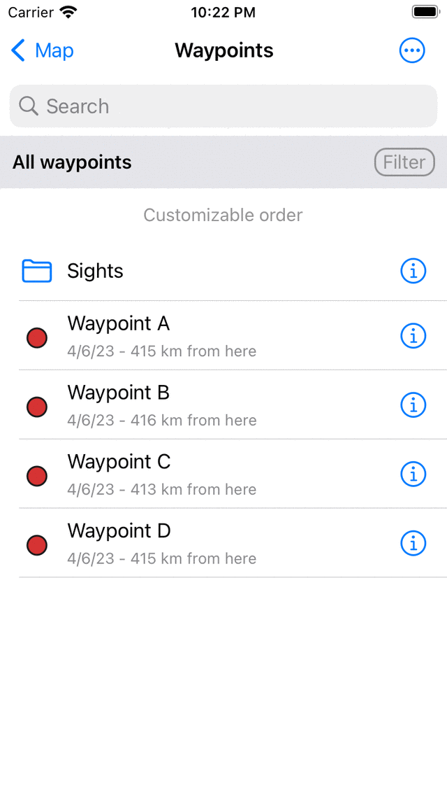

.. _ss-waypoints-organize:

Organizing waypoints
====================

You can keep your waypoints organized by :ref:`creating folders <ss-waypoint-folder-create>` and :ref:`moving waypoints into folders <ss-waypoint-folder-move>`.
It is also possible to :ref:`change the order of the waypoints <ss-waypoint-folder-reorder>` appearing in the waypoints screen if they are :ref:`sorted in customizable order <ss-waypoint-sort>`. In addition you can keep waypoints organized by assigning them :ref:`specific icons <ss-waypoint-icons>` and :ref:`filter them on icon <ss-waypoint-filter-icon>`.

Folders are only visible in the :ref:`waypoints screen <ss-waypoint-load>` if the :ref:`filter <ss-waypoint-filter>` (below the search bar) is disabled.

.. _ss-waypoint-folder-create:

Creating a folder
~~~~~~~~~~~~~~~~~
To create a folder, first open the :ref:`waypoints screen <ss-waypoint-load>` (Menu > Waypoints). Then tap More (top right) > New Folder. The new folder screen will be opened, an example is shown below:

   
   *The new folder screen*
    
To create a folder, you have to enter a name for the new folder. The default location of the newly created folder is the currently active folder in the waypoints screen. If you want to create the new folder in another folder, you have to tap the 'Location' section and choose a folder. When you are done, tap 'Save' to create the folder. You will return to the waypoints screen and the newly created folder will be shown in the list (if the folder is saved in the currently active folder).

As an example we will enter 'Sights' and press 'Save' to create a 'Sights' folder. The waypoints screen now looks as follows:

   
   *A 'Sights' folder has been created.*
   
The 'Sights' folder is listed in the waypoints screen with a folder icon.

.. _ss-waypoint-folder-move:

Moving waypoints into folder
~~~~~~~~~~~~~~~~~~~~~~~~~~~~
To move waypoints into a folder you have to open the :ref:`selection screen <ss-waypoints-select>` by pressing long on an item in the waypoints screen. Select the to be moved items and tap the folder icon in the bottom toolbar. Then the 'Move items to folder' screen will be shown, example is shown below:

.. figure:: ../_static/waypoint-folder3.png
   :height: 568px
   :width: 320px
   :alt: Move waypoints screen Topo GPS
   
   *Move items to folder screen.*

In the 'Move items to folder' screen, the folder tree is shown. If you tap on a folder the selected items will be moved to that folder and you will return to the waypoints screen.

As an example we now will move the waypoints 'C' and 'D' to the 'Sights' folder. After moving the two waypoints as indicated above the waypoints screen looks as follows:

   
   *The waypoints screen after moving two waypoints into the folder 'Sights'.*

In the waypoints screen the waypoints 'C' and 'D' have disappeared. They now can be found in the folder 'Sights'.

.. _ss-waypoint-folder-open:

Opening a folder
~~~~~~~~~~~~~~~~
To open a folder, just tap the folder item in the waypoints screen. As an example we now open the folder 'Sights'. The waypoints screen will then look as follows:

   
   *The contents of the 'Sights' folder.*

The 'C' and 'D' waypoints now can be found in the 'Sights' folder. 

Below the search bar you can see the current location in the folder tree. If you press 'All waypoints' you will return to the root folder.

.. _ss-waypoint-folder-load:

Loading contents of folder
~~~~~~~~~~~~~~~~~~~~~~~~~~
To load all waypoints in a folder and its descendant folders, press long on a folder item in the waypoints screen (Menu > Waypoints) to select the folder. Then press the map icon in the bottom toolbar to load the contents of the folder on the map.

Alternatively tap the info button next to a folder in the waypoints screen (Menu > Waypoints). Then press 'Show on map' on the top right to load all waypoints on the map. You will return to the main map screen and the map will be zoomed to the contents of the folder. 

.. _ss-waypoint-folder-unload:

Removing contents of folder from map
~~~~~~~~~~~~~~~~~~~~~~~~~~~~~~~~~~~~
To remove the waypoints in a folder and it descendant folders from the map,  press long on a folder item in the waypoints screen (Menu > Waypoints) to enter the selection mode and to select the folder. Then tap in the bottom tool bar the more button and then tap 'Remove from map'.

Alternatively, first tap the info button next to a folder in the waypoints screen (Menu > Waypoints) to open the folder details screen. Then press 'Remove from map' on the top right to remove all waypoints from the map. If 'Shown on map' is shown, first tap it to load all waypoints, then go back to the waypoints screen to open the folder details screen. Then press 'Remove from map' on the top right.

.. _ss-waypoint-folder-rename:

Renaming folders
~~~~~~~~~~~~~~~~
To rename a folder first open the waypoints screen (Menu > Waypoints) and tap the info button next to a folder item to open the folder details screen. Then tap 'Edit' in the bottom toolbar, change the name and press 'Save'.

.. _ss-waypoint-folder-reorder:

Changing the order of waypoints 
~~~~~~~~~~~~~~~~~~~~~~~~~~~~~~~
Just below the folder tree and filter bar in the waypoints screen the current sort method is displayed. If you tap the sort method you can change it. If it is set to 'Customizable order' you can determine the order of the waypoints.

To change the order of the waypoints in the 'Sights' folder, just open that folder. Then press More > Select to enter the selection mode.
The waypoints screen then looks as follows:

.. figure:: ../_static/waypoint-folder6.png
   :height: 568px
   :width: 320px
   :alt: An opened folder Topo GPS
   
   *The 'Sights' folder in selection mode.*

On the right hand side of each item a handle with three bars is displayed. Drag such a handle to a desired position and release your finger. The waypoint will then be moved in the list to the desired location. In the example below, we haved moved 'C' to the bottom.

.. figure:: ../_static/waypoint-folder7.png
   :height: 568px
   :width: 320px
   :alt: An opened folder Topo GPS
   
   *The contents of the 'Sights' folder after moving the 'C' waypoint.*

