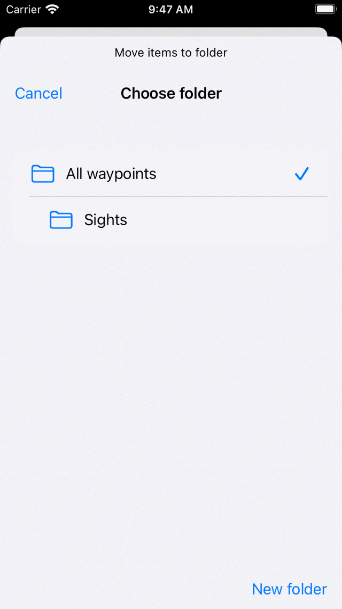
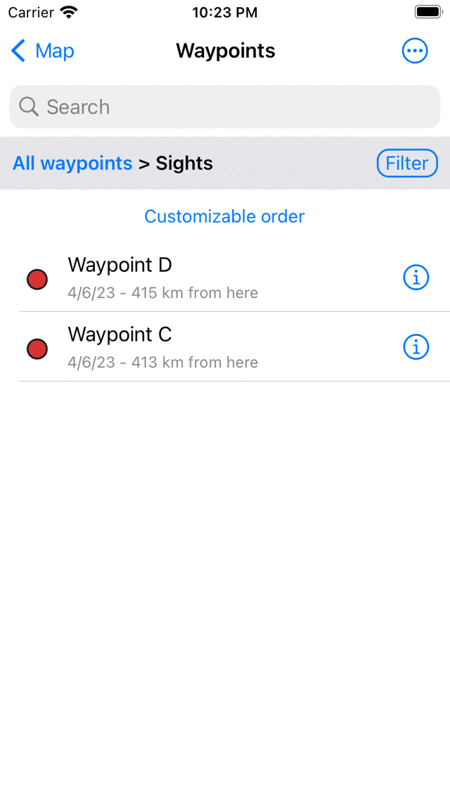

.. _ss-waypoints-organize:

Organizing waypoints
====================

You can keep your waypoints organized by creating folders and moving waypoints into folders.
It is also possible to change the order of the waypoints appearing in the waypoints screen.

Creating a folder
~~~~~~~~~~~~~~~~~
To create a folder, first open the :ref:`waypoints screen <ss-waypoint-load>` (Menu > Waypoints).
Then press More (top right) > New Folder. The new folder screen will be opened, an example is shown below:

.. figure:: ../_static/waypoint-folder1.png
   :height: 568px
   :width: 320px
   :alt: New waypoint folder Topo GPS
   
   *The new folder screen*
   
To create a folder, you have to enter a name. Optionally you can choose the location in the folder tree where the new folder is to be added. This is always initially set to the currently opened folder in the waypoints screen. If you press location and select a folder you can change the location to another folder. When you have entered a name you need to press 'Save' to create a new folder. You will return to the waypoints screen and the newly created folder will be shown in the list.

As an example we will enter 'Sights' and press 'Save' to create a 'Sights' folder. The waypoints screen now looks as follows:

.. figure:: ../_static/waypoint-folder2.png
   :height: 568px
   :width: 320px
   :alt: New waypoint folder Topo GPS
   
   *A 'Sights' folder has been created.*
   
The 'Sights' folder is listed in the waypoints screen with a folder icon.

Moving waypoints into folder
~~~~~~~~~~~~~~~~~~~~~~~~~~~~
To move waypoints into a folder you have to open the :ref:`selection screen <ss-waypoint-select>` by pressing More > Select or pressing long on an item in the waypoints screen. Select the to be moved waypoints and press the folder icon in the bottom toolbar. Then the 'Move items to folder' screen will be shown, example is shown below:

   
   *Move items to folder screen.*

In the 'Move items to folder' screen, the folder tree is shown. If you tap on a folder the selected items will be moved to that folder and you will return to the waypoints screen.

As an example we now will move the waypoints 'Stonehenge' and 'Tower bridge' to the 'Sights' folder. After moving the two waypoints as indicated above the waypoints screen looks as follows:

.. figure:: ../_static/waypoint-folder4.png
   :height: 568px
   :width: 320px
   :alt: Waypoints creen Topo GPS
   
   *The waypoints screen after moving two waypoints into the folder 'Sights'.*

In the waypoints screen the waypoints 'Stonehenge' and 'Tower bridge' have disappeared. They now can be found in the folder 'Sights'.

Opening a folder
~~~~~~~~~~~~~~~~
To open a folder, just tap the folder item in the waypoints screen. As an example we now open the folder 'Sights'. The waypoints screen will then look as follows:

.. figure:: ../_static/waypoint-folder5.png
   :height: 568px
   :width: 320px
   :alt: An opened folder Topo GPS
   
   *The contents of the 'Sights' folder.*

The 'Stonehenge' and 'Tower bridge' waypoints now can be found in the 'Sights' folder. 

Below the search bar you can see the current location in the folder tree. If you press 'All waypoints' you will return to the root folder.

Changing the order of waypoints 
~~~~~~~~~~~~~~~~~~~~~~~~~~~~~~~
Just the folder tree / filter bar in the waypoints screen the current sort method is displayed. If you tap it you can change it. If it is set to 'Customizable order' you can determine the order of the waypoints.

To change the order of the waypoints in the 'Sights' folder, just open that folder. Then press More > Select to enter the selection mode.
The waypoints screen looks then as follows:

   
   *The 'Sights' folder in selection mode.*

On the right hand side of each item there is a handle with three bars. Drag a handle to a desired position and release the finger. The waypoint will then be moved in the list to the desired location. In the example we below, we have move 'Stonehenge' to the top.

   
   *The contents of the 'Sights' folder after moving the 'Stonehenge' waypoint.*

