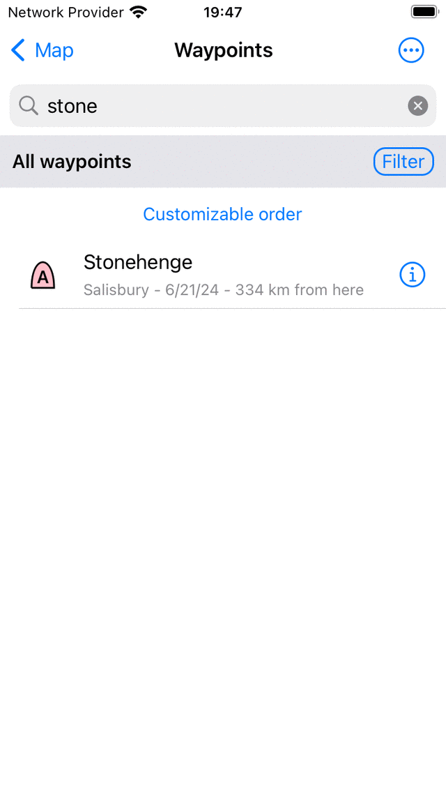
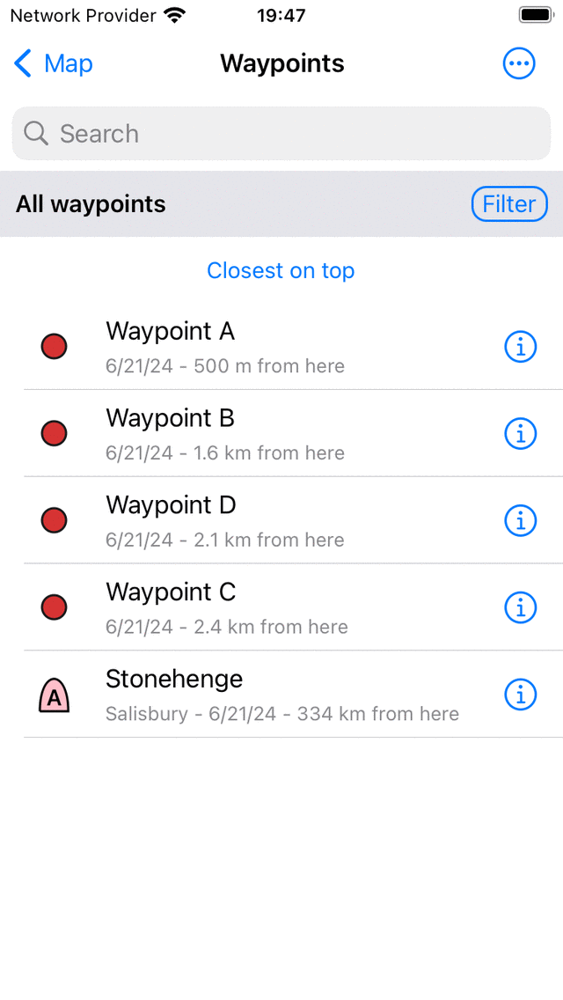
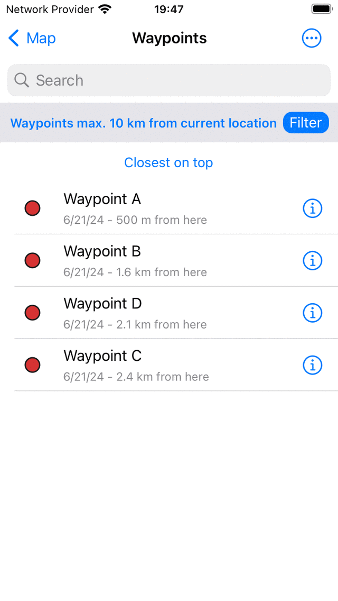
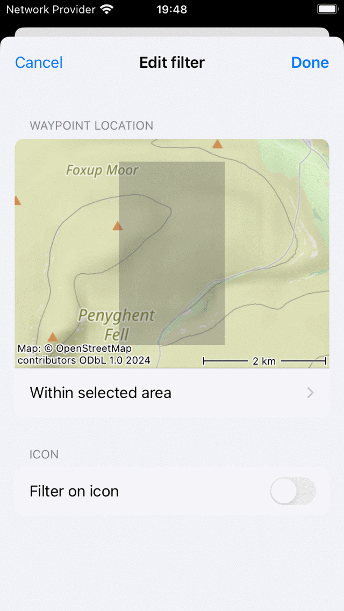

.. _ss-waypoint-search:

Searching waypoints
===================

In the waypoints screen (Menu > Waypoints) you can search waypoints by :ref:`entering keywords in the search bar <ss-waypoint-search-keywords>`, and by :ref:`applying filters <ss-waypoint-filter>`. Furthermore you can :ref:`sort the waypoints <ss-waypoint-sort>` in various ways.

.. _ss-waypoint-search-keywords:

Searching waypoints with keywords
~~~~~~~~~~~~~~~~~~~~~~~~~~~~~~~~~
If you enter a keyword in the search bar on the top of the waypoint screen only waypoints will be shown which have the keyword in its title, description, street, town, province, two character iso countrycode, or zip code. Search is case insenstive. 
If you search in a folder, also all search results in descendant folders will be displayed.
If a :ref:`filter <ss-waypoint-filter>` is applied, the search will restrict itself to the filtered waypoints.

  
   *Searching on 'Stone'*
   
.. _ss-waypoint-sort:

Sorting waypoints
~~~~~~~~~~~~~~~~~
Below the folder/filter bar below the search bar, the current sort method is displayed in the middle.
If you tap the sort button you can change the current sort method between:

- *Customizable order*: The waypoints are sorted in customizable order. If you did not change the order manually, the most recent added waypoints are on top.
- *Closest on top*: The waypoints are sorted according to their distance to your current location, the closest is on top.
- *Newest on top*: The waypoints are sorted according to their creation time, the newest is on top.
- *Oldest on top*: The waypoints are sorted according to their creation time, the oldest is on top.
- *Most recently updated on top*: The waypoints are sorted according to the time at which they were last changed, the waypoint that was changed most recently is on top.
- *Least recently updated on top*: The waypoints are sorted according to the time at which they were last changed, the waypoint that was changed the longest go is on top.
- *Alphabetically*: The waypoints are sorted in alphabetical order.

  
   *Sorting waypoints on distance to current location.*

.. _ss-waypoint-filter:

Filtering waypoints
~~~~~~~~~~~~~~~~~~~
It is also possible to filter waypoints on location and on icon kind.
To enable a filter, tap the filter button in the waypoints screen (just below the search bar on the right hand side). If the filter is enabled, the filter button has a blue background, as in the figure below. If the filter is disabled, only the edge of the filter button is blue, as in the figure above.

  
   *A filter is enabled.*
   
In the figure above you see an example of an enabled filter. Below the search bar on the left hand side you see a description of the currently active filter. 
Here the waypoints are filtered on location, only waypoints within 100 km of the current location are shown.
If you tap the filter description you can modify the current filter. To disable the filter, tap on the filter button.

.. _ss-waypoint-filter-location:

Filtering on location
---------------------
To filter the waypoints on location, tap the filter button to enable the filter. Then tap the filter description to modify the current filter. 
The following screen will be shown in which you can change the current filter:

  
   *Modifying a filter.*

In the section 'Waypoint location' you can change the properties of the location filter.
The slider can be moved to determine the maximal distance of shown waypoints to a specific point.
Below the slider, the point is displayed. In the example above this is the current location.
If you tap it, you could change the current point to:

- *Everywhere*: There is no filtering on location.
- *Current location*: Only waypoints within a certain distance of the current location are shown.
- *Visible part of map*: Only waypoints that are within the bounds of the currently visible part of the main map are shown in the waypoints sceen.
- *Custom location*: If you enter a custom location or coordinate only waypoint within a certain distance of the entered location are shown.

.. _ss-waypoint-filter-icon:

Filtering on icon
-----------------
To filter the waypoints on location, tap the filter button to enable the filter. Then tap the filter description to modify the current filter.
Then in the bottom of the filter edit screen, enable filtering on icon:

  
   *Filtering on icon is enabled.*

In the figure above, filtering on icon is enabled. The icon is set to the default icon, implying that this filter only will show waypoints which have the default icon. To modify this to a specific icon, tap the icon in the filter edit screen. Then the waypoint icons screen will be opened, from which you can select another icon. In the example below we have choosen for the 'Ancient monument' icons.

  
   *Setting the filter to the 'Ancient monument icon'.*

When applying a filtering on icon, only waypoints with a specific icon will be shown in the waypoints screen, as in the figure below. There you see only waypoints with the 'Ancient monument' icon. To indicate that an icon filter is active, the icon on which is filtered is displayed below the search bar left of the filter description.

  
   *Filtering on 'Ancient monuments'.*

   
