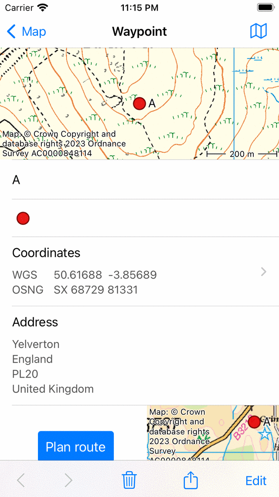

.. _ss-waypoint-details:

Waypoint details
================
The waypoint details screen appears by tapping on the icon of a waypoint that is loaded on the map. You can also open this screen
by pressing the info button (i) on the right hand side of a title in the :ref:`waypoints screen <ss-waypoint-load>`.

The waypoint details screen of the waypoint ‘Stonehenge’ is displayed below:

   *The waypoint details screen of the waypoint ‘Stonehenge’.*

On the top right of the waypoint details screen you find a map icon with a slash. If you tap this button, the waypoint will be removed from
the main map. If the waypoint is not loaded on the map, a map icon withouth a slash is shown. If you tap that icon, the waypoint will be loaded on the map and you will return to the main map.

The waypoint details screen contains information about the waypoint, such
as the title and the coordinates. If available you can also find here a description, photos, a phone number and/or an URL.

The coordinates are displayed in various formats. You can set the displayed coordinate types via 'Menu > More > Settings > :ref:`Displayed coordinate types <sec-settings-coordinates>`'. In the example above only WGS decimal and OSNG are shown.

The physical address of a waypoint is also displayed in the details screen. If the address of a waypoint is still unknown, Topo GPS will look up this address in a database of Apple. For this you have to enable the option :ref:`Addresses - find automatically <sec-settings-addresses>` in the :ref:`settings <ss-settings>`. You have also to be connected to the internet.

On the bottom of the waypoint details screen a small map is shown with shows the waypoint relative to your current location. Note that this map will not show up if you have disabled location access for Topo GPS. On the left hand side of the map there is a plan button. If you press the plan button a route will be planned from your current location to the waypoint with the transportation mode which is displayed below the plan button. If you tap the transportation mode button below the plan button you can change the transportation mode.

With the button on the top right of the waypoint details screen you can load a waypoint on the map or remove it from the map.

In the bottom of the waypoint details screen you can find a toolbar with the following buttons:

- ‘<‘ and ‘>’ button: Allows you to browse through the list of waypoints, or through the waypoints that are loaded on the map.
- Trash button: If you press this button a pop-up will show up asking you whether you would like to :ref:`remove the waypoint from your device <ss-waypoint-remove>`.
- Export button: If you press this button the export pop-up will show up which allows you to :ref:`export the waypoint <ss-waypoints-exporting>`.
- ‘Edit’: Allows you to :ref:`edit the waypoint <ss-waypoint-edit>`.
