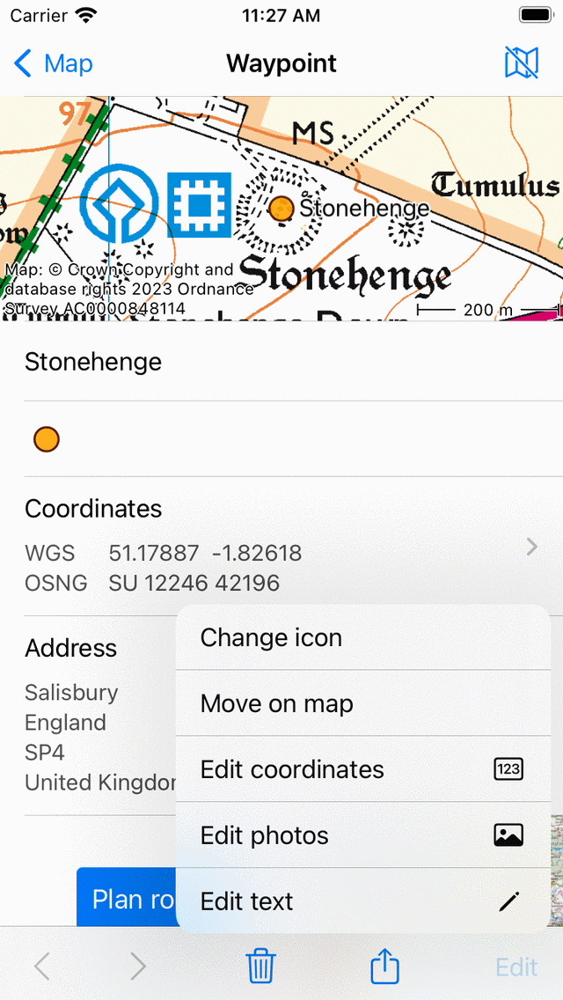

.. _ss-waypoint-edit:

Editing waypoints
=================
To edit a waypoint you have to press the ‘Edit’ button on the bottom of the :ref:`waypoint details screen <ss-waypoint-details>`.
If you press this button an edit pop-up will appear like in the figure below:

   *A pop-up with five possibilities to modify a waypoint.*

The pop-up shows five possibilities to modify the waypoint.

- *Change icon*: Allows you to :ref:`change the icon of the waypoint <ss-waypoint-change-icon>`.
- *Move on map*: Allows you to :ref:`move the waypoint on the map <ss-waypoint-edit-map>`.
- *Edit coordinates*: Allows you to :ref:`edit the coordinates <ss-waypoint-edit-coordinates>` of a waypoint.
- *Edit photos*: Allows you to :ref:`edit the photos <ss-waypoint-edit-photos>` of a waypoint.
- *Edit text*: Allows you to :ref:`edit the title and description <ss-waypoint-edit-title>` of a waypoint.

.. _ss-waypoint-edit-title:

Editing title and description
~~~~~~~~~~~~~~~~~~~~~~~~~~~~~
By pressing ‘Edit text’ in the :ref:`edit pop-up <ss-waypoint-edit>` you can modify the title and
the description of the waypoint. An example is shown below:

.. figure:: ../_static/waypoint-edit-text1.png
   :height: 568px
   :width: 320px
   :alt: Editing Waypoints Topo GPS

   *Modifying the description of the waypoint ‘Stonehenge’.*

To save the changes you have to press ‘Save’ on the top right of the screen. You return to the waypoints details screen as you can see below:

.. figure:: ../_static/waypoint-edit-text2.png
   :height: 568px
   :width: 320px
   :alt: Editing Waypoints Topo GPS

   *The description of the waypoint ‘Stonehenge’ has been modified.*

.. _ss-waypoint-edit-photos:

Editing photos
~~~~~~~~~~~~~~
By pressing the 'Edit photos' button in the :ref:`edit pop-up <ss-waypoint-edit>` you can add photos to the waypoint
and remove photos from the waypoint. If you press this button the following screen will appear.

.. figure:: ../_static/waypoint-photo1.png
   :height: 568px
   :width: 320px
   :alt: Empty photos screen Topo GPS

   *The photos screen if the waypoint does not have photos.*

In the bottom toolbar of the photos screen you can find three buttons:

- *Folder button*: If you press this button you can import photos from your photo library to the waypoint.
- *Camera button*: If you press this button the camera will be opened. If you take a photo it will be added to the waypoint. You could also use Menu > Camera for this, then a waypoint is automatically created at your current location and the taken photo is added to it.
- *Trash button*: If you press this button you can remove the currently displayed photo from a waypoint.

If you have made changes to the photos of a waypoint you have to press 'Done' on the top right to save the changes. If you press 'Cancel' the photos will not be modified.

The added photos are always copied to Topo GPS. So removing the photo afterwards from your photo library does not remove the photo in Topo GPS. The resolution of the added photo can be set via 'Menu > Settings > Camera > Photo size'. Larger photo sizes will require more disk space.

You can view the added photos in the :ref:`waypoint details screen <ss-waypoint-details>`. Below you see an example of the 'Stonehenge' waypoint details screen with a photo:

   *The waypoint details screen with a photo.*

If you tap a photo in the waypoint details screen, the photo screen will be opened with a larger version of the tapped photo. You can zoom in on the displayed photo by making a zoom gesture with two fingers. Sharing the photo is possible by pressing the 'Export' icon on the top right. If you press 'Edit' on the top right you can modify the photos of the waypoint. If the waypoint has multiple photos, you can browse through the available photos by sliding the current photo to the left or to the right. Tapping the info button on the bottom shows the location a photo was taken and if available the direction in which it was taken on a map.

.. _ss-waypoint-edit-coordinates:

Editing coordinates
~~~~~~~~~~~~~~~~~~~
By pressing ‘Edit coordinates’ in the :ref:`edit pop-up <ss-waypoint-edit>` 
the same screen appears when entering coordinates. If you press ‘Save’ on the top right the waypoint will be displaced to the entered coordinates.

.. _ss-waypoint-edit-map:

Move on map
~~~~~~~~~~~
By pressing `Move on map` in the :ref:`edit pop-up <ss-waypoint-edit>` a screen will appear in which you
can move the location of the waypoint manually on a map. You have to press long on the waypoint and can drag it to a new location.
To save the new location of the waypoint you have to press ‘Save’ in the top right of the screen. Otherwise press ‘Cancel’.

.. _ss-waypoint-change-icon:

Change icon
~~~~~~~~~~~
If you press 'Change icon' in the :ref:`edit pop-up <ss-waypoint-edit>` the :ref:`waypoint icons screen <ss-waypoint-icons>` will appear. The waypoint icons screen contains a list of available icons. The currently active icon of the waypoint has a grey background. If you tap an icon, the waypoint icon will be changed and you will return to the waypoint details screen. If the desired icon is not shown in the waypoint icons screen, you can :ref:`create a new icon <ss-waypoint-create-icons>` by pressing 'New icon' in bottom of the waypoint icons screen.
