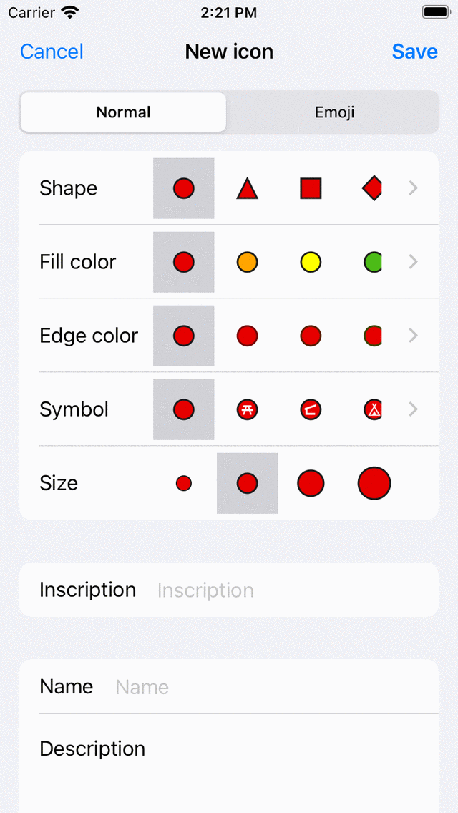
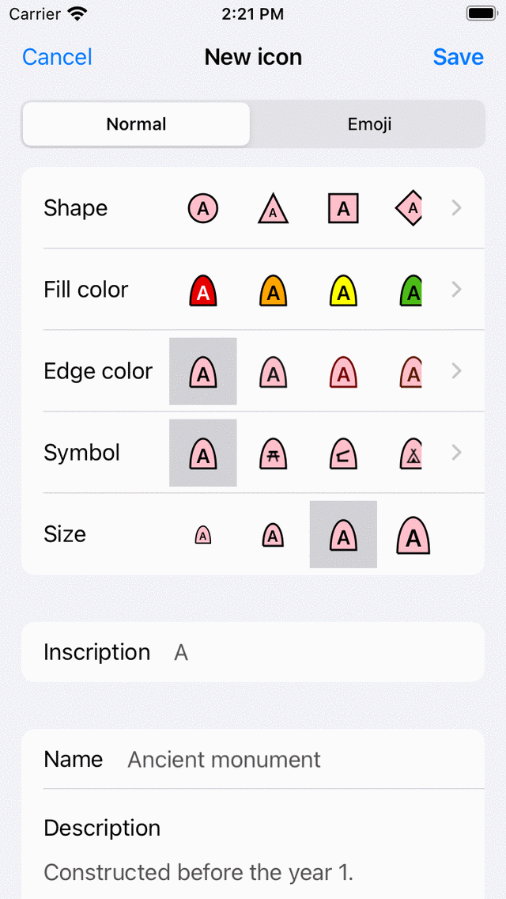

.. _ss-waypoint-icons:

Waypoint icons
==============

A :ref:`waypoint <ss-waypoint>` is displayed on the map with an icon. If you :ref:`create a waypoint <ss-waypoint-create-map>` you can choose an icon from the waypoint icons screen. The waypoint icons screen displays the list of available icons on your device. An example of this screen is shown below.

.. figure:: ../_static/waypoint-ic1.png
   :height: 568px
   :width: 320px
   :alt: Waypoint icons screen Topo GPS

   *The waypoint icons screen .*

The waypoint icons screen can accessed in several ways when creating or modifying waypoints.

- From the :ref:`waypoint creation screen <ss-waypoint-create-map>` by tapping the '>' in the 'Icon' row.
- From the :ref:`waypoint details screen <ss-waypoint-details>` by pressing 'Edit > Change icon'.
- From the :ref:`waypoints screen <ss-waypoints-select>` by pressing 'More > Select > More (bottom) > Change icons'.
- From the Enter coordinates screen by tapping the 'Icon' row.

Default icon
~~~~~~~~~~~~
In the top of the waypoint icons screen, the default icon is shown. This icon is used for all waypoints for which an icon was not explicitly set. 

To change the default icon, tap the info button to open the 'Edit icon' screen. If you change the default icon, this will be reflected immediately in all waypoints that are using the default icon. You only need to change the default icon if you want to change the default red circle. Otherwise it is better to use one of the predefined icons or create a new icon.

Predefined icons
~~~~~~~~~~~~~~~~
If you tap the folder 'Predefined icons' in the waypoint icons screen, the avaiable predefined icons are shown. These are several circles, triangles, and squares of various colors. Also a list of icons with various symbols are shown. If you scroll down you can view more.

If the icon of your liking is not among the predefined icons, you can create one yourself.

.. figure:: ../_static/waypoint-ic2.png
   :height: 568px
   :width: 320px
   :alt: New icon screen Topo GPS
   
   *The predefined icons screen*

Using a predefined icon saves you the hassle of creating one yourself, but the drawback is that there is less customization possible.

.. _ss-waypoint-create-icons:

Creating icons
~~~~~~~~~~~~~~
To create a new icon tap 'New icon' in the bottom of the waypoint icons screen. The 'New icon' screen will be opened as in the figure below:

   
   *The new icon screen*

Using the tab selector in the top of the new icon screen you can choose between creating a normal icon or an emoji icon.

If you choose a normal icon you can change the following properties.

- *Shape*: Tap on one of the shown shapes to change the shape. Scroll to the right or tap '>' to view more shapes.
- *Fill color*: Tap a fill color to change the fill color. Scroll to the right or tap '>' to choose from more colors.  If you tap '>' you can also set the opacity of the fill color.
- *Edge color*: Tap a edge color to change the edge color. Scroll to the right or tap '>' to choose from more colors.
- *Symbol*: Tap a symbol to choose a symbol or none. Scroll to the right or tap '>' for more symbols. 
- *Size*: Tap the desired size.
- *Inscription*: If you enter a inscription in the inscription field, a inscription (for example an 'A') will be shown in the middle of the icon. The color of the inscription is the same as the edge color if the contrast with the fill color is large enough. If not, it is either white or black, depending on which color gives the most contrast with the fill color. You cannot combine an inscription with a symbol.

The currently selected icon has a grey background.

If you select the emjoi tab to create an emoji icon you can choose the emoji from a list of emojis. You can scroll down to view more. It is possible to set the size of the emoji icon by tapping the desired size.

After you have the set the icon properties, you can give the icon a name and a description. The name and description will be shown in the waypoint icons screen and also in the waypoint details screen of waypoints using that icon.

As an example we now will create an icon for ancient monuments. We choose a rotated rectangle as the shape, set the size to large, fill color to pink, and enter 'A' as inscription. Then for the name we enter 'Ancient monument' and as a description information about when to use this icon. The result is shown in the figure below.

   
   *The new icon screen in which a new icon is about to be created.*
   
To save the icon, press 'Save' on the top right of the new icon screen. Then newly created waypoint icon will immediately shown in the waypoint icons screen as is shown below.

.. figure:: ../_static/waypoint-ic3.png
   :height: 568px
   :width: 320px
   :alt: Waypoint icons screen Topo GPS

   *The newly created icon for ancient monuments in the waypoint icons screen.*
   
The newly created icon can now be used for creating new waypoints, and for :ref:`changing the icon of waypoints <ss-waypoint-change-icon>`.

Editing icons
~~~~~~~~~~~~~
To edit an stored custom icon in the waypoint icons screen, tap the info button next to the icon. You can change the properties of an icon in the same way as explained above when creating a new icon. Press 'Save' to confirm the changes and to return to the waypoint icons screen. If you make a change to a icon in this way, it will be immediately reflected in all waypoints that are using this icon.

.. _ss-waypoint-change-icon:

Changing icon of a waypoint
~~~~~~~~~~~~~~~~~~~~~~~~~~~
To change the icon of an individual waypoint, open the :ref:`waypoint detail screen <ss-waypoint-details>`. Then tap 'Edit > Change icon'. The waypoint icons screen will be shown. Then select the desired icon in the waypoint icons screen.  If the desired icon is not in the waypoints screen, tap 'New icon' in the bottom to :ref:`create a new icon <ss-waypoint-create-icons>`. The currently set icon has a grey background. After tapping the desired icon, you will return immediately and the waypoint will use the selected icon. 

.. _ss-waypoint-multiple-change-icon:

Changing icon of multiple waypoints
~~~~~~~~~~~~~~~~~~~~~~~~~~~~~~~~~~~
To change the icon of multiple waypoints open the waypoints screen via ':ref:`Menu <sec-menu>` > Waypoints'. Then press 'More > Select' to enter the selection mode. Select the desired waypoints and press in the bottom toolbar 'More > Change icons'. Then the waypoint icons screen will be opened. 
Tap the desired waypoint icon. You will return immediately to the waypoints screen and the icons will be changed.
If the desired icon is not in the waypoints screen, tap 'New icon' in the bottom of the screen to :ref:`create a new icon <ss-waypoint-create-icons>`.

Removing icons
~~~~~~~~~~~~~~
If you press 'More > Select' in the waypoint icons screen you can select icons to be removed. Then if you press the trash button and confirm the removal, the icons will be removed. If there are still any waypoints that are using the icons that were removed, they will no longer use the removed icons, but the default icon instead.

Organizing icons into folders
~~~~~~~~~~~~~~~~~~~~~~~~~~~~~
It is possible to move the icons in the waypoint icons screen to folders. This is just like with waypoints and routes. In this way you can keep the waypoint icons organized.

Press 'More > Create folder' to create a new folder. To move waypoint icons into a folder press 'More > Select' and select the desired waypoint icons. Then press the folder icon in the bottom to open the folder tree. Select the folder to move the selected icons to the desired folder.

Changing order of icons
~~~~~~~~~~~~~~~~~~~~~~~
If the sort method (below search bar) is set to 'Customizable order' you can customize the order of the icons.
Press 'More > Select' to enter the selection mode. By pressing long on the handle on the right hand side you can drag a waypoint icon to the desired position.

Exporting icons
~~~~~~~~~~~~~~~
If you tap 'More > Select' in the waypoint icons screen you can select icons to be exported. Then if you press the export button in the bottom right you can export the selected icons. The icons will be exported in the wsf (Waypoint Style Format) file format. This is a special XML file format designed for use in Topo GPS. Another user of Topo GPS (iOS) can open this file with Topo GPS. Then all icons in this wsf file will be imported and shown in the waypoint icons screen.

