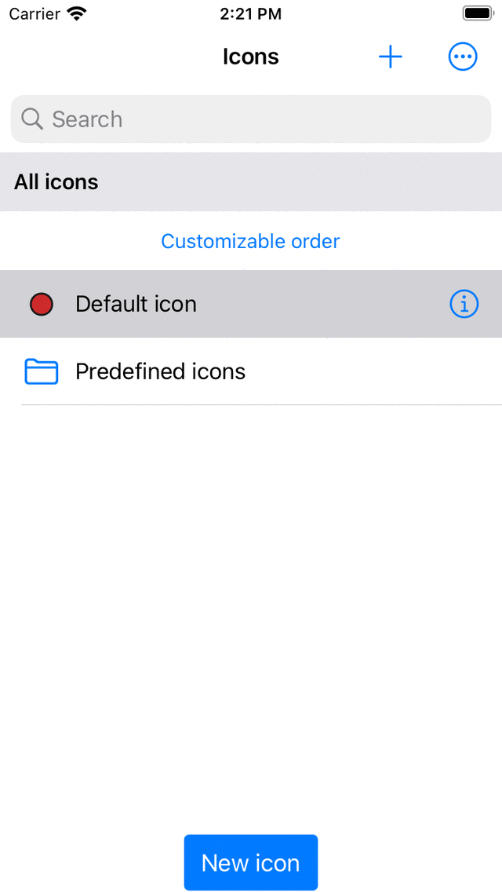
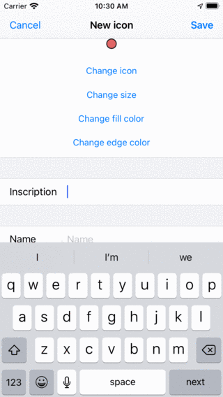
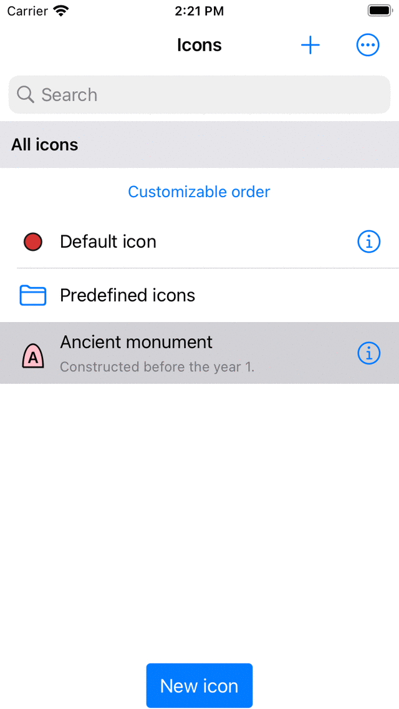
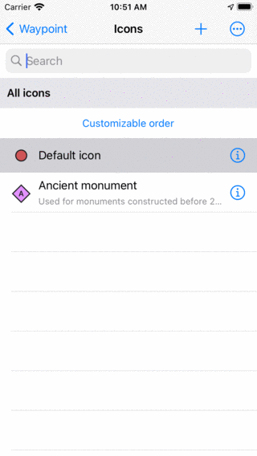
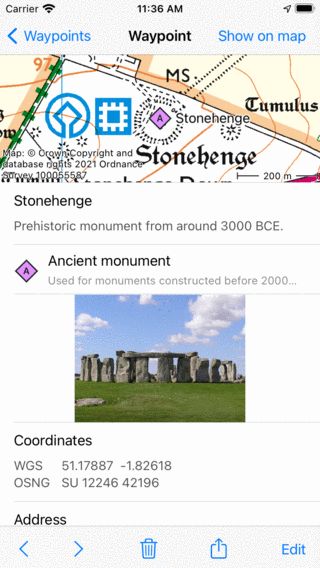
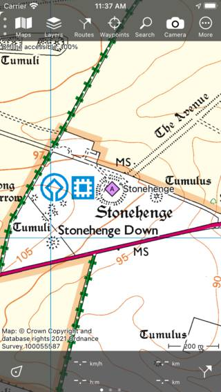

.. _ss-waypoint-icons:

Waypoint icons
==============

Waypoints are displayed on the map with an icon and a title. It is possible to customize the waypoint icon. Multiple waypoints can use exactly the same icon. Waypoints in the waypoints screen (Menu > Waypoints) can be :ref:`filtered on icon <ss-waypoint-filter-icon>`.

The waypoint icons screen displays the list of available icons on your device. An example is shown below.

   *The waypoint icons screen (Waypoint details > Edit > Change icon).*

Each waypoint is using an icon from the waypoint icons screen. The waypoint icons screen can accessed in several ways when creating or modifying waypoints.

- From the :ref:`waypoint details screen <ss-waypoint-details>` by pressing 'Edit > Change icon'.
- From the :ref:`waypoints screen <ss-waypoints-select>` by pressing 'More > Select > More (bottom) > Change icons'.
- From the input coordinates screen by tapping the 'Icon' row.
- From the :ref:`waypoint creation screen <ss-waypoint-create-map>` by tapping the 'Icon' row.

Default icon
~~~~~~~~~~~~
In the waypoint icons screen in the example above only one icon is shown. The default icon. This icon is used for all waypoints for which an icon was not explicitly set. 

To change the default icon, tap the info button to open the 'Edit icon' screen. If you change the default icon, this will be reflected immediately in all waypoints that are using the default icon.

You only need to change the default icon if you want to change the default red circle. Otherwise it is better to first create a new icon.

.. _ss-waypoint-create-icons:

Creating icons
~~~~~~~~~~~~~~
In the waypoint icons screen above only the default icon is shown. To add a new icon press '+' on the top right.
The 'New icon' screen will be opened.

   
   *The new icon screen*

The following properties of an icon can be modified.

- Shape. Press 'Change icon' and tap the desired shape. You can choose between circle, triangle, rectangle, square, rhombus among other.
- Size. Press 'Change size' and tap the desired size. You can choose between 'Small', 'Normal' and 'Large'.
- Fill color. Press 'Change fill color' to change the fill color of the icon. The color picker screen will appear in which you select the desired color. In the bottom you can set the opacity. If you have selected a color you have to press the cross on the top right to return.
- Edge color. Press 'Change edge color' to change the color of the edge of the icon. 
- Inscription. If you enter a inscription in the inscription field, a inscription (for example an 'A') will be shown in the middle of the icon. The color of the inscription is the same as the edge color if the contrast with the fill color is large enough. If not, it is either white or black, depending on which color gives the most contrast with the fill color.

After you have the set the icon properties, you can give the icon a name and a description. The name and description will be shown in the waypoint icons screen.

As an example we now will create an icon for ancient monuments. We choose a rotated rectangle as the shape, set the size to large, fill color to pink, and enter 'A' as inscription. Then for the name we enter 'Ancient monument' and as a description information about when to use this icon. The result is shown in the figure below.

   
   *The new icon screen in which a new icon is about to be created.*
   
To save the icon, press 'Save' on the top right of the new icon screen. Then newly created waypoint icon will immediately shown in the waypoint icons screen as is shown below.

   *The waypoint icons screen with the newly created icon for ancient monuments.*
   
Editing icons
~~~~~~~~~~~~~
To edit an icon, press the info button next to an icon in the waypoint icons screen. You can change the properties of an icon in the same way as explained above when creating a new icon. Press 'Save' to confirm the changes and to return to the waypoint icons screen. If you make a change to a icon in this way, it will be immediately reflected in all waypoints that are using this icon.

Changing icon of a waypoint
~~~~~~~~~~~~~~~~~~~~~~~~~~~
To change the icon of an individual waypoint, open the :ref:`waypoint detail screen <ss-waypoint-details>`. Then press 'Edit > Change icon'. The waypoint icons screen will be shown. Then select the desired icon from the list of icons in the waypoint icons screen. 
If the desired icon is not in the waypoints screen, please first press + on the top right to :ref:`create a new icon <ss-waypoint-create-icons>`.
The currently set icon has a grey background. After tapping the desired icon, you will return immediately and the waypoint will use the selected icon. 

In this way we for example set the icon of the Stonehenge waypoint to our ancien monument icon.

   
   *The icon of the 'Stonehenge' waypoint was changed to 'Ancient monument'*

In the details screen above, the used icon is shown below the title. On the main map the 'Stonehenge' waypoint with the newly created icon looks as follows:

   
   *The 'Stonehenge' waypoint with the 'Ancient monument' icon on the main map.*

Changing icon of multiple waypoints
~~~~~~~~~~~~~~~~~~~~~~~~~~~~~~~~~~~
To change the icon of multiple waypoints open the waypoints screen via ':ref:`Menu <sec-menu>` > Waypoints'. Then press 'More > Select' to enter the selection mode. Select the desired waypoints and press in the bottom toolbar 'More > Change icons'. Then the waypoint icons screen will be opened. 
Tap the desired waypoint icon. You will return immediately to the waypoints screen and the icons will be changed.
If the desired icon is not in the waypoints screen, please first press + on the top right to :ref:`create a new icon <ss-waypoint-create-icons>`.

Removing icons
~~~~~~~~~~~~~~
If you press 'More > Select' in the waypoint icons screen you can select icons to be removed. Then if you press the trash button and confirm the removal, the icons will be removed. If there are still any waypoints that are using the icons that were removed, they will no longer use the removed icons, but the default icon instead.

Organizing icons into folders
~~~~~~~~~~~~~~~~~~~~~~~~~~~~~
It is possible to organize the icons in the waypoint icons screen just like you do with waypoints and routes. In this way you can keep the waypoint icons organized.

Press 'More > Create folder' to create a new folder. To move waypoint icons into a folder press 'More > Select' and select the desired waypoints. Then press the folder icon in the bottom to open a folder tree. Select the folder to move the selected icons to the desired folder.

Changing order of icons
~~~~~~~~~~~~~~~~~~~~~~~
If the sort method (below search bar) is set to 'Customizable order' you can customize the order of the icons.
Press 'More > Select' to enter the selection mode. By pressing long on the handle on the right hand side you can drag a waypoint icon row in the list to the desired position.

Exporting icons
~~~~~~~~~~~~~~~
If you tap 'More > Select' in the waypoint icons screen you can select icons to be exported. Then if you press the export button in the bottom right you can export the selected icons. The icons will be exported in the wsf (Waypoint Style Format) file format. This is a special XML file format designed for use in Topo GPS. Another user of Topo GPS (iOS) can open this file with Topo GPS. Then all icons in this wsf file will be imported and shown in the waypoint icons screen.

