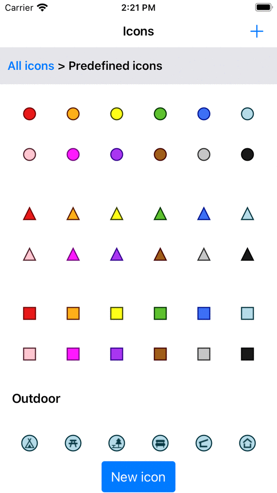

.. _ss-waypoint-icons

Waypoint icons
==============

Waypoints are displayed on the map with an icon and a title. It is possible to customize the waypoint icon. 

The icon of a waypoint or a set of waypoints can be set via the waypoint icons screen. 
The waypoint icons screen displays the list of available icons on your device. An example is shown below.

.. figure:: ../_static/waypoint-ic1.png
   :height: 568px
   :width: 320px
   :alt: Waypoint icons screen Topo GPS

   *The waypoint icons screen (Waypoint details > Edit > Change icon).*

The waypoint icons screen can accessed in several ways when creating or modifying waypoints.

- From the :ref:`waypoint details screen <ss-waypoint-details>` by pressing 'Edit > Change icon'.
- From the :ref:`waypoints screen <ss-waypoints-select>` by pressing 'More > Select > More (bottom) > Change icons'.
- From the input coordinates screen by pressing the 'Icon' row.
- From the :ref:`waypoint creation screen <ss-waypoint-create-map>` by pressing the 'Icon' row.

Default icon
~~~~~~~~~~~~
In the waypoint icons screen in the example above only one icon is shown. The default icon. This icon is used for all waypoints for which an icon was not explicitly set. 

To change the default icon, tap the info button to open the 'Edit icon' screen. If you change the default icon, this will be reflected immediately in all waypoints that are using the default icon.

You only need to change the default icon if you want to change the default red circle. Otherwise it is better to first create a new icon.

Creating icons
~~~~~~~~~~~~~~
In the waypoint icons screen above only the default icon is shown. To add a new icon press '+' on the top right.
The 'New icon' screen will be opened.

   
   *The new icon screen*

The following properties of an icon can be modified.

- Shape. Press 'Change icon' and tap the desired shape. You can choose between circle, triangle, rectangle, square, rhombus among other.
- Size. Press 'Change size' and tap the desired size. You can choose between 'Small', 'Normal' and 'Large'.
- Fill color. Press 'Change fill color' to change the fill color of the icon. The color picker screen will appear in which you select the desired color. In the bottom you can set the opacity. If you have selected a color you have to press the cross on the top right to return.
- Edge color. Press 'Change edge color' to change the color of the edge of the icon. 
- Inscription. If you enter a inscription in the inscription field, a inscription (for example an 'A') will be shown in the middle of the icon. The color of the inscription is the same as the edge color if the contrast with the fill color is large enough. If not, it is either white or black, depending on which color gives the most contrast with the fill color.

After you have the set the icon properties, you can give the icon a name and a description. The name and description will be shown in the waypoint icons screen.

As an example we now will create an icon for ancient monuments. We choose a rotated rectangle as the shape, set the size to large, fill color to pink, and enter 'A' as inscription. Then for the name we enter 'Ancient monument' and as a description information about when to use this icon. The result is shown in the figure below.

.. figure:: ../_static/waypoint-ic3.png
   :height: 568px
   :width: 320px
   :alt: New icon screen Topo GPS
   
   *The new icon screen in which a new icon is about to be created.*
   
To save the icon, press 'Save' on the top right of the new icon screen. Then newly created waypoint icon will immediately shown in the waypoint icons screen as is shown below.

.. figure:: ../_static/waypoint-ic4.png
   :height: 568px
   :width: 320px
   :alt: Waypoint icons screen Topo GPS

   *The waypoint icons screen with the newly created icon for ancient monuments.

