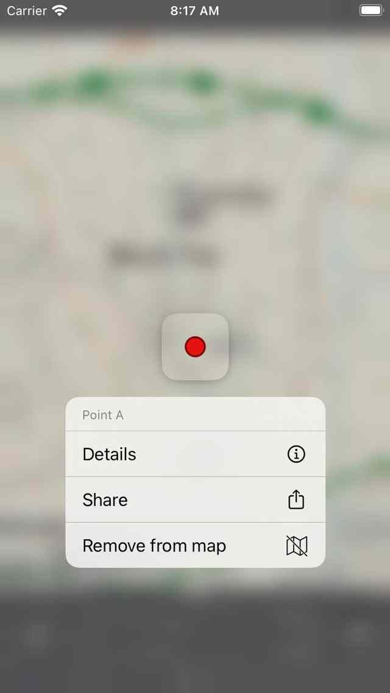

.. _ss-waypoint-quick-actions:

Waypoint quick actions
======================
If you press long on a waypoint icon on the main map, a quick actions menu will be shown as in the figure below:

   
   *The quick actions menu that appears when pressing long on a waypoint.*

You can use the quick actions menu to view the :ref:`waypoint details <ss-waypoint-details>`, to :ref:`share the waypoint <ss-waypoints-exporting>`, 
and to remove the waypoint from the map. 

<APPLE>
To interact quickly with this popup, press long on a waypoint icon, hold your finger on the screen and move it to the desired item in the popup. Then release your finger.
</APPLE>
