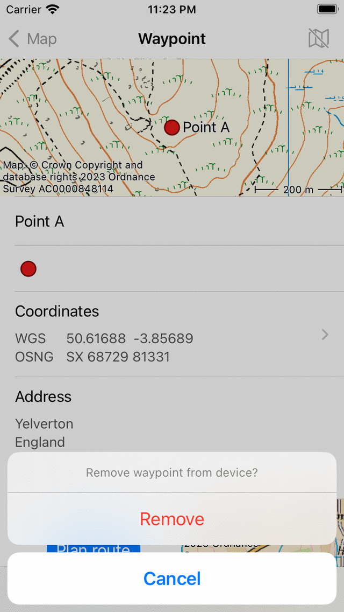

.. _ss-waypoint-remove:

Removing waypoints
==================
To remove a waypoint from your device you first have
to open the :ref:`waypoint details screen <ss-waypoint-details>`.

You can do this by pressing the info button right of a waypoint title
in the :ref:`waypoints screen <ss-waypoint-load>` or by
tapping a waypoint that is loaded on the map.

You can remove the waypoint by pressing the trash icon on the bottom of the waypoint details screen. A pop-up will appear in which you have
to confirm the removal as is shown below:

   *Removing a waypoint.*

If you press ‘Remove’ the waypoint and all its photo's will be removed from your device.

If you have enabled :ref:`iCloud synchronization of waypoints <ss-routes-synchronize-icloud>` the waypoint will also be removed from iCloud and from all devices that are synchronized with the same iCloud account.

It is also possible to remove multiple waypoints at once from the :ref:`waypoints screen <ss-waypoint-load>`. Press long on a waypoint item or tap 'More > Select’ to enter the selection mode. Then :ref:`select <ss-waypoints-select>` the waypoints that need to be removed. Next press the trash icon on the bottom of the screen and confirm the removal.

If you only want to :ref:`remove a waypoint from the map (and not from the device) <ss-waypoint-unload>` you have to tap the map icon with a slash in the top right of the waypoint details screen. 
