.. _ss-waypoint-create-map:

Creating waypoints
==================
There are several ways to create waypoints in Topo GPS.

- Pressing long on the map and dragging the icon to the desired location.
- Entering an address in the address tab via Menu > Search.
- Entering coordinates in the coordinates tab via Menu > Search.
- Scanning coordinates with the coordinates scanner via Menu > Search.
- Importing a geodata file which contains waypoints via Menu > Waypoints > More > Import file.
- Saving the current location as a waypoint by pressing the position marker and then 'Save' or 'Create waypoint'. 
- Taking a photo via Menu > Camera.
- Adding waypoints via the waypoints screen > More > +.

In this section we will explain how to create a waypoint directly on the map.

Creating waypoints on the map
~~~~~~~~~~~~~~~~~~~~~~~~~~~~~
If you press with one finger long on the map an icon will appear. An example is shown in the figure below:

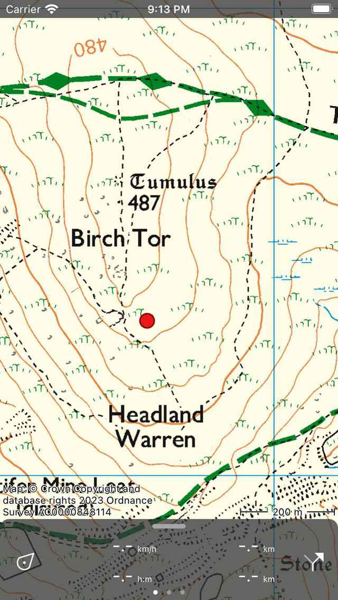

   *By pressing long on the map an icon will appear.*

As long as you hold your finger on the map you can drag the icon to the
desired location. If you release your finger the waypoint creation screen will appear. In the waypoint creation screen you can
set the properties of the waypoint.

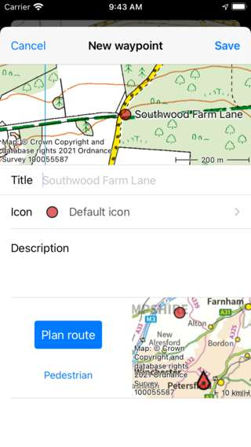

   *Waypoint creation screen in which you can set the properties and save the waypoint.*

In the waypoint creation screen you can optionally give the waypoint a title, set the icon and enter a description.

If you are connected to the internet and you have enabled ‘Addresses - Find automatically’ in the :ref:`settings <sec-settings-addresses>`, an automatic suggestion for the waypoint title will appear. This title has a light grey color and will be used if no title has been entered. In the example of Fig. 2 the suggestion is ‘Southwood Farm Lane’. If you wish to have a waypoint without a title please enter a single space in the title field.

As an example we enter ‘Goal A’ as a title. If you press ‘Save’ the waypoint will be saved on your device and loaded on the map with the title as is illustrated in the figure below.

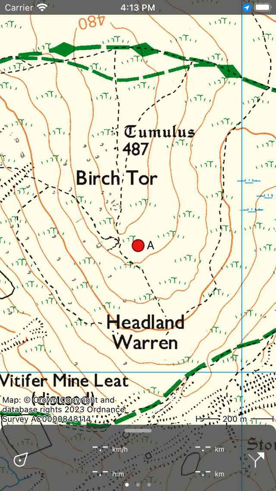

   *The waypoint ‘Goal A’ has been added to the map.*

The waypoint that is created from the map is saved on your device and hence will appear in the :ref:`waypoints screen <ss-waypoint-load>`.

If you accidentally pressed long on the main map so that an icon appeared, you can drag the icon to the top or bottom of map screen. It will then be removed and the waypoint creation screen will not pop up. Also if you press 'Cancel' in the waypoint creation screen, the waypoint will not be created.

If you have entered a description in the waypoint creation screen, you can view it in the waypoint details screen. The waypoint details screen will be opened by tapping on a waypoint that is loaded on the map.

Setting the icon of a created waypoint
--------------------------------------
In the waypoint creation screen you can set the icon of the to be created waypoint. In the example above the icon is set to the default icon, which is in this case a red circle. If you press the icon item below the title field, the waypoint icons screen will be opened as is shown in the figure below:

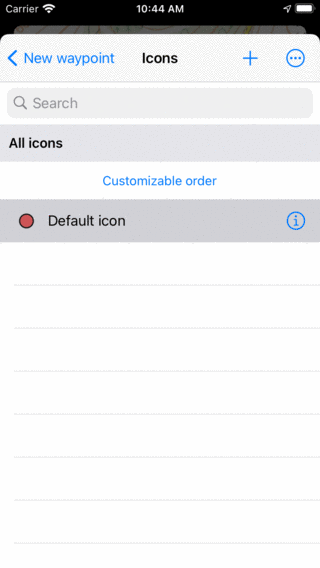

   *A screen which show all the available waypoint icons on a device.*

The currently active icon type has a grey background color. Currently the waypoint icons screen shows only the default icon. To create a new icon, press the + button on the top right. A new screen opens in which you can create an icon.

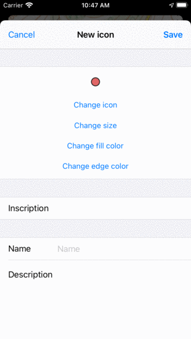

   *A screen in which you can create a new icon.*

In the new icon screen you can adjust the properties of the icon. For example we can create a orange rotated rectangle icon with a G inscription like in the example below:

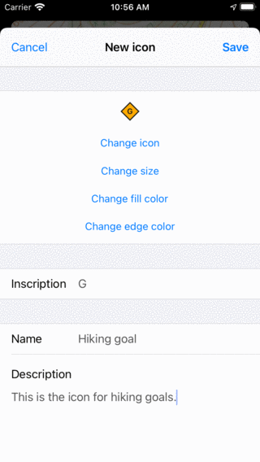

   *A new icon is about to be created.*

If you press 'Save' the new waypoint icon is created and you will return to the waypoint icons screen.

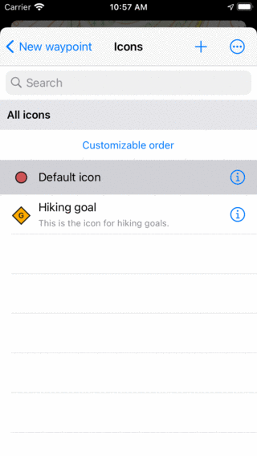

   *Waypoint icons screen with the newly created 'Hiking goal' icon.*
   
If you press the newly created hiking goal icon it will be used as icon in the waypoint creation screen.
   
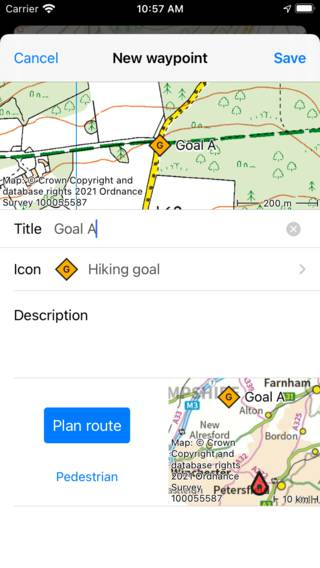

   *The hiking goal icon is now the icon for the to be created waypoint.*

The icon in the waypoint screen is now set to the newly created 'Hiking goal' icon. Then if you press 'Save'
you will return to the map and the waypoint with the hiking goal icon is shown on the map.

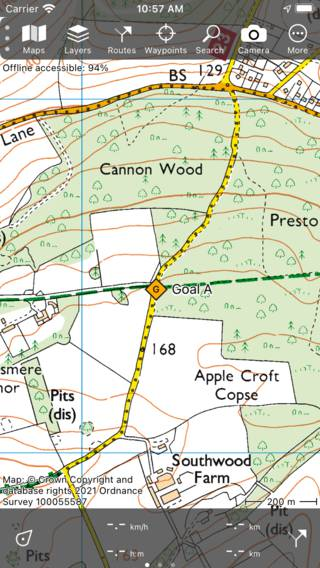

   *The waypoint with the hiking goal icon is shown on the map.*

If you now create a new icon by pressing long on the map the icon of the last created waypoint will be used. So in the example you will drag a 'Hiking goal' icon along the map. If you release your finger the waypoint creation screen will be opened, again with the hiking goal icon as the initially set icon. 

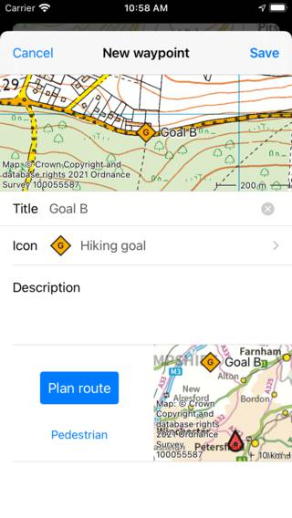

   *Newly created waypoints have initially the same icon as the icon of the last created waypoint.*

Planning a route to a created waypoint
--------------------------------------
If you want to plan a route from you current location to a point on the map, you can press long on the map to create an icon on the map and drag it to the desired location. Then the waypoint creation screen will be opened. In the bottom of the waypoint creation screen you see a 'Plan' button with a map next to it. The map shows the newly created waypoint relative to your current location. Below the 'Plan' button you can see the currently selected transportation mode. In the example above this is 'Pedestrian'. If you tap 'Pedestrian' you can change the transportation mode, for example you can change it to 'Bicycle'. If you press 'Plan' a route is immediately planned from your location to the newly created point and you will return to the map as is shown below. 

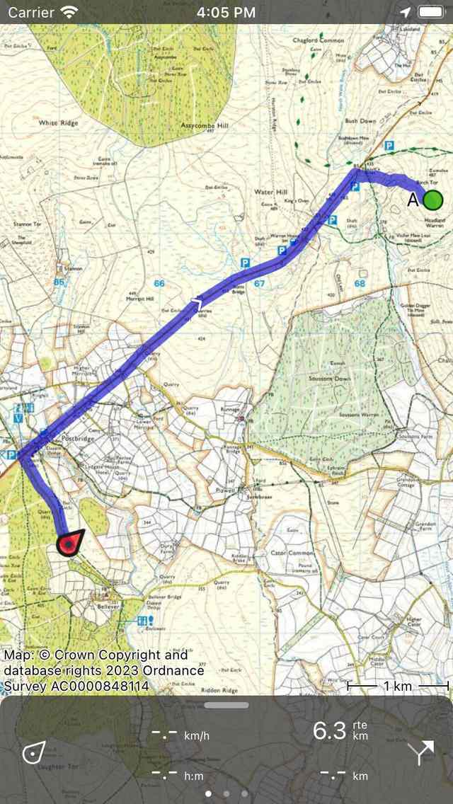

   *A route was planned from the current location to a newly created point on the map.*

The planned route and the waypoint are not saved automatically. To save the planned route press on the route line to open the route planner and then press 'Save' on the top right to save the planned route. After the route is saved it will appear in the routes screen.

