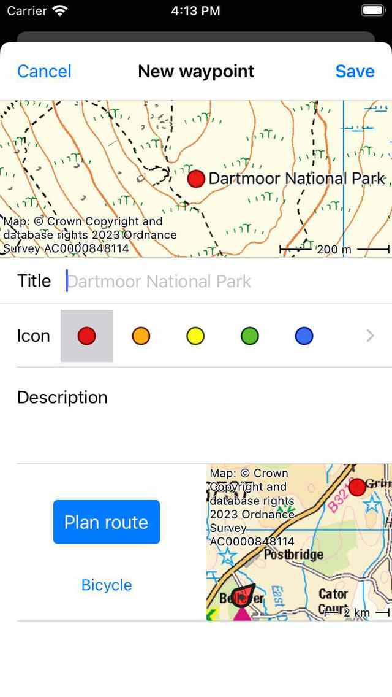

.. _ss-waypoint-create-map:

Creating waypoints
==================
There are several ways to create waypoints in Topo GPS.

- Pressing long on the map and dragging the icon to the desired location.
- Entering an address in the address tab via Menu > Search > Search address.
- Entering coordinates in the coordinates tab via Menu > Search > Enter coordinates.
- Scanning coordinates with the coordinates scanner via Menu > Search > Scan coordinates.
- Importing a geodata file which contains waypoints via Menu > More > Import file.
- Saving the current location as a waypoint by pressing the position marker and then 'Save' or 'Create waypoint'. 
- Taking a photo via Menu > Camera.
- Adding waypoints via the waypoints screen > More > +.

In this section we will explain how to create a waypoint directly on the map.

Creating waypoints on the map
~~~~~~~~~~~~~~~~~~~~~~~~~~~~~
If you press with one finger long on the map an icon will appear. An example is shown in the figure below:

.. figure:: ../_static/waypoints-create-map1.jpg
   :height: 568px
   :width: 320px
   :alt: Waypoint press long on map Topo GPS

   *By pressing long on the map an icon will appear.*

As long as you hold your finger on the map you can drag the icon to the
desired location. If you release your finger the waypoint creation screen will appear. In the waypoint creation screen you can
set the properties of the waypoint.

   *Waypoint creation screen in which you can set the properties and save the waypoint.*

In the waypoint creation screen you can optionally give the waypoint a title, set the icon and enter a description.
If you do not enter a title, the :ref:`automatically suggested title <ss-waypoint-create-automatic-title>` (which is light grey) is used.

As an example we enter ‘A’ as a title. If you press ‘Save’ the waypoint will be saved on your device and loaded on the map with the title as is illustrated in the figure below.

   *The waypoint ‘A’ has been added to the map.*

The waypoint that is created from the map is saved on your device and hence will appear in the :ref:`waypoints screen <ss-waypoint-load>`.

If you accidentally pressed long on the main map so that an icon appeared, you can drag the icon to the top or bottom of map screen. It will then be removed and the waypoint creation screen will not pop up. Also if you press 'Cancel' in the waypoint creation screen, the waypoint will not be created.

If you have entered a description in the waypoint creation screen, you can view it in the waypoint details screen. The waypoint details screen will be opened by tapping on a waypoint that is loaded on the map.

.. _ss-waypoint-create-automatic-title:

Automatic title suggestions
---------------------------
If you are connected to the internet and you have enabled ‘Addresses - Find automatically’ in the :ref:`settings <sec-settings-addresses>`, an automatic suggestion for the waypoint title will appear in the title box. This title has a light grey color and will be used if no title has been entered. If you wish to have a waypoint without a title please enter a single space in the title field.

If you enter a number in as a title, for example '001', the next time you create a waypoint manually from the map, the suggested title will be '002', etc.
This also works with characters, if you enter an 'A', the next suggested title will be 'B', etc. Or if you have entered 'Node_001', the next suggested title will be 'Node_002'. If you do not like the suggested title, you can just enter your desired title, and the next suggested title will be derived from the last input.

Setting the icon of a created waypoint
--------------------------------------
In the waypoint creation screen you can set the icon of the to be created waypoint. In the example above the selected icon is a red circle. By tapping the another icon, it will be used instead. You can scroll to the list of icons to see more icon suggestions. Only the last used icons are shown in the waypoint creation screen. If you want to use a different icon, you can tap the '>' button on the right hand side. Then the waypoint icons screen will be opened. Here you can choose from many predefined icons, and you can create your own custom icons.

Planning a route to a created waypoint
--------------------------------------
If you want to plan a route from you current location to a point on the map, you can press long on the map to create an icon on the map and drag it to the desired location. Then the waypoint creation screen will be opened. In the bottom of the waypoint creation screen you see a 'Plan' button with a map next to it. The map shows the newly created waypoint relative to your current location. Below the 'Plan' button you can see the currently selected transportation mode. In the example above this is 'Pedestrian'. If you tap 'Pedestrian' you can change the transportation mode. You can for exmaple change it to 'Bicycle'. If you press 'Plan' a route is immediately planned from your location to the newly created point and you will return to the map as is shown below. 

   *A route was planned from the current location to a newly created point on the map.*

The planned route and the waypoint are not saved automatically. To save the planned route press on the route line to open the route planner. Then press 'Save' on the top right to save the planned route. After the route is saved it will appear in the routes screen.

