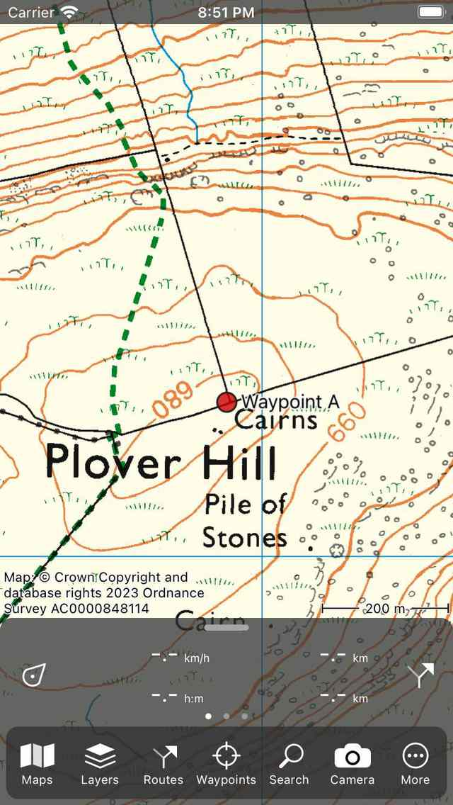
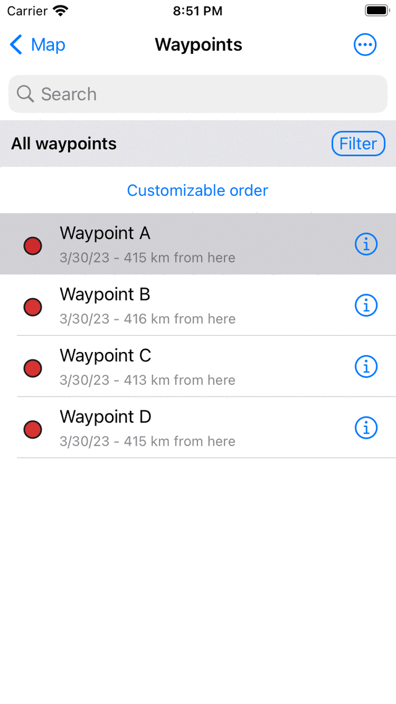

.. _ss-waypoint-load:

Loading waypoints
=================
To load waypoints that are saved on your device on the map,
you first have to open the waypoints screen. You can open
the waypoints screen by pressing ‘Waypoints’ in the :ref:`menu <sec-menu>`.
An example of the waypoints screen is displayed below:

.. figure:: ../_static/waypoints-load1.png
   :height: 568px
   :width: 320px
   :alt: Loading waypoints Topo GPS

   *The waypoints screen (Menu > Waypoints).*

The waypoints screen shows the list of waypoints that are stored locally on your device. On the left hand side the icon of the waypoint is depicted, in this case a red circle. Next to that you see the title. Below the title you find information about the location and creation date. If you press an item in the list, the corresponding waypoint will be loaded on the map and you will return to the map screen.

As an example we now will load the waypoint ‘Waypoint A’. After pressing the 'Waypoint A' item in the waypoint list, you will return to the map and the situation will then be as follows:

   *The waypoint ‘Waypoint A’ has been loaded on the map.*

In the figure you can see that a waypoint is shown on the map with a red circle icon and a title. If you tap the icon of a waypoints you can view the :ref:`waypoint details screen <ss-waypoint-details>`.

Waypoints that are loaded on the map acquire a grey background color in the waypoint screen. An example is shown below:

   *The grey background color indicates that the waypoint ’Waypoint A’ has been loaded on the map.*

It is also possible to load multiple waypoints on the map at once. This is explained in detail in the section :ref:`ss-waypoints-select`. Summarized: press long on a waypoint item in the waypoints screen to open the selection mode. Next select the other desired waypoints by tapping them. Then press the 'Map’ button on the bottom of the screen to load the selected waypoints onto the map.

In the next section we will explain how to :ref:`remove waypoints <ss-waypoint-remove>` from the map.

Overlappping waypoints
~~~~~~~~~~~~~~~~~~~~~~
If there are two waypoints near to each other, the icons could overlap when zoomed out far enough. Instead Topo GPS will only show the latest added waypoint and the other waypoint is not shown. The underlying other waypoint will only appear if you zoom in far enough. If the waypoints do not show up when zoomed in maximally, you might try to extend the maximum allowed zoom of the map in the :ref:`Topo GPS settings <sec-settings-map>`. 
