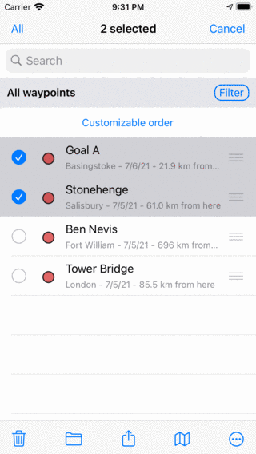
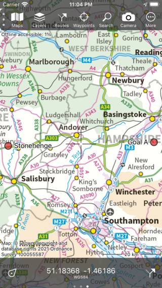

.. _ss-waypoints-select:

Selecting waypoints
===================
In the :ref:`waypoints screen <ss-waypoint-load>` (Menu > Waypoints) you can
select waypoints and perform one of the following actions on the selected waypoints: 

- Remove selected waypoints
- Move selected waypoints into a folder
- Export selected waypoints
- Load selected waypoints on the map
- Change icon of selected waypoints
- Remove selected waypoints from the map

Selecting waypoints is similar to :ref:`selecting routes <sec-routes-select>`.

Opening selection screen
~~~~~~~~~~~~~~~~~~~~~~~~
To open the the selection screen, you have to press long a waypoint item you want to select. Alternatively, you can tap the button 'More' on the top right and then tap 'Select'. 

To select a waypoint, tap a waypoint item in the selection screen. A checkmark will show up and the background of the waypoint item will become grey to indicate that it is selected. An example in which two waypoints are selected is displayed below:

   *Two selected waypoints.*

The title of the selection screen shows how many items are selected. You can deselect an waypoint tapping a selected one. If you want to select all waypoints in the list, you have to press ‘All’ on the top left. To return to the usual waypoints screen you have to press ‘Cancel’.

To quickly select multiple waypoints you can long press on a item, leave the finger on the list and then go up or down. In the same way you can quickly deselect multiple items.

If you tap 'All' on the top left of the selection screen, all items listed are selected immediately.

If you need to select a specific set of waypoints, before making the selection it might be useful first apply :ref:`filters <ss-waypoint-filter>`, :ref:`search keywords <ss-waypoint-search-keywords>`, and :ref:`sort <ss-waypoint-sort>` the waypoints in a handy way.

If you select a :ref:`waypoint folder <ss-waypoints-organize>`, the applied action will be carried out recursively to the contents of the folder. For example, if you select a folder by pressing long on the folder in the waypoints screen, and then tap the map icon in the bottom of the screen, all waypoints contained in the folder will appear on the map.

Performing an action
~~~~~~~~~~~~~~~~~~~~
If you have made a selection you can perform an action with one of the buttons in the toolbar on the bottom of the screen. The toolbar buttons are from left to right:

- *Trash button*: If you press this button a pop-up will ask to to whether you would like to remove the selected waypoints from your device (and iCloud if enabled). If you press 'Remove' the selected waypoints will be removed.

- *Folder button*: If you press this button a screen with the folder tree will be opened. You can select a folder and the selected waypoints will be moved to another folder.

- *Export button*: If you press this button the :ref:`export pop-up <ss-waypoints-exporting>` will be shown. In this pop-up you can select the kind of data to be exported and change the export settings. If you press 'Export' in the export pop-up the selected waypoints will be exported. Another pop-up with apps and actions will be shown. If you tap an app or action, the result of the export will be handled by the app or action.

- *Map button*: If you press this button, the selected waypoints will be loaded on the map. The map will zoom automatically to the selected waypoints and you will be returned to the map.

- *More button*: If you press the more button in the bottom toolbar, a menu will appear from which you can choose the following actions:

  - *Remove from map*: If you press this button, the selected waypoints will be removed from the map.
  
  - *Change icon*: If you press this button the waypoint icons screen will be opened. You can press an icon in this screen to change the icon of the selected waypoints. 

As an example we now will load the two selected waypoints from the example above on the map by pressing the map icon. The map screen will appear and the map will be zoomed to the two selected waypoints as you can see in the figure below:

   *The waypoints 'Goal A' and 'Stonehenge' have been loaded on the map.*

