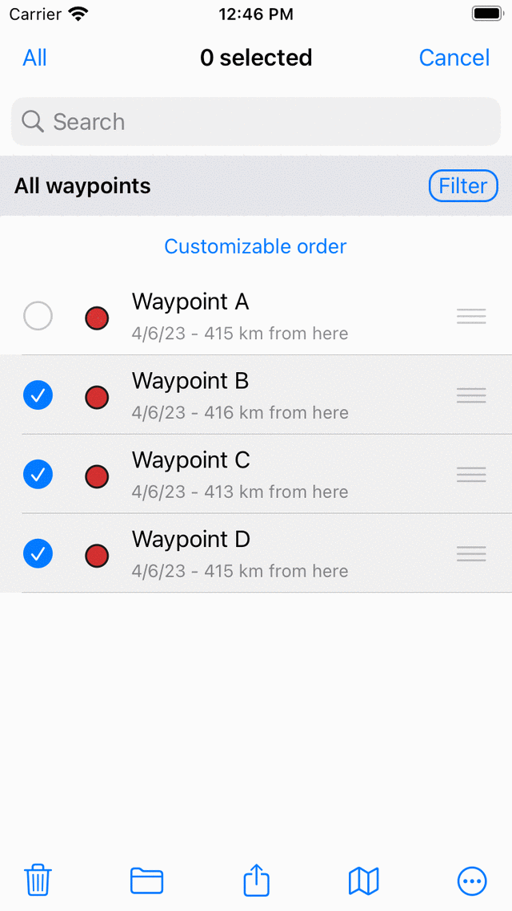
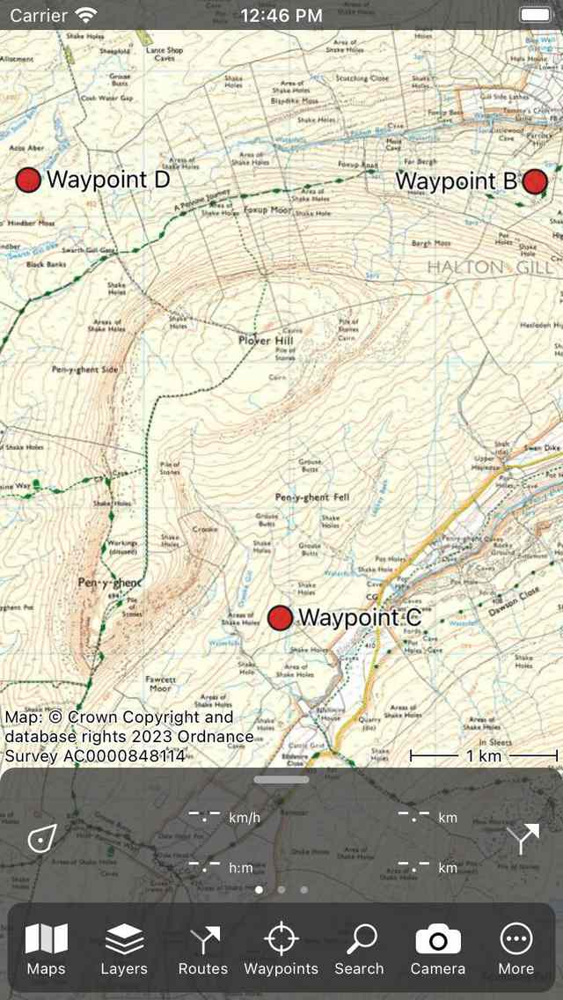

.. _ss-waypoints-select:

Selecting waypoints
===================
In the :ref:`waypoints screen <ss-waypoint-load>` (Menu > Waypoints) you can
select waypoints and perform one of the following actions on the selected waypoints: 

- Remove selected waypoints
- Move selected waypoints into a folder
- Export selected waypoints
- Load selected waypoints on the map
- Change icon of selected waypoints
- Remove selected waypoints from the map

Selecting waypoints is similar to :ref:`selecting routes <sec-routes-select>`.

Opening selection screen
~~~~~~~~~~~~~~~~~~~~~~~~
To open the selection screen and select the fist waypoint, you have to press long on a waypoint item you want to select. Alternatively, you can tap the button 'More' on the top right of the screen and then tap 'Select'. 

To select more waypoints, tap a waypoint item in the selection screen. 
<APPLE>
A checkmark will show up and the background of the waypoint item will become grey to indicate that it is selected.
</APPLE>
<ANDROID>
The background of the waypoint item will become light blue to indicate that it is selected.
</ANDROID>
An example in which three waypoints are selected is displayed below:

   *Three selected waypoints.*

The title of the selection screen shows how many items are selected. You can deselect an waypoint tapping a selected one. 
<APPLE>
If you want to select all waypoints in the list, you have to press ‘All’ on the top left. To return to the usual waypoints screen you have to press ‘Cancel’.
</APPLE>
<ANDROID>
If you want to select all waypoints in the list, you have to press ‘More > Select all’ on the top right. To return to the usual waypoints screen you have to press the arrow on the top left of the screen.
</ANDROID>

To quickly select multiple waypoints you can long press on a item, leave the finger on the list and then go up or down. In the same way you can quickly deselect multiple items.

<APPLE>
If you tap 'All' on the top left of the selection screen, all items listed will be selected.
</APPLE>

It might be useful to first apply :ref:`filters <ss-waypoint-filter>`, and :ref:`search keywords <ss-waypoint-search-keywords>`, and :ref:`sort <ss-waypoint-sort>` the waypoints, before selecting the required waypoints.

If you select a :ref:`waypoint folder <ss-waypoints-organize>`, the applied action will be carried out recursively to the contents of the folder. For example, if you select a folder by pressing long on the folder in the waypoints screen, and then tap the map icon in the bottom of the screen, all waypoints contained in the folder will be loaded on the map.

Performing an action
~~~~~~~~~~~~~~~~~~~~
If you have selected the waypoints you can perform an action with one of the buttons in the toolbar on the <APPLE>bottom</APPLE><ANDROID>top</ANDROID> of the screen. The toolbar buttons are from left to right:

<APPLE>
- *Trash button*: If you tap this button a pop-up will ask to to whether you would like to remove the selected waypoints from your device (and iCloud if enabled). If you press 'Remove' the selected waypoints will be removed from your device. This cannot be undone.

- *Folder button*: If you tap this button a screen with the folder tree will be opened. You can select a folder and the selected waypoints will be moved to another :ref:`folder <ss-waypoints-organize>`.

- *Export button*: If you tap this button the :ref:`export pop-up <ss-waypoints-exporting>` will be shown. In this pop-up you can select the kind of data to be exported and change the export settings. If you press 'Export' in the export pop-up the selected waypoints will be exported. Another pop-up with apps and actions will be shown. If you tap an app or action, the result of the export will be handled by the app or action.

- *Map button*: If you tap this button, the selected waypoints will be loaded on the map. The map will zoom automatically to the selected waypoints and you will be returned to the map.

- *More button*: If you tap the more button in the bottom toolbar, a menu will appear from which you can choose the following actions:

  - *Remove from map*: If you tap this button, the selected waypoints will be removed from the map.
  
  - *Change icon*: If you tap this button the :ref:`waypoint icons screen <ss-waypoint-icon>` will be opened. You can tap an icon in this screen to change the icon of the selected waypoints. 
</APPLE>
<ANDROID>
- *Map button*: If you tap this button, the selected waypoints will be loaded on the map. The map will zoom automatically to the selected waypoints and you will be returned to the map.

- *Share button*: If you tap this button the :ref:`export pop-up <ss-waypoints-exporting>` will be shown. In this pop-up you can select the kind of data to be exported and change the export settings. If you press 'Export' in the export pop-up the selected waypoints will be exported. Another pop-up with apps and actions will be shown. If you tap an app or action, the result of the export will be handled by the app or action.

- *More button*: If you tap the more button in the toolbar in the top, a menu will appear from which you can choose the following actions:

  - *Remove*: If you tap this button a pop-up will ask to to whether you would like to remove the selected waypoints from your device (and iCloud if enabled). If you press 'Remove' the selected waypoints will be removed from your device. This cannot be undone.
  
  - *Move to folder*: If you tap this button a screen with the folder tree will be opened. You can select a folder and the selected waypoints will be moved to another :ref:`folder <ss-waypoints-organize>`. 
  
  - *Remove from map*: If you tap this button, the selected waypoints will be removed from the map.
  
  - *Change icon*: If you tap this button the :ref:`waypoint icons screen <ss-waypoint-icon>` will be opened. You can tap an icon in this screen to change the icon of the selected waypoints. 

  - *Select all*: If you tap this button, all waypoints will be selected.
</ANDROID>

As an example we now will load the three selected waypoints from the example above on the map by pressing the map icon. The map screen will appear and the map will be zoomed to the three selected waypoints as you can see in the figure below:

   *The waypoints 'B', 'C', and 'D' have been loaded on the map.*

