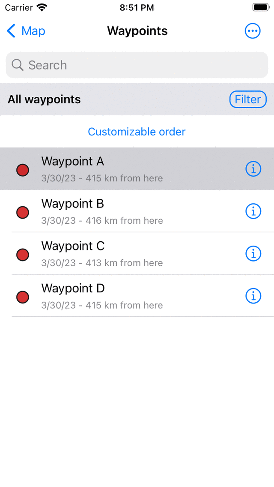
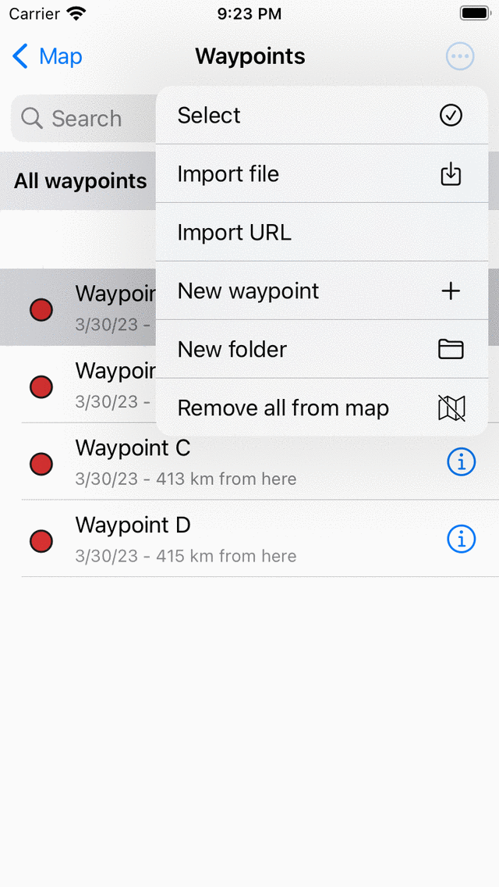

.. _ss-waypoint-unload:

Removing waypoints from the map
===============================

You can remove waypoints from the map, via the waypoints screen, the waypoint quick actions menu and the waypoint details screen.

Waypoints screen
~~~~~~~~~~~~~~~~
Via the :ref:`waypoints screen <ss-waypoint-load>` (Menu > Waypoints) you can remove waypoints from the map. 
An example of the waypoints screen is displayed in the figure below:

   *The grey background color indicates that the waypoint ‘Stonehenge’ is loaded on the map.*

The grey background color of the waypoint ‘Stonehenge’ indicates that it is currently loaded on the map.

If you tap a waypoint item that has a grey background color it will be immediately removed from the map. The grey background color will disappear.

You can also remove all loaded waypoints from the map at once. For this press ‘More' (the top right circle with three dots) to open the 'More' menu in the waypoints screen. Then press 'Remove all from map' in the bottom of the menu. 

   *The more menu in the waypoints screen with the 'Remove all from map' option.*

Waypoint quick actions menu
~~~~~~~~~~~~~~~~~~~~~~~~~~~
If you press long on a waypoint that is loaded on the map, a menu will appear next to the waypoint. Tap in this menu 'Remove from map' to remove the waypoint from the map.

Waypoint details screen
~~~~~~~~~~~~~~~~~~~~~~~
It is also possible to remove a waypoint from the map via the :ref:`waypoint details screen <ss-waypoint-details>`. Tap the waypoint icon of a waypoint that is loaded on the map to open the details screen. Or tap the info button (i) of a waypoint in the waypoints screen to open the details screen. In the waypoint detail screen tap the remove from map icon on the top right.
