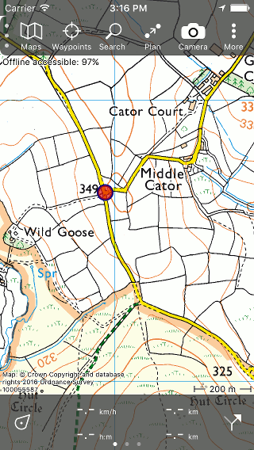
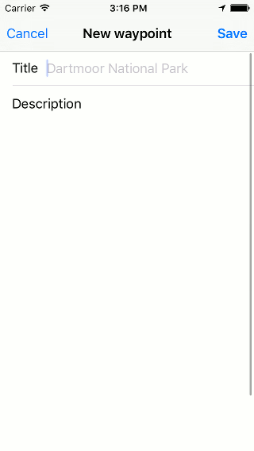
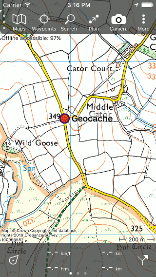

.. _ss-waypoint-create-map:

Creating waypoints
==================
You can create a new waypoint by pressing the ‘+’ button
on the bottom of the :ref:`waypoints screen <ss-waypoint-load>`. Next
you can enter a coordinate or an address. You can also do this via
Menu > Search > Coordinate.

In this section it will be explained how you can create a waypoint directly from the map.

Creating waypoints on the map
~~~~~~~~~~~~~~~~~~~~~~~~~~~~~
By pressing long on the map a red circle will appear (the route planner needs to be closed). An example is shown in the figure below:

   *Figure 1. By pressing long on the map a red circle will appear.*

As long as you hold your finger on the map you can drag the circle to the
desired location. If you release your finger the following screen will appear:

   *Figure 2. Screen in which you can give the waypoint a title and a description.*

In this screen you can give the waypoint a title and a description.

If you are connected to the internet and you have enabled ‘Adresses - Find automatically’ in the :ref:`settings <subsec-settings>`, an automatic suggestion for the waypoint title will appear. This title has a light grey color and will be used if no title has been entered. In the example of Fig. 2 the suggestion is ‘Dartmoor National Park’.

If we now enter ‘Geocache’ as a title and press ‘Save’ the waypoint will be saved on your device. The waypoint will be loaded on the map with the title as is illustrated in the figure below:

   *Figure 3. The waypoint ‘Geocache’ has been added to the map.*

A waypoint that is created from the map will be stored on your device. Hence, this waypoint will appear in the :ref:`waypoints screen <ss-waypoint-load>`.

