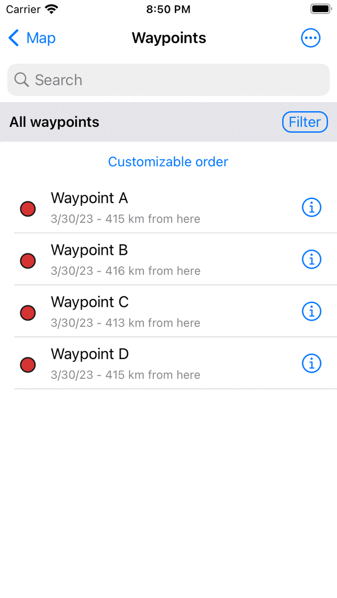

.. _ss-waypoint-load:

Loading waypoints
=================
To load waypoints that are saved on your device on the map,
you first have to open the waypoints screen. You can open
the waypoints screen by pressing ‘Waypoints’ in the :ref:`menu <sec-menu>`.
An example of the waypoints screen is displayed below:

   *Figure 1. The waypoints screen (Menu > Waypoints).*

The waypoints screens shows the list of waypoints that are
stored on your device. If you press a title in the list, the corresponding waypoint will be loaded on the map and you will return to the map screen.

As an example we now will load the waypoint ‘Stonehenge’. The map screen will then look as follows:

.. figure:: _static/waypoints-load2.png
   :height: 568px
   :width: 320px
   :alt: Loading waypoints Topo GPS

   *Figure 2. The waypoint ‘Stonehenge’ has been loaded on the map.*

In Fig. 2 you can see that a waypoint is depicted on the map with a red circle and a title. If you tap this red circle you can view the :ref:`waypoint details screen <ss-waypoint-details>`.

Waypoints that are loaded on the map acquire a grey background color in the waypoint screen. An example is shown below:

.. figure:: _static/waypoints-load3.png
   :height: 568px
   :width: 320px
   :alt: Loading waypoints Topo GPS

   *Figure 3. The grey background color indicates that the waypoint ’Stonehenge’ has been loaded on the map.*

It is also possible to load multiple waypoints on the map at once. This is explained in detail in the section :ref:`ss-routes-select`. Summarized: press ‘Select’ on the top right of the waypoints screen. Next select the desired waypoints by tapping them.  Then press the ‘Load’ button on the bottom of the screen to load the selection onto the map.