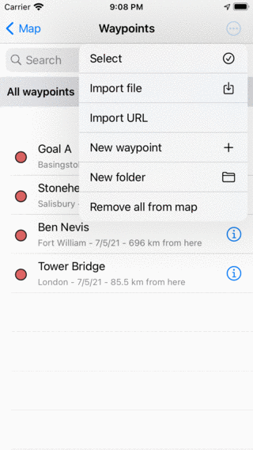
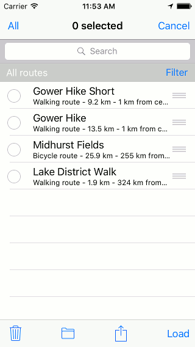
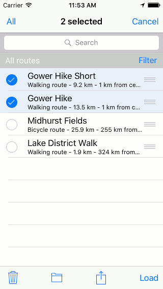
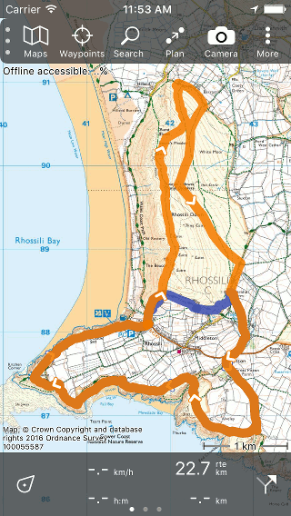

.. _ss-waypoints-select:

Selecting waypoints
===================
In the :ref:`waypoints screen <ss-waypoint-load>` you can
select waypoints and perform one of the following actions on the selected waypoints: 

- Remove selected waypoints
- Move selected waypoints into a folder
- Export selected waypoints
- Load selected waypoints on the map
- Change icon of selected waypoints
- Remove selected waypoints from the map

Selecting waypoints is similar to selecting routes.

Opening selection screen
~~~~~~~~~~~~~~~~~~~~~~~~
If you press the button 'More' on the top right of the waypoints screen, a menu will be show as in the figure below.

   *The more menu of the waypoints screen.*

Press ‘Select’ . In the select screen you can select routes or waypoints. You can also open the select screen by pressing long on a item in the routes or waypoints screen. The item that you press will then also be selected. An example of the select screen is displayed below:

   *The select screen in which you can select routes.*

Selecting
~~~~~~~~~
By pressing an item in the list of routes/waypoints the item will be selected. If an item is selected a checkmark will show up and the background of the item will become light blue. An example in which two routes are selected is displayed below:

   *Figure 3. The routes screen.*

The title of the selection screen shows how many items are selected. You can deselect an item by pressing it once more. If you want to select all items in the list, you have to press ‘All’ on the top left. To return to the usual routes/waypoints screen you have to press ‘Cancel’.

Performing action
~~~~~~~~~~~~~~~~~
If you have made a selection you can perform an action with one of the buttons
in the toolbar on the bottom of the screen. The possible actions are:

- *Trash icon*: Allows you to remove the selection from your device and iCloud.

- *Export icon*: Allows you to share the selected routes/waypoints. A pop-up will appear in which you can choose an app for sharing.

- *Map icon*; Allows you to move the selection into a folder.

- *Load*: Allows you to load the selection on the map.

As an example we now will load the selection from Fig. 3 on the map by pressing ‘Load’. The map screen will appear and you can see below that the two selected routes have been loaded on the map:

   *Figure 4. The routes ‘Gower Hike’ and ‘Gower Hike Short’ are loaded on the map.*

